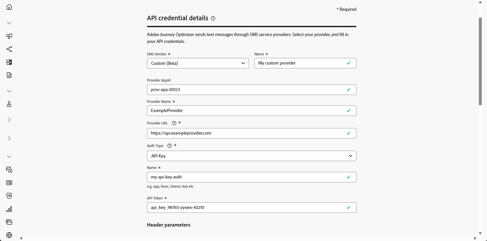

# Een aangepaste SMS-provider configureren {#sms-configuration-custom}

>[!CONTEXTUALHELP]
>id="ajo_admin_sms_api_byop_provider_url"
>title="URL provider"
>abstract="Geef de URL op van de externe API waarmee u verbinding wilt maken. Deze URL fungeert als eindpunt voor toegang tot de functies en functies van de API."

>[!CONTEXTUALHELP]
>id="ajo_admin_sms_api_byop_header_parameters"
>title="Parameters koptekst"
>abstract="Geef het label, het type en de waarde van extra headers op om de juiste verificatie, de opmaak van de inhoud en de effectieve API-communicatie mogelijk te maken. "

>[!CONTEXTUALHELP]
>id="ajo_admin_sms_api_byop_provider_payload"
>title="Payload van provider"
>abstract="Geef de lading van de aanvraag op om ervoor te zorgen dat de juiste gegevens worden verzonden voor het genereren van de verwerking en reactie."

>[!AVAILABILITY]
>
>Aangepaste providers zijn momenteel alleen beschikbaar als bètaversie voor geselecteerde gebruikers. Vraag uw Adobe-vertegenwoordiger om deel te nemen aan de Beta.
>In deze Beta worden binnenkomende berichten voor het beheer van de opt-in- of opt-out-toestemming en voor de rapportage van de levering niet ondersteund.

Deze eigenschap machtigt u om uw eigen leveranciers van SMS te integreren en te vormen, die flexibiliteit voorbij de standaardleveranciers (Sinch, Twilio, en Infobip) aanbieden. Dit maakt naadloos SMS-schrijven, levering, rapportage en beheer van de toestemming mogelijk.

Met de aangepaste leveranciersconfiguratie voor SMS kunt u:

* Configureer aangepaste SMS-providers rechtstreeks in Journey Optimizer.
* Geavanceerde aanpassing van de payload gebruiken voor dynamisch overseinen.
* Beheer de voorkeuren voor toestemming (opt-in/opt-out) om naleving te garanderen.

## Uw API-referentie maken {#api-credential}

Voer de volgende stappen uit als u berichten wilt verzenden in Journey Optimizer via een aangepaste provider die niet vanuit de doos beschikbaar is door Adobe (bijv. Sinch, Infobip, Twilio):

1. Navigeer in de linkertrack naar **[!UICONTROL Administration]** `>` **[!UICONTROL Channels]** , selecteer het menu **[!UICONTROL API Credentials]** en klik op de knop **[!UICONTROL Create new API credentials]** .

   

1. Configureer uw SMS API-referenties, zoals hieronder wordt beschreven:

   * **[!UICONTROL SMS vendor]**: Aangepast.

   * **[!UICONTROL Name]**: voer een naam in voor uw API-referentie.

   * **[!UICONTROL Provider AppId]**: voer de toepassings-id in die u van uw SMS-provider hebt ontvangen.

   * **[!UICONTROL Provider Name]**: voer de naam van uw SMS-provider in.

   * **[!UICONTROL Provider URL]**: voer de URL van uw SMS-provider in.

   * **[!UICONTROL Auth Type​]**: Selecteer uw toestemmingstype en [ voltooi de overeenkomstige gebieden ](#auth-options) die op de gekozen authentificatiemethode worden gebaseerd.

     

1. Klik in de sectie **[!UICONTROL Headers]** op **[!UICONTROL Add new parameter]** om de HTTP-headers op te geven voor het aanvraagbericht dat naar de externe service wordt verzonden.

   De **inhoud-Type** en **Charset** kopbalgebieden worden geplaatst door gebrek en kunnen niet worden geschrapt.

   

1. Voeg uw **[!UICONTROL Provider Payload]** toe om uw verzoeklading te bevestigen en aan te passen.

   U kunt uw lading dynamisch personaliseren gebruikend profielattributen, en ervoor zorgen wordt de nauwkeurige gegevens verzonden voor verwerking en reactiegeneratie met de hulp van ingebouwde hulpfuncties.
<!--
1. Add your **Inbound settings** to determine how your system handles incoming messages and subscriber preferences: 

    * **[!UICONTROL Inbound Webhook URL]**: Specify the endpoint URL where inbound messages (e.g. replies or new messages from users) are sent.
    * **[!UICONTROL Opt-in Keywords]**: Enter the default or custom keywords that will automatically trigger your Opt-In Message. For multiple keywords, use comma-separated values.
    * **[!UICONTROL Opt-in Message]**: Enter the custom response that is automatically sent as your Opt-In Message.
    * **[!UICONTROL Opt-out Keywords]**: Enter the default or custom keywords that will automatically trigger your Opt-Out Message. For multiple keywords, use comma-separated values.
    * **[!UICONTROL Opt-out Message]**: Enter the custom response that is automatically sent as your Opt-Out Message.
-->

1. Klik op **[!UICONTROL Submit]** wanneer u de configuratie van uw API-referenties hebt voltooid.

1. Klik in het menu **[!UICONTROL API Credentials]** op het binpictogram om uw API-referenties te verwijderen.

   

1. Als u bestaande referenties wilt wijzigen, zoekt u de gewenste API-referenties en klikt u op de optie **[!UICONTROL Edit]** om de benodigde wijzigingen aan te brengen.

   

Nadat u de API-referentie hebt gemaakt en geconfigureerd, moet u nu een kanaaloppervlak voor SMS-berichten maken. [Meer informatie](sms-configuration-surface.md)

Zodra gevormd, kunt u hefboomwerking alle uit-van-de-doos kanaalmogelijkheden zoals bericht creatie, verpersoonlijking, verbinding het volgen, en rapportering.

### Verificatieopties voor aangepaste SMS-providers {#auth-options}

>[!CONTEXTUALHELP]
>id="ajo_admin_sms_api_byop_auth_type"
>title="Type verificatie"
>abstract="Specificeer de authentificatiemethode nodig om tot API toegang te hebben, verzekert dit veilige en erkende communicatie met de externe dienst."

>[!BEGINTABS]

>[!TAB  API sleutel ]

Zodra uw API-referentie is gemaakt, vult u de velden in die vereist zijn voor API-sleutelverificatie:

* **[!UICONTROL Name]** &#x200B;: voer een naam in voor uw API-sleutelconfiguratie.
* **[!UICONTROL API Token]** &#x200B;: voer het API-token in dat door uw SMS-provider is opgegeven.

>[!TAB  de authentificatie van MAC ]

Zodra uw API-referentie is gemaakt, vult u de velden in die vereist zijn voor MAC-verificatie:

* **[!UICONTROL Name]** &#x200B;: voer een naam in voor uw MAC-verificatieconfiguratie.
* **[!UICONTROL API Token]** &#x200B;: voer het API-token in dat door uw SMS-provider is opgegeven.
* **[!UICONTROL API Secret Key]**: voer de API-beveiligingssleutel in die door uw SMS-provider wordt opgegeven. Deze sleutel wordt gebruikt om MAC (de Code van de Authentificatie van het Bericht) voor veilige mededeling te produceren.
* **[!UICONTROL Mac Authorization Hash Format]**: Kies de hashindeling voor de MAC-verificatie.

>[!TAB  OAuth authentificatie ]

Zodra uw API-referentie is gemaakt, vult u de velden in die vereist zijn voor OAuth-verificatie:

* **[!UICONTROL Name]** &#x200B;: ga een naam voor uw OAuth authentificatieconfiguratie in.

* **[!UICONTROL API Token]** &#x200B;: voer het API-token in dat door uw SMS-provider is opgegeven.

* **[!UICONTROL OAuth URL]** &#x200B;: ga URL voor het verkrijgen van het teken OAuth in.

* **[!UICONTROL OAuth Body]** &#x200B;: geef de OAuth-aanvraaginstantie de JSON-indeling, inclusief parameters zoals `grant_type` , `client_id` en `client_secret` .

>[!TAB  authentificatie JWT ]

Zodra uw API-referentie is gemaakt, vult u de velden in die vereist zijn voor JWT-verificatie:

* **[!UICONTROL Name]** &#x200B;: ga een naam voor uw JWT authentificatieconfiguratie in.

* **[!UICONTROL API Token]** &#x200B;: voer het API-token in dat door uw SMS-provider is opgegeven.

* **[!UICONTROL JWT Payload]** &#x200B;: voer de JSON-lading in met de claims die vereist zijn voor JWT, zoals de uitgever, het onderwerp, het publiek en de vervaldatum.

>[!ENDTABS]

## Hoe kan ik-video {#video}

>[!VIDEO](https://video.tv.adobe.com/v/3443612?captions=dut)
