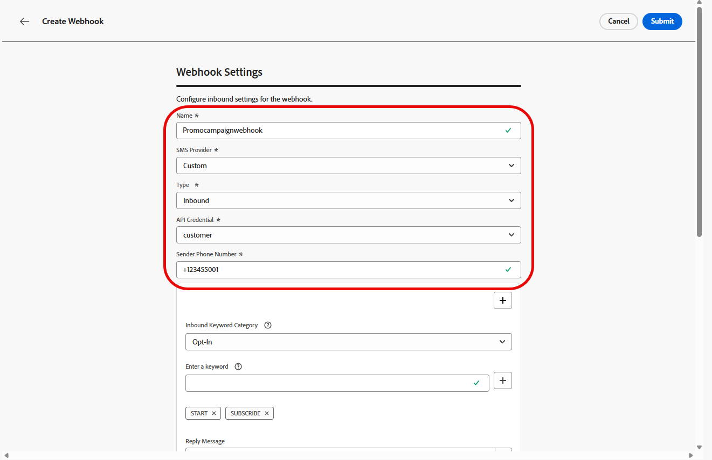

# Een aangepaste provider configureren {#sms-configuration-custom}

>[!CONTEXTUALHELP]
>id="ajo_admin_sms_api_byop_provider_url"
>title="URL provider"
>abstract="Geef de URL op van de externe API waarmee u verbinding wilt maken. Deze URL fungeert als eindpunt voor toegang tot de functies en functies van de API."

>[!CONTEXTUALHELP]
>id="ajo_admin_sms_api_byop_header_parameters"
>title="Parameters koptekst"
>abstract="Geef het label, het type en de waarde van extra headers op om de juiste verificatie, de opmaak van de inhoud en de effectieve API-communicatie mogelijk te maken. "

>[!CONTEXTUALHELP]
>id="ajo_admin_sms_api_byop_provider_payload"
>title="Payload van provider"
>abstract="Geef de lading van de aanvraag op om ervoor te zorgen dat de juiste gegevens worden verzonden voor het genereren van de verwerking en reactie."

Deze eigenschap machtigt u om uw eigen overseinenleveranciers te integreren en te vormen, die flexibiliteit voorbij de standaardopties (Sinch, Twilio, en Infobip) aanbieden. Dit maakt naadloos ontwerp, levering, rapportering, en toestemmingsbeheer voor zowel SMS als RCS berichten mogelijk.

Met de configuratie van de douaneleverancier, kunt u de diensten van het derdeoverseinen direct binnen Journey Optimizer verbinden, berichtlading voor dynamische inhoud aanpassen, en opt-in beheren/opt-out voorkeur om naleving over zowel SMS als kanalen te verzekeren.

Volg onderstaande stappen om uw aangepaste provider te configureren:

1. [API-referentie maken](#api-credential)
1. [Webhaak maken](#webhook)
1. [Kanaalconfiguratie maken](sms-configuration-surface.md)
1. [Reis of Campagne maken met SMS-kanaalactie](create-sms.md)

## Uw API-referentie maken {#api-credential}

Voer de volgende stappen uit als u SMS- en RCS-berichten in Journey Optimizer wilt verzenden via een aangepaste provider die niet vanuit de doos beschikbaar is door Adobe (bijvoorbeeld Sinch, Infobip, Twilio):

1. Navigeer in de linkertrack naar **[!UICONTROL Administration]** `>` **[!UICONTROL Channels]** , selecteer het menu **[!UICONTROL API Credentials]** onder **[!UICONTROL SMS settings]** en klik op de knop **[!UICONTROL Create new API credentials]** .

   

1. Configureer uw SMS API-referenties, zoals hieronder wordt beschreven:

   * **[!UICONTROL SMS vendor]**: Aangepast.

   * **[!UICONTROL Name]**: voer een naam in voor uw API-referentie.

   * **[!UICONTROL Provider AppId]**: voer de toepassings-id in die u van uw SMS-provider hebt ontvangen.

   * **[!UICONTROL Provider Name]**: voer de naam van uw SMS-provider in.

   * **[!UICONTROL Provider URL]**: voer de URL van uw SMS-provider in.

   * **[!UICONTROL Auth Type&#x200B;]**: Selecteer uw toestemmingstype en [ voltooi de overeenkomstige gebieden ](#auth-options) die op de gekozen authentificatiemethode worden gebaseerd.

     

1. Schakel de optie **[!UICONTROL mTLS support]** in, die ervoor zorgt dat zowel de client als de server elkaar verifiëren voordat een veilige verbinding tot stand wordt gebracht.

   Als u alleen mTLS wilt gebruiken, selecteert u **[!UICONTROL No Authentication]** in de vervolgkeuzelijst **[!UICONTROL Auth Type]** en schakelt u vervolgens **[!UICONTROL mTLS support]** in.

1. Klik in de sectie **[!UICONTROL Headers]** op **[!UICONTROL Add new parameter]** om de HTTP-headers op te geven voor het aanvraagbericht dat naar de externe service wordt verzonden.

   De **inhoud-Type** en **Charset** kopbalgebieden worden geplaatst door gebrek en kunnen niet worden geschrapt.

   

1. Voeg uw **[!UICONTROL Provider Payload]** toe om uw verzoeklading te bevestigen en aan te passen.

   Voor RCS- berichten, wordt deze nuttige lading later gebruikt tijdens [ inhoudsontwerp ](create-sms.md#sms-content).

1. Klik op **[!UICONTROL Submit]** wanneer u de configuratie van uw API-referenties hebt voltooid.

1. In het **[!UICONTROL API Credentials]** menu, klik het  om uw API geloofsbrieven te schrappen.

   

1. Als u bestaande referenties wilt wijzigen, zoekt u de gewenste API-referenties en klikt u op de optie **[!UICONTROL Edit]** om de benodigde wijzigingen aan te brengen.

   

1. Klik op **[!UICONTROL Verify SMS connection]** vanuit uw bestaande API-referenties om uw SMS API-referenties te testen en te verifiëren door een voorbeeldbericht naar een opgegeven apparaat te verzenden.

1. Vul de **gebieden van het Aantal** en **Bericht** in en klik **[!UICONTROL Verify connection]**.

   >[!IMPORTANT]
   >
   >Het bericht moet zodanig zijn gestructureerd dat het wordt uitgelijnd met de indeling voor de lading van de provider.

   

Na het creëren van en het vormen van uw API geloofsbrieven, moet u nu opstelling [ de binnenkomende montages voor Webhaak ](#webhook) voor de berichten van SMS.

### Verificatieopties voor aangepaste SMS-providers {#auth-options}

>[!CONTEXTUALHELP]
>id="ajo_admin_sms_api_byop_auth_type"
>title="Type verificatie"
>abstract="Specificeer de authentificatiemethode nodig om tot API toegang te hebben, verzekert dit veilige en erkende communicatie met de externe dienst."

>[!BEGINTABS]

>[!TAB  API sleutel ]

Zodra uw API-referentie is gemaakt, vult u de velden in die vereist zijn voor API-sleutelverificatie:

* **[!UICONTROL Name]** &#x200B;: voer een naam in voor uw API-sleutelconfiguratie.
* **[!UICONTROL API Token]** &#x200B;: voer het API-token in dat door uw SMS-provider is opgegeven.

>[!TAB  de authentificatie van MAC ]

Zodra uw API-referentie is gemaakt, vult u de velden in die vereist zijn voor MAC-verificatie:

* **[!UICONTROL Name]** &#x200B;: voer een naam in voor uw MAC-verificatieconfiguratie.
* **[!UICONTROL API Token]** &#x200B;: voer het API-token in dat door uw SMS-provider is opgegeven.
* **[!UICONTROL API Secret Key]**: voer de API-beveiligingssleutel in die door uw SMS-provider wordt opgegeven. Deze sleutel wordt gebruikt om MAC (de Code van de Authentificatie van het Bericht) voor veilige mededeling te produceren.
* **[!UICONTROL Mac Authorization Hash Format]**: Kies de hashindeling voor de MAC-verificatie.

>[!TAB  OAuth authentificatie ]

Zodra uw API-referentie is gemaakt, vult u de velden in die vereist zijn voor OAuth-verificatie:

* **[!UICONTROL Name]** &#x200B;: ga een naam voor uw OAuth authentificatieconfiguratie in.

* **[!UICONTROL API Token]** &#x200B;: voer het API-token in dat door uw SMS-provider is opgegeven.

* **[!UICONTROL OAuth URL]** &#x200B;: ga URL voor het verkrijgen van het teken OAuth in.

* **[!UICONTROL OAuth Body]** &#x200B;: geef de OAuth-aanvraaginstantie de JSON-indeling, inclusief parameters zoals `grant_type` , `client_id` en `client_secret` .

>[!TAB  authentificatie JWT ]

Zodra uw API-referentie is gemaakt, vult u de velden in die vereist zijn voor JWT-verificatie:

* **[!UICONTROL Name]** &#x200B;: ga een naam voor uw JWT authentificatieconfiguratie in.

* **[!UICONTROL API Token]** &#x200B;: voer het API-token in dat door uw SMS-provider is opgegeven.

* **[!UICONTROL JWT Payload]** &#x200B;: voer de JSON-lading in met de claims die vereist zijn voor JWT, zoals de uitgever, het onderwerp, het publiek en de vervaldatum.

>[!ENDTABS]

## Webhaak maken {#webhook}

>[!BEGINSHADEBOX]

Als de trefwoorden opt-in of opt-out niet worden opgegeven, worden standaardtoestemmingsberichten gebruikt om de privacy van de gebruiker te respecteren. Als u aangepaste trefwoorden toevoegt, worden de standaardwaarden automatisch genegeerd.

**Standaardsleutelwoorden:**

* **Opt-binnen**: ABONNEMENT, JA, ONSTOP, BEGIN, DOORGAAN, HERVATTEN, BEGINNEN
* **Opt-out**: STOP, SLUIT, ANNULEREN, EINDE, ONABONNEMENT, GEEN
* **Hulp**: HELP

>[!ENDSHADEBOX]

Zodra uw API geloofsbrieven met succes zijn gecreeerd, kunt u Webhooks nu vormen om binnenkomende reacties voor het beheren van opt-in en opt-out toestemming te vangen, en leveringsrapporten zoals lees ontvangstbewijzen te ontvangen waar beschikbaar.

Wanneer u een webhaak instelt, kunt u het doel ervan definiëren op basis van het type gegevens dat u wilt vastleggen:

* **[!UICONTROL Inbound]**: gebruik deze optie als u toestemmingsreacties, zoals opt-ins of opt-outs, wilt vangen en gebruikersvoorkeur verzamelt.

* **[!UICONTROL Feedback]**: Kies deze optie om bezorgings- en betrokkenheidsgebeurtenissen, inclusief leesontvangstbewijzen en gebruikersinteracties, bij te houden ter ondersteuning van rapportage en analyse.

>[!BEGINTABS]

>[!TAB  binnenkomend ]

1. Navigeer in de linkertrack naar **[!UICONTROL Administration]** `>` **[!UICONTROL Channels]** , selecteer het menu **[!UICONTROL SMS Webhooks]** onder **[!UICONTROL SMS settings]** en klik op de knop **[!UICONTROL Create Webhook]** .

   

1. Configureer uw WebHaak-instellingen, zoals hieronder wordt beschreven:

   * **[!UICONTROL Name]**: ga een naam voor uw Webhaak in.

   * **[!UICONTROL Select SMS vendor]**: Aangepast.

   * **[!UICONTROL Type]**: Binnenkomend.

   * **[!UICONTROL API credentials]**: Kies van drop-down u [ eerder gevormde API geloofsbrieven ](#api-credential).

   * **[!UICONTROL Sender Phone Number &#x200B;]**: ga het de telefoonaantal van de Afzender in &#x200B; u voor uw mededelingen wilt gebruiken.

     

1. Klik op  om trefwoordencategorieën toe te voegen en configureer deze als volgt:

   * **[!UICONTROL Inbound Keyword Category]**: Kies de trefwoordcategorieën **[!UICONTROL Opt-In]** , **[!UICONTROL Opt-Out]** , **[!UICONTROL Help]** of **[!UICONTROL Default]** .

   * **[!UICONTROL Enter a keyword]**: voer de standaardtrefwoorden of aangepaste trefwoorden in die het bericht automatisch activeren. Klik op  om meerdere trefwoorden toe te voegen.

   * **[!UICONTROL Reply Message]**: selecteer in het keuzemenu de aangepaste reactie die automatisch wordt verzonden.

   

1. Klik op **[!UICONTROL View payload editor]** om uw aanvraag te valideren en aan te passen.

   U kunt uw lading dynamisch personaliseren gebruikend profielattributen, en ervoor zorgen wordt de nauwkeurige gegevens verzonden voor verwerking en reactiegeneratie met de hulp van ingebouwde hulpfuncties.

1. Klik **[!UICONTROL Submit]** wanneer u de configuratie van uw Webhaak voltooide.

1. In het **[!UICONTROL Webhooks]** menu, klik het  om uw Webhaak te schrappen.

1. Als u de bestaande configuratie wilt wijzigen, zoekt u de gewenste Webhaak en klikt u op de optie **[!UICONTROL Edit]** om de gewenste wijzigingen aan te brengen.

1. Open en kopieer uw nieuwe **[!UICONTROL Webhook URL]** vanuit uw eerder verzonden **[!UICONTROL Webhook]** .

   

Na het creëren van en het vormen van de binnenkomende montages voor Webhaak, moet u nu a [ kanaalconfiguratie ](sms-configuration-surface.md) voor de berichten van SMS tot stand brengen.

Zodra gevormd, kunt u hefboomwerking alle uit-van-de-doos kanaalmogelijkheden zoals bericht creatie, verpersoonlijking, verbinding het volgen, en rapportering.

>[!TAB  Terugkoppeling ]

1. Navigeer in de linkertrack naar **[!UICONTROL Administration]** `>` **[!UICONTROL Channels]** , selecteer het menu **[!UICONTROL SMS Webhooks]** onder **[!UICONTROL SMS settings]** en klik op de knop **[!UICONTROL Create Webhook]** .

   

1. Configureer uw WebHaak-instellingen, zoals hieronder wordt beschreven:

   * **[!UICONTROL Name]**: ga een naam voor uw Webhaak in.

   * **[!UICONTROL Select SMS vendor]**: Aangepast.

   * **[!UICONTROL Type]**: Feedback.

   

1. Klik op **[!UICONTROL View payload editor]** om uw aanvraag te valideren en aan te passen.

   U kunt uw lading dynamisch personaliseren gebruikend profielattributen, en ervoor zorgen wordt de nauwkeurige gegevens verzonden voor verwerking en reactiegeneratie met de hulp van ingebouwde hulpfuncties.

1. Klik **[!UICONTROL Submit]** wanneer u de configuratie van uw Webhaak voltooide.

1. In het **[!UICONTROL Webhooks]** menu, klik het  om uw Webhaak te schrappen.

1. Als u de bestaande configuratie wilt wijzigen, zoekt u de gewenste Webhaak en klikt u op de optie **[!UICONTROL Edit]** om de gewenste wijzigingen aan te brengen.

1. Open en kopieer uw nieuwe **[!UICONTROL Webhook URL]** vanuit uw eerder verzonden **[!UICONTROL Webhook]** .

   

Na het creëren van en het vormen van de binnenkomende montages voor Webhaak, moet u nu a [ kanaalconfiguratie ](sms-configuration-surface.md) voor de berichten van SMS tot stand brengen.

Zodra gevormd, kunt u hefboomwerking alle uit-van-de-doos kanaalmogelijkheden zoals bericht creatie, verpersoonlijking, verbinding het volgen, en rapportering.

>[!ENDTABS]

## Hoe kan ik-video {#video}

>[!VIDEO](https://video.tv.adobe.com/v/3431625)

