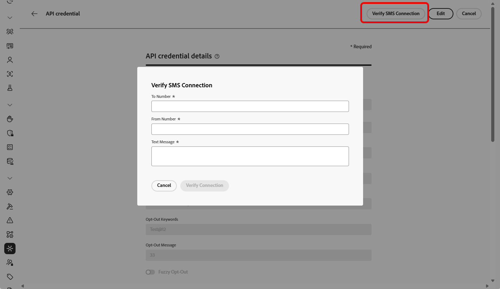

# Infobip-provider configureren {#sms-configuration-infobip}

>[!BEGINSHADEBOX]

Als de trefwoorden opt-in of opt-out niet worden opgegeven, worden standaardtoestemmingsberichten gebruikt om de privacy van de gebruiker te respecteren. Als u aangepaste trefwoorden toevoegt, worden de standaardwaarden automatisch genegeerd.

**Standaardsleutelwoorden:**

* **Opt-binnen**: ABONNEMENT, JA, ONSTOP, BEGIN, DOORGAAN, HERVATTEN, BEGINNEN
* **Opt-out**: STOP, SLUIT, ANNULEREN, EINDE, ONABONNEMENT, GEEN
* **Hulp**: HELP

>[!ENDSHADEBOX]

## API-referenties configureren voor SMS

Ga als volgt te werk om Infobip met Journey Optimizer te configureren:

1. Blader in de linkertrack naar **[!UICONTROL Administration]** `>` **[!UICONTROL Channels]** en selecteer het menu **[!UICONTROL API Credentials]** . Klik op de knop **[!UICONTROL Create new API credentials]**.

1. Configureer uw SMS API-referenties, zoals hieronder wordt beschreven:

   +++ Lijst met SMS-referenties voor configuratie

   | Configuratievelden | Beschrijving |
   |---|---|    
   | SMS-leverancier | Infobip |
   | Naam | Kies een naam voor uw API-referentie. |
   | API basis-URL en API-sleutel | Ga naar de webinterface-homepage of de API-sleutelbeheerpagina om uw referenties te zoeken. Voor regionale of alternatieve eindpunten van domeinen, bijvoorbeeld `api-ny2.infobip.com` , geeft u de volledige basis-URL op en controleert u het verificatietoken met ondersteuning voor Infobip.   Leer meer in [&#x200B; Infobip Documentatie &#x200B;](https://www.infobip.com/docs/api){target="_blank"} |
   | Trefwoorden bij Inschakelen | Voer de standaardtrefwoorden of aangepaste trefwoorden in die automatisch uw aanmeldingsbericht activeren. Gebruik voor meerdere trefwoorden door komma&#39;s gescheiden waarden. |
   | Bericht bij aanmelden | Voer de aangepaste reactie in die automatisch wordt verzonden als uw aanmeldingsbericht. |
   | Trefwoorden uitschakelen | Voer de standaardtrefwoorden of aangepaste trefwoorden in die automatisch het bericht Uitschakelen activeren. Gebruik voor meerdere trefwoorden door komma&#39;s gescheiden waarden. |
   | Bericht bij Afmelden | Voer de aangepaste reactie in die automatisch wordt verzonden als uw bericht om te weigeren. |
   | Trefwoorden Help | Ga het gebrek of douanetrefwoorden in die automatisch uw **Bericht van de Hulp** zullen teweegbrengen. Gebruik voor meerdere trefwoorden door komma&#39;s gescheiden waarden. |
   | Help-bericht | Ga de douanereactie in die automatisch als uw **Bericht van de Hulp** wordt verzonden. |
   | Dubbele invoegtrefwoorden | Voer de trefwoorden in die het dubbele aanmeldingsproces activeren. Als een gebruikersprofiel niet bestaat, wordt het gecreeerd na succesvolle bevestiging. Gebruik voor meerdere trefwoorden door komma&#39;s gescheiden waarden. [&#x200B; Leer meer over SMS Dubbelopt-binnen &#x200B;](https://video.tv.adobe.com/v/3427129/?learn=on). |
   | Dubbel bericht voor aanmelden | Voer de aangepaste reactie in die automatisch wordt verzonden als reactie op de dubbele aanmeldingsbevestiging. |
   | Id van hoofdentiteit | Ga uw toegewezen Hoofdentiteitskaart van DLT in. |
   | Inhoudssjabloon-id | Voer uw geregistreerde sjabloon-id voor DLT-inhoud in. |
   | Geldigheidsperiode | Voer de geldigheidsperiode van het bericht in uren in. Als berichten niet binnen deze termijn kunnen worden geleverd, zal het systeem extra pogingen doen om hen opnieuw te verzenden. De standaardgeldigheidsperiode is ingesteld op 48 uur. |
   | Callback-gegevens | Voer de aanvullende clientgegevens in die worden verzonden via de URL Waarschuwen. |
   | Inkomend getal | Voeg uw unieke binnenkomende aantal toe. Hierdoor kunt u dezelfde API-referenties gebruiken in verschillende sandboxen, elk met een eigen binnenkomend nummer. |
   | Aangepaste binnenkomende trefwoorden | U kunt unieke trefwoorden definiëren die geen betrekking hebben op toestemming voor handelingen op batchbasis, zoals KORTING, AANBIEDINGEN, ENROLL. Deze trefwoorden worden vastgelegd en opgeslagen als kenmerken in het profiel, zodat u een gebatchsegmentkwalificatie binnen de reis kunt activeren en een aangepaste reactie of actie kunt leveren. |
   | Standaardbericht voor binnenkomende reactie | Ga het standaardantwoord in dat wordt verzonden wanneer een eindgebruiker binnenkomende SMS verzendt die om het even welke bepaalde sleutelwoorden niet aanpast. |

   +++

1. Schakel de optie **[!UICONTROL Fuzzy Opt-out]** in om berichten te detecteren die lijken op uitschakeltrefwoorden (bijvoorbeeld &#39;CANCIL&#39;) en pas het bevestigingsantwoord aan in het veld **[!UICONTROL Fuzzy Auto Reply]** .

   **[!UICONTROL Fuzzy Opt-out]** identificeert SMS-berichten die aangeven dat een gebruiker zijn abonnement wil opzeggen, zelfs als het bericht niet exact overeenkomt met een gedefinieerd uitschakeltrefwoord. Deze functie kan veelgebruikte woordgroepen voor niet-deelname en bepaalde aanstootgevende termen detecteren, zodat uw campagnes de gebruikersvoorkeuren respecteren en aan de vereisten blijven voldoen.

1. Klik op **[!UICONTROL Submit]** wanneer u de configuratie van uw API-referenties hebt voltooid.

1. Klik in het menu **[!UICONTROL API Credentials]** op het binpictogram om uw API-referenties te verwijderen.

1. Als u bestaande referenties wilt wijzigen, zoekt u de gewenste API-referenties en klikt u op de optie **[!UICONTROL Edit]** om de benodigde wijzigingen aan te brengen.

1. Klik op **[!UICONTROL Verify SMS connection]** vanuit uw bestaande API-referenties om uw SMS API-referenties te testen en te verifiëren door een voorbeeldbericht naar een opgegeven apparaat te verzenden.

1. Vul de **gebieden van het Aantal** en **Bericht** in en klik **[!UICONTROL Verify connection]**.

   >[!IMPORTANT]
   >
   >Het bericht moet zodanig zijn gestructureerd dat het wordt uitgelijnd met de indeling voor de lading van de provider.

   

Nadat u de API-referentie hebt gemaakt en geconfigureerd, moet u nu een kanaalconfiguratie voor SMS- en MMS-berichten maken. [Meer informatie](sms-configuration-surface.md)

## API-referentie configureren voor RCS

Het overseinen RCS wordt gesteund in Adobe Journey Optimizer door Infobip gebruikend de [&#x200B; eigenschap van de Leverancier van SMS van de Douane &#x200B;](sms-configuration-custom.md). Dit maakt het mogelijk rijke, interactieve berichten via geverifieerde bedrijfsprofielen te verzenden, met elementen zoals carrousels, knoppen en multimedia-inhoud.

➡️ [&#x200B; Onderzoek hoe Infobip RCS in Infrobip- documentatie &#x200B;](https://www.infobip.com/docs/api/channels/rcs) steunt

Om RCS overseinen met Infobip toe te laten, moeten de nieuwe API geloofsbrieven via een Leverancier van Aangepaste SMS worden gevormd. De bestaande referenties van Infobip SMS zijn niet compatibel, aangezien RCS een verschillend ladingsformaat vereist.

RCS met Infobip vormen:

1. **Registreer Uw Zaken voor RCS via Infobip**

   Begin met het voltooien van het RCS-instapproces en het registratieproces binnen het Infobip-platform. Hiertoe moet u het RCS-verzendersprofiel instellen en ervoor zorgen dat uw account geschikt is voor RCS. Leer meer in [&#x200B; Infobip documentatie &#x200B;](https://www.infobip.com/docs/rcs/get-started)

1. **creeer een Webhaak van SMS**

   [&#x200B; vorm een Webhaak van douaneSMS &#x200B;](sms-configuration-custom.md#webhook) in Journey Optimizer. Deze webhaak is verantwoordelijk voor de afhandeling van ontvangstbewijzen, binnenkomende RCS-berichten en statusupdates van het platform van Infobip.

1. **creeer API Verantwoordelijkheid gebruikend Douane als verkoper van SMS**

   [&#x200B; creeer een nieuwe API referentie &#x200B;](sms-configuration-custom.md#api-credential) binnen Journey Optimizer, die &quot;Douane&quot;als leverancier van SMS selecteert. Gebruik de aangewezen methode van de RCS eindpuntauthentificatie, basis URL, en kopballen.

Nadat u de API-referentie hebt gemaakt en geconfigureerd, moet u nu een kanaalconfiguratie voor uw RCS-berichten maken. [Meer informatie](sms-configuration-surface.md)
