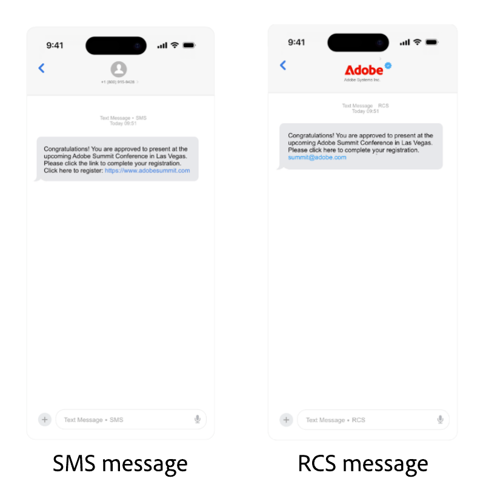

# Sinch-provider configureren {#sms-configuration-sinch}

Wanneer u de Sinch-provider gebruikt met Journey Optimizer, kunt u drie verschillende opties vinden:

* **Configuratie van SMS**: Opstelling uw geloofsbrieven van Sinch API om de berichten van SMS foutloos te verzenden.

* **Configuratie MMS**: Voor het overseinen van verschillende media (MMS), vorm uw Inch MMS API geloofsbrieven. Merk op dat het volgen en het antwoorden aan binnenkomende berichten, door de configuratie van SMS worden behandeld. De opstelling MMS is slechts voor uitgaande levering van het MMS bericht.

* **Configuratie RCS**: Opstelling uw Invoeglijke API van de Plaats om RCS- berichten foutloos te verzenden.

## API-referenties configureren voor SMS{#create-api}

>[!BEGINSHADEBOX]

Als de trefwoorden opt-in of opt-out niet worden opgegeven, worden standaardtoestemmingsberichten gebruikt om de privacy van de gebruiker te respecteren. Als u aangepaste trefwoorden toevoegt, worden de standaardwaarden automatisch genegeerd.

**Standaardsleutelwoorden:**

* **Opt-binnen**: ABONNEMENT, JA, ONSTOP, BEGIN, DOORGAAN, HERVATTEN, BEGINNEN
* **Opt-out**: STOP, SLUIT, ANNULEREN, EINDE, ONABONNEMENT, GEEN
* **Hulp**: HELP

>[!ENDSHADEBOX]

Voer de volgende stappen uit om uw Sinch-provider te configureren voor het verzenden van SMS-berichten en MMS met Journey Optimizer:

1. Blader in de linkertrack naar **[!UICONTROL Administration]** > **[!UICONTROL Channels]** `>` **[!UICONTROL SMS Settings]** en selecteer het menu **[!UICONTROL API Credentials]** . Klik op de knop **[!UICONTROL Create new API credentials]**.

1. Configureer uw SMS API-referenties, zoals hieronder wordt beschreven:

   +++ Lijst met SMS-referenties voor configuratie

   | Configuratievelden | Beschrijving |
   |---|---|    
   | SMS-leverancier | Sinch |
   | Naam | Kies een naam voor uw API-referentie. |
   | Service-id en API-token | Open de pagina met API&#39;s en je kunt je gegevens vinden op het tabblad SMS. Leer meer in [ de Documentatie van de Sinch ](https://developers.sinch.com/docs/sms/getting-started/){target="_blank"}. |
   | Trefwoorden bij Inschakelen | Voer de standaardtrefwoorden of aangepaste trefwoorden in die automatisch uw aanmeldingsbericht activeren. Gebruik voor meerdere trefwoorden door komma&#39;s gescheiden waarden. |
   | Bericht bij aanmelden | Voer de aangepaste reactie in die automatisch wordt verzonden als uw aanmeldingsbericht. |
   | Trefwoorden uitschakelen | Voer de standaardtrefwoorden of aangepaste trefwoorden in die automatisch het bericht Uitschakelen activeren. Gebruik voor meerdere trefwoorden door komma&#39;s gescheiden waarden. |
   | Bericht bij Afmelden | Voer de aangepaste reactie in die automatisch wordt verzonden als uw bericht om te weigeren. |
   | Trefwoorden Help | Ga het gebrek of douanetrefwoorden in die automatisch uw **Bericht van de Hulp** zullen teweegbrengen. Gebruik voor meerdere trefwoorden door komma&#39;s gescheiden waarden. |
   | Help-bericht | Ga de douanereactie in die automatisch als uw **Bericht van de Hulp** wordt verzonden. |
   | Dubbele invoegtrefwoorden | Voer de trefwoorden in die het dubbele aanmeldingsproces activeren. Als een gebruikersprofiel niet bestaat, wordt het gecreeerd na succesvolle bevestiging. Gebruik voor meerdere trefwoorden door komma&#39;s gescheiden waarden. [ Leer meer over SMS Dubbelopt-binnen ](https://video.tv.adobe.com/v/3427129/?learn=on). |
   | Dubbel bericht voor aanmelden | Voer de aangepaste reactie in die automatisch wordt verzonden als reactie op de dubbele aanmeldingsbevestiging. |
   | Inkomend getal | Voeg uw unieke binnenkomende aantal of korte code toe. Hierdoor kunt u dezelfde API-referenties gebruiken in verschillende sandboxen, elk met een eigen binnenkomend nummer of korte code. |
   | Aangepaste binnenkomende trefwoorden | Definieer unieke trefwoorden voor specifieke acties, zoals KORTING, AANBIEDINGEN, ENROLL. Deze trefwoorden worden vastgelegd en opgeslagen als kenmerken in het profiel, zodat u een kwalificatie voor een streaming segment op de reis kunt activeren en een aangepaste reactie of actie kunt leveren. |
   | Standaardbericht voor binnenkomende reactie | Ga het standaardantwoord in dat wordt verzonden wanneer een eindgebruiker binnenkomende SMS verzendt die om het even welke bepaalde sleutelwoorden niet aanpast. |
   | URL overschrijven | Voer uw aangepaste URL in ter vervanging van de standaardeindpunten voor SMS-leveringsrapporten, feedbackgegevens, binnenkomende berichten of gebeurtenismeldingen. Sinch verzendt alle relevante updates naar deze URL in plaats van de vooraf gedefinieerde. |

   +++

1. Schakel de optie **[!UICONTROL Fuzzy Opt-out]** in om berichten te detecteren die lijken op uitschakeltrefwoorden (bijvoorbeeld &#39;CANCIL&#39;) en pas het bevestigingsantwoord aan in het veld **[!UICONTROL Fuzzy Auto Reply]** .

   **[!UICONTROL Fuzzy Opt-out]** identificeert SMS-berichten die aangeven dat een gebruiker zijn abonnement wil opzeggen, zelfs als het bericht niet exact overeenkomt met een gedefinieerd uitschakeltrefwoord. Deze functie kan veelgebruikte woordgroepen voor niet-deelname en bepaalde aanstootgevende termen detecteren, zodat uw campagnes de gebruikersvoorkeuren respecteren en aan de vereisten blijven voldoen.

1. Klik op **[!UICONTROL Submit]** wanneer u de configuratie van uw API-referenties hebt voltooid.

1. Klik in het menu **[!UICONTROL API Credentials]** op het binpictogram om uw API-referenties te verwijderen.

1. Als u bestaande referenties wilt wijzigen, zoekt u de gewenste API-referenties en klikt u op de optie **[!UICONTROL Edit]** om de benodigde wijzigingen aan te brengen.

1. Klik op **[!UICONTROL Verify SMS connection]** vanuit uw bestaande API-referenties om uw SMS API-referenties te testen en te verifiëren door een voorbeeldbericht naar een opgegeven apparaat te verzenden.

1. Vul de **gebieden van het Aantal** en **Bericht** in en klik **[!UICONTROL Verify connection]**.

   >[!IMPORTANT]
   >
   >Het bericht moet zodanig zijn gestructureerd dat het wordt uitgelijnd met de indeling voor de lading van de provider.

   

Nadat u de API-referentie hebt gemaakt en geconfigureerd, moet u nu een kanaalconfiguratie voor SMS-berichten maken. [Meer informatie](sms-configuration-surface.md)

## API-referenties configureren voor MMS{#sinch-mms}

>[!IMPORTANT]
>
> Samen met de opstelling MMS, moet u ook de geloofsbrieven van Sinch API tot stand brengen specifiek voor het volgen van binnenkomende berichten en het beheren van toestemmingsverzoeken.

Voer de volgende stappen uit om Sinch MMS te configureren voor het verzenden van MMS met Journey Optimizer:

1. Blader in de linkertrack naar **[!UICONTROL Administration]** > **[!UICONTROL Channels]** `>` **[!UICONTROL SMS Settings]** en selecteer het menu **[!UICONTROL API Credentials]** . Klik op de knop **[!UICONTROL Create new API credentials]**.

1. Configureer uw MMS API-referenties, zoals hieronder wordt beschreven:

   * **[!UICONTROL SMS vendor]**: Sinch MMS.

   * **[!UICONTROL Name]**: kies een naam voor uw API-referentie.

   * **[!UICONTROL Project ID]** , **[!UICONTROL App ID]** en **[!UICONTROL API Token]** : volg de onderstaande stappen om uw MMS API-referenties te verzamelen.

      * Voor **[!UICONTROL Project ID]** en **[!UICONTROL App ID]**: Heb toegang tot de [ API van de Gesprek - overzicht ](https://dashboard.sinch.com/convapi/overview) pagina van uw project van Sinch op uw Staaldashboard.
      * Voor **[!UICONTROL API Token]**: Verkrijg de [ sleutels van de Toegang ](https://community.sinch.com/t5/Customer-Dashboard/Sinch-Access-Keys/ta-p/12638) voor uw Project van de Sinch en produceer a **Base64 API Symbolisch** uit uw Duidelijke Sleutels van de Toegang van het Project **&#x200B;**.

1. Klik op **[!UICONTROL Submit]** wanneer u de configuratie van uw API-referenties hebt voltooid.

1. Klik in het menu **[!UICONTROL API Credentials]** op het binpictogram om uw API-referenties te verwijderen.

1. Als u bestaande referenties wilt wijzigen, zoekt u de gewenste API-referenties en klikt u op de optie **[!UICONTROL Edit]** om de benodigde wijzigingen aan te brengen.

Nadat u de API-referentie hebt gemaakt en geconfigureerd, moet u nu een kanaalconfiguratie voor MMS-berichten maken. [Meer informatie](sms-configuration-surface.md)

## API-referentie configureren voor RCS

<!---->

Het overseinen van RCS (Rich Communication Services) wordt gesteund in Journey Optimizer door Sinch, toestaand het verzenden van basisberichten gebruikend geverifieerde bedrijfsprofielen met brandingselementen zoals logo&#39;s en afzendernamen.

De berichten vallen automatisch terug naar SMS wanneer het apparaat van het profiel geen RCS steunt of tijdelijk onbereikbaar via RCS is.

<!--
### Basic RCS Messages

>[!AVAILABILITY]
>
> Basic RCS messages is only available upon Adobe RCS add-on offering.

1. **Set up your branded RCS agent**

    Create a branded RCS agent in the Sinch Dashboard. [Learn more on branded RCS agent](https://community.sinch.com/t5/RCS/Getting-Started-with-RCS-using-Conversation-API/ta-p/17844)

1. **Set up your [Custom API credentials](sms-configuration-custom.md)**
    
    Once your RCS agent is approved, you need to set up your Sinch API credentials, which include your access key, secret, and service plan ID. These credentials will be used by Journey Optimizer to authenticate and send messages through Sinch's platform.

1. **Create a [channel configuration](sms-configuration-surface.md) for your RCS messages**

    Configure a channel surface in Journey Optimizer by linking your Sinch credentials and defining the messaging parameters. This setup enables you to compose and send RCS messages from Journey Optimizer.

1. **Create and personalize your [SMS message](../sms/create-sms.md)**

    Your messages automatically falls back to SMS when the profile's device does not support RCS or is temporarily unreachable via RCS.
-->

### RCS Multimedia-berichten

>[!AVAILABILITY]
>
> De geavanceerde RCS- berichten zijn slechts beschikbaar met een directe rekening die door Sinch wordt beheerd.

1. **Opstelling uw brandde agent RCS**

   Creeer een branded agent RCS in het Snel Dashboard van de Sinch. [ Leer meer op brandde agent RCS ](https://community.sinch.com/t5/RCS/Getting-Started-with-RCS-using-Conversation-API/ta-p/17844)

1. **Opstelling uw [ geloofsbrieven van de Douane API](sms-configuration-custom.md)**

   Zodra uw agent RCS wordt goedgekeurd, moet u opstelling uw geloofsbrieven van de Douane API, die uw AppId, Naam, URL en authentificatietype omvatten.

1. **vorm uw RCS met de nuttige lading van de Leverancier.**

   In uw [ geloofsbrieven van de Douane API ](sms-configuration-custom.md), voeg uw Payload van de Leverancier toe om uw RCS- berichten te bevestigen en aan te passen.

1. **creeer a [ kanaalconfiguratie ](sms-configuration-surface.md) voor uw RCS- berichten**

   Vorm een kanaaloppervlakte in Journey Optimizer door uw geloofsbrieven van Sinch te verbinden en de overseinenparameters te bepalen. Met deze instelling kunt u RCS-berichten van Journey Optimizer samenstellen en verzenden.

1. **creeer en verpersonaliseer uw [ bericht van SMS](../sms/create-sms.md)**

   Plak uw lading direct in de inhoud van SMS om uw Rich Communication Services (RCS) berichten in te bedden en te leveren.

   ➡️ [ Onderzoek hoe de Steun van Sinch RCS in de documentatie van de Sonde ](https://sinch.com/blog/rcs-api-guide/)

