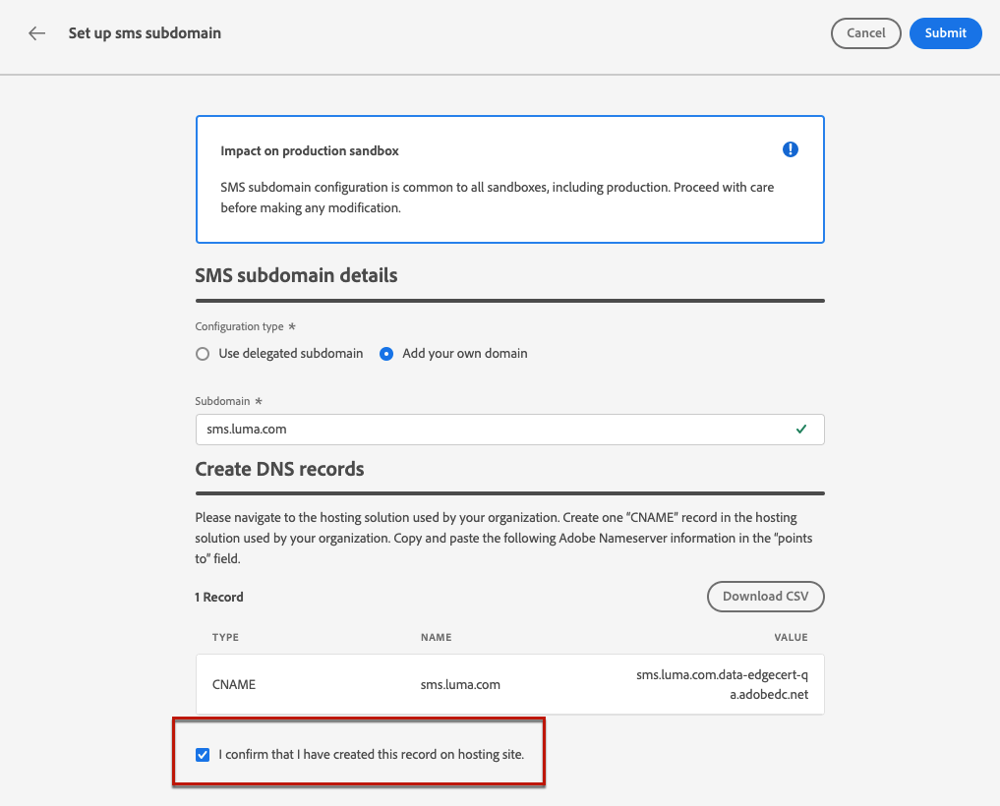

# SMS-subdomeinen configureren {#sms-mms-subdomains}

>[!CONTEXTUALHELP]
>id="ajo_admin_subdomain_sms_header"
>title="Een SMS/MMS-subdomein delegeren"
>abstract="Stel uw subdomein in voor tekstberichten (SMS/MMS). U kunt een subdomein gebruiken dat al aan Adobe is gedelegeerd, of een nieuw subdomein vormen."

>[!CONTEXTUALHELP]
>id="ajo_admin_subdomain_sms"
>title="Een SMS/MMS-subdomein delegeren"
>abstract="U moet een subdomein vormen voor uw tekstberichten te gebruiken, aangezien u dit subdomein nodig hebt om een configuratie van SMS tot stand te brengen. U kunt een subdomein gebruiken dat al aan Adobe is gedelegeerd, of een nieuw subdomein vormen."
>additional-url="https://experienceleague.adobe.com/en/docs/journey-optimizer/using/channels/sms/configure-sms/sms-configuration-surface" text="Een SMS-configuratie maken"

>[!CONTEXTUALHELP]
>id="ajo_admin_config_sms_subdomain"
>title="Een SMS/MMS-subdomein selecteren"
>abstract="Om een configuratie van SMS te kunnen tot stand brengen, zorg ervoor u eerder minstens één subdomain van SMS om van de lijst Subdomain te kiezen hebt gevormd."
>additional-url="https://experienceleague.adobe.com/en/docs/journey-optimizer/using/channels/sms/configure-sms/sms-configuration-surface" text="Een SMS-configuratie maken"

Om URLs te kunnen verkorten die aan uw SMS/MMS- berichten wordt toegevoegd, moet u opstelling subdomain u wanneer [ creërend een configuratie van SMS ](sms-configuration.md#message-preset-sms) selecteren.

U kunt een subdomein gebruiken dat al aan Adobe is gedelegeerd, of u kunt een ander subdomein vormen. Leer meer over het delegeren van subdomeinen aan Adobe in [ deze sectie ](../configuration/delegate-subdomain.md).

>[!CAUTION]
>
>* De subdomeinconfiguratie van SMS wordt gedeeld tussen alle milieu&#39;s. Daarom heeft elke wijziging van een subdomein van SMS ook invloed op andere productiesandboxen.
>
>* Als u SMS-subdomeinen wilt openen en bewerken, moet u over de machtiging **[!UICONTROL Manage SMS Subdomains]** in de productiesandbox beschikken. Leer meer over toestemmingen in [ deze sectie ](../administration/high-low-permissions.md).
>

## Een bestaand subdomein gebruiken {#sms-use-existing-subdomain}

Voer de onderstaande stappen uit als u een subdomein wilt gebruiken dat al is gedelegeerd aan Adobe.

1. Blader naar het menu **[!UICONTROL Administration]** > **[!UICONTROL Channels]** en selecteer **[!UICONTROL SMS settings]** > **[!UICONTROL SMS subdomains]** .

1. Klik op **[!UICONTROL Set up subdomain]**.

   

1. Selecteer **[!UICONTROL Use delegated subdomain]** in de sectie **[!UICONTROL Configuration type]** .

   

1. Voer het voorvoegsel in dat in je SMS-URL wordt weergegeven.

   >[!NOTE]
   >
   >Alleen alfanumerieke tekens en afbreekstreepjes zijn toegestaan.

1. Selecteer een gedelegeerd subdomein in de lijst.

   >[!NOTE]
   >
   >U kunt geen subdomein selecteren dat al als subdomein van SMS wordt gebruikt.

   <!--Capital letters are not allowed in subdomains. TBC by PM-->

   

   <!--Note that you cannot use multiple delegated subdomains of the same parent domain. For example, if 'marketing1.yourcompany.com' is already delegated to Adobe for your SMS messages, you will not be able to use 'marketing2.yourcompany.com'. However, multi-level subdomains being supported for SMS, you may proceed using a subdomain of 'marketing1.yourcompany.com' (such as 'email.marketing1.yourcompany.com'), or a different parent domain.-->

   >[!CAUTION]
   >
   >Als u een domein selecteert dat aan Adobe gebruikend de [ methode van de NAAM ](../configuration/delegate-subdomain.md#cname-subdomain-delegation) werd afgevaardigd, moet u het DNS verslag op uw het ontvangen platform tot stand brengen. Om het DNS verslag te produceren, is het proces het zelfde als wanneer u een nieuw subdomain van SMS vormt. Leer hoe in [ deze sectie ](#sms-configure-new-subdomain).

1. Klik op **[!UICONTROL Submit]**.

1. Na verzending wordt het subdomein in de lijst weergegeven met de status **[!UICONTROL Processing]** . Voor meer op de statussen van subdomeinen, verwijs naar [ deze sectie ](../configuration/about-subdomain-delegation.md#access-delegated-subdomains).<!--Same statuses?-->

   >[!NOTE]
   >
   >Alvorens dat subdomain te kunnen gebruiken om berichten te verzenden, moet u wachten tot Adobe de vereiste controles uitvoert, die tot 4 uren kunnen vergen.<!--Learn more in [this section](delegate-subdomain.md#subdomain-validation).-->

1. Zodra de controles succesvol zijn, krijgt subdomain de **[!UICONTROL Success]** status. Het is klaar om te worden gebruikt om de kanaalconfiguraties van SMS tot stand te brengen.

## Een nieuw subdomein configureren {#sms-configure-new-subdomain}

>[!CONTEXTUALHELP]
>id="ajo_admin_sms_subdomain_dns"
>title="De overeenkomende DNS-record genereren"
>abstract="Om een nieuw subdomein van SMS te vormen, moet u de Adobe nameserver informatie kopiëren die in de interface van Journey Optimizer wordt getoond en het kleven in uw domein-ontvangende oplossing om het passende DNS verslag te produceren. Zodra de controles succesvol zijn, is subdomain klaar om worden gebruikt om de configuraties van SMS tot stand te brengen."

Volg onderstaande stappen om een nieuw subdomein te configureren.

1. Blader naar het menu **[!UICONTROL Administration]** > **[!UICONTROL Channels]** en selecteer vervolgens **[!UICONTROL SMS settings]** > **[!UICONTROL SMS subdomains]** .

1. Klik op **[!UICONTROL Set up subdomain]**.

   

1. Selecteer **[!UICONTROL Add your own domain]** in de sectie **[!UICONTROL Configuration type]** .

   

1. Geef het subdomein op dat u wilt delegeren.

   >[!CAUTION]
   >
   >* U kunt geen bestaand subdomein van SMS gebruiken.
   >
   >* Hoofdletters zijn niet toegestaan in subdomeinen.

   Het delegeren van een ongeldig subdomein naar Adobe is niet toegestaan. Zorg ervoor dat u een geldig subdomein invoert dat eigendom is van uw organisatie, zoals marketing.yourcompany.com.

   >[!NOTE]
   >
   >Subdomeinen op meerdere niveaus (van hetzelfde bovenliggende domein) worden ondersteund. U kunt bijvoorbeeld &#39;sms.marketing.yourcompany.com&#39; gebruiken.

1. Het verslag dat in uw DNS serververtoningen moet worden geplaatst. Kopieer deze record of download een CSV-bestand en navigeer vervolgens naar de oplossing voor domeinhosting om de overeenkomende DNS-record te genereren.

1. Zorg ervoor dat DNS het verslag in uw domein-ontvangende oplossing is geproduceerd. Als alles correct is geconfigureerd, schakelt u het selectievakje &quot;I confirm...&quot; in en klikt u op **[!UICONTROL Submit]** .

   

   >[!NOTE]
   >
   >Wanneer u een nieuw subdomain van SMS vormt, zal het altijd aan een verslag van de NAAM richten.

1. Nadat de subdomeindelegatie is verzonden, wordt het subdomein in de lijst weergegeven met de status **[!UICONTROL Processing]** . Voor meer op de statussen van subdomeinen, verwijs naar [ deze sectie ](../configuration/about-subdomain-delegation.md#access-delegated-subdomains).<!--Same statuses?-->

Voordat u SMS-berichten verzendt met een subdomein, moet u wachten tot Adobe de vereiste controles uitvoert. Dit kan maximaal 4 uur in beslag nemen.<!--Learn more in [this section](#subdomain-validation).--> Zodra de controles succesvol zijn, krijgt het subdomein de **[!UICONTROL Success]** status. Het is klaar om te worden gebruikt om de kanaalconfiguraties van SMS tot stand te brengen.

Het subdomein wordt gemarkeerd als **[!UICONTROL Failed]** als u geen validatierecord maakt voor de hostoplossing.

## Een subdomein delegeren ongedaan maken {#undelegate-subdomain}

Neem contact op met uw Adobe-vertegenwoordiger als u een SMS-subdomein wilt dedelegeren.

U moet echter verschillende stappen uitvoeren in de gebruikersinterface voordat u Adobe bereikt.

>[!NOTE]
>
>U kunt alleen subdomeinen met de status **[!UICONTROL Success]** dedelegeren. Subdomeinen met de statussen **[!UICONTROL Draft]** en **[!UICONTROL Failed]** kunnen eenvoudig uit de gebruikersinterface worden verwijderd.

Voer eerst de volgende stappen uit in [!DNL Journey Optimizer] :

1. Deactiveer alle kanaalconfiguraties verbonden aan subdomain. [ leer hoe ](../configuration/channel-surfaces.md#deactivate-a-surface)

<!--
1. If the SMS subdomain is using an email subdomain that was [already delegated](#lp-use-existing-subdomain) to Adobe, undelegate the email subdomain. [Learn how](../configuration/delegate-subdomain.md#undelegate-subdomain)-->

1. Stop de actieve campagnes verbonden aan subdomeinen. [ leer hoe ](../campaigns/modify-stop-campaign.md#stop)

1. Stop de actieve reizen verbonden aan subdomeinen. [ leer hoe ](../building-journeys/end-journey.md#stop-journey)

1. Als subdomain van SMS a [ nieuw gedelegeerd subdomain ](#sms-configure-new-subdomain) was, verwijder de DNS ingangen verbonden aan dat subdomain.

Als u klaar bent, neemt u contact op met uw Adobe-vertegenwoordiger met het subdomein dat u wilt uitschakelen.

Nadat uw verzoek door Adobe wordt behandeld, wordt het niet-gedelegeerde domein niet meer getoond op de pagina van de subdomeininventaris.

>[!CAUTION]
>
>Nadat een subdomein niet is gedelegeerd:
>
>   * U kunt de kanaalconfiguraties die dat subdomein gebruikten, niet opnieuw activeren.
>   * U kunt exacte subdomein niet opnieuw delegeren via de gebruikersinterface. Neem desgewenst contact op met uw Adobe-vertegenwoordiger.
