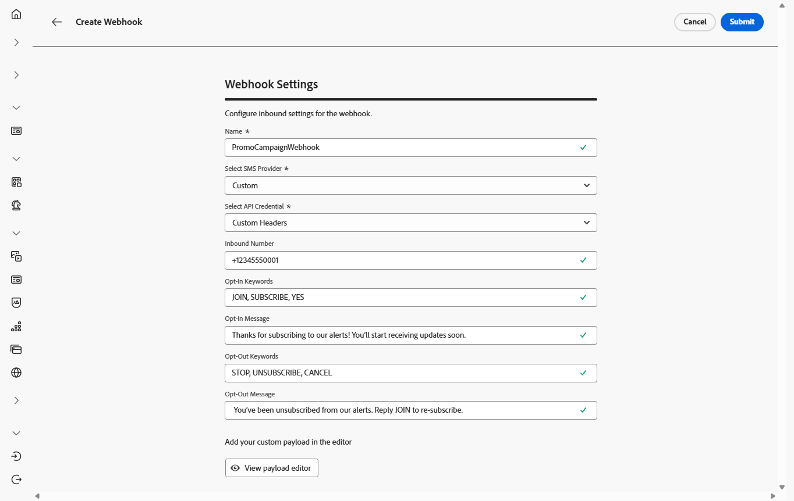
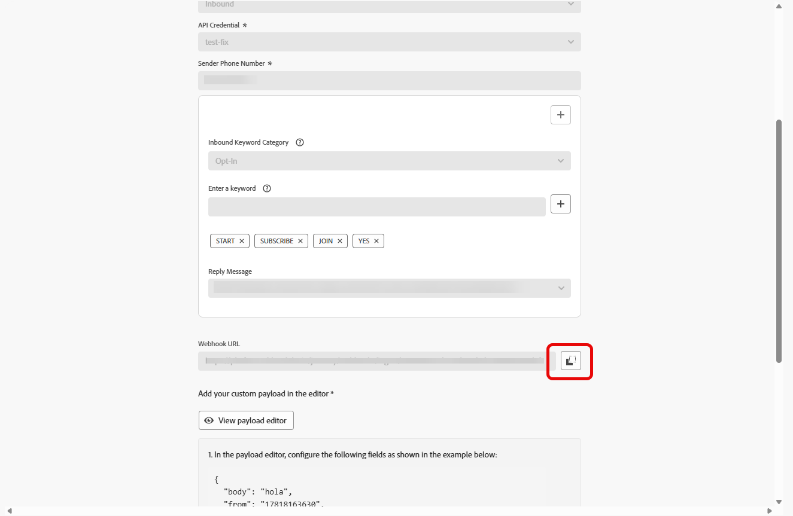

# Webhaak maken {#webhook}

>[!BEGINSHADEBOX]

Als de trefwoorden opt-in of opt-out niet worden opgegeven, worden standaardtoestemmingsberichten gebruikt om de privacy van de gebruiker te respecteren. Als u aangepaste trefwoorden toevoegt, worden de standaardwaarden automatisch genegeerd.

**Standaardsleutelwoorden:**

* **Opt-binnen**: ABONNEMENT, JA, ONSTOP, BEGIN, DOORGAAN, HERVATTEN, BEGINNEN
* **Opt-out**: STOP, SLUIT, ANNULEREN, EINDE, ONABONNEMENT, GEEN
* **Hulp**: HELP

>[!ENDSHADEBOX]

Zodra uw API geloofsbrieven met succes zijn gecreeerd, kunt u Webhooks nu vormen om binnenkomende reacties voor het beheren van opt-in en opt-out toestemming te vangen, en leveringsrapporten zoals lees ontvangstbewijzen te ontvangen waar beschikbaar.

Wanneer u een webhaak instelt, kunt u het doel ervan definiëren op basis van het type gegevens dat u wilt vastleggen:

* **[!UICONTROL Inbound]**: gebruik deze optie als u toestemmingsreacties, zoals opt-ins of opt-outs, wilt vangen en gebruikersvoorkeur verzamelt.

* **[!UICONTROL Feedback]**: Kies deze optie om bezorgings- en betrokkenheidsgebeurtenissen, inclusief leesontvangstbewijzen en gebruikersinteracties, bij te houden ter ondersteuning van rapportage en analyse.

Blader door de onderstaande tabbladen, afhankelijk van uw SMS-providers:

>[!BEGINTABS]

>[!TAB  Douane ]

1. Navigeer in de linkertrack naar **[!UICONTROL Administration]** `>` **[!UICONTROL Channels]** , selecteer het menu **[!UICONTROL SMS Webhooks]** onder **[!UICONTROL SMS settings]** en klik op de knop **[!UICONTROL Create Webhook]** .

   {zoomable="yes"}

1. Configureer uw WebHaak-instellingen, zoals hieronder wordt beschreven:

   * **[!UICONTROL Name]**: ga een naam voor uw Webhaak in.

   * **[!UICONTROL Select SMS vendor]**: Aangepast.

   * **[!UICONTROL Type]**: Binnenkomend.

   * **[!UICONTROL API credentials]**: Kies van drop-down u [ eerder gevormde API geloofsbrieven ](sms-configuration-custom.md#api-credential).

   * **[!UICONTROL Sender Phone Number &#x200B;]**: ga het de telefoonaantal van de Afzender in &#x200B; u voor uw mededelingen wilt gebruiken.

     {zoomable="yes"}

1. Klik op  om trefwoordencategorieën toe te voegen en configureer deze afhankelijk van uw SMS-provider:

   * **[!UICONTROL Inbound Keyword Category]**: Kies de trefwoordcategorieën **[!UICONTROL Opt-In]** , **[!UICONTROL Opt-Out]** , **[!UICONTROL Double Opt-In]** , **[!UICONTROL Help]** of **[!UICONTROL Custom]** .

   * **[!UICONTROL Enter a keyword]**: voer de standaardtrefwoorden of aangepaste trefwoorden in die het bericht automatisch activeren. Klik op  om meerdere trefwoorden toe te voegen.

     Gebruik voor **[!UICONTROL Custom keyword]** trefwoorden die geen betrekking hebben op toestemming, voor handelingen op basis van batchverwerking tijdens een rit.

   * **[!UICONTROL Reply Message]**: selecteer in het keuzemenu de aangepaste reactie die automatisch wordt verzonden.

   * **[!UICONTROL Fuzzy Opt-out]**: Schakel deze optie in om een automatisch antwoord te verzenden wanneer een bijna-overeenkomend uitschakeltrefwoord wordt gevonden.

   {zoomable="yes"}

1. Voer automatisch een **[!UICONTROL Default Reply Message]** in die wordt verzonden wanneer een binnenkomend bericht niet overeenkomt met een geconfigureerd trefwoord of een geconfigureerde categorie.

1. Klik op **[!UICONTROL View payload editor]** om uw aanvraag te valideren en aan te passen.

   U kunt uw lading dynamisch personaliseren gebruikend profielattributen, en ervoor zorgen wordt de nauwkeurige gegevens verzonden voor verwerking en reactiegeneratie met de hulp van ingebouwde hulpfuncties.

1. Klik **[!UICONTROL Submit]** wanneer u de configuratie van uw Webhaak voltooide.

1. Als u een **[!UICONTROL Feedback]** webhaak wilt maken, voert u dezelfde stappen uit als hierboven, en selecteert u **[!UICONTROL Feedback]** als uw webhaak **[!UICONTROL Type]** .

1. Vanuit het menu **[!UICONTROL Webhooks]** kunt u bestaande websites bewerken of verwijderen, of de **[!UICONTROL Webhook URL]** openen en kopiëren voor integratie met uw SMS-provider.

   {zoomable="yes"}

Na het creëren van en het vormen van de montages voor Webhaak, moet u nu a [ kanaalconfiguratie ](sms-configuration-surface.md) voor de berichten van SMS tot stand brengen.

Zodra gevormd, kunt u hefboomwerking alle uit-van-de-doos kanaalmogelijkheden zoals bericht creatie, verpersoonlijking, verbinding het volgen, en rapportering.

>[!TAB  Infobip ]

1. Navigeer in de linkertrack naar **[!UICONTROL Administration]** `>` **[!UICONTROL Channels]** , selecteer het menu **[!UICONTROL SMS Webhooks]** onder **[!UICONTROL SMS settings]** en klik op de knop **[!UICONTROL Create Webhook]** .

   {zoomable="yes"}

1. Configureer uw WebHaak-instellingen, zoals hieronder wordt beschreven:

   * **[!UICONTROL Name]**: ga een naam voor uw Webhaak in.

   * **[!UICONTROL Select SMS vendor]**: Infobip.

   * **[!UICONTROL Type]**: Binnenkomend.

   * **[!UICONTROL API credentials]**: Kies van drop-down u [ eerder gevormde API geloofsbrieven ](sms-configuration-infobip.md#api-credential).

   * **[!UICONTROL Sender Phone Number &#x200B;]**: ga het de telefoonaantal van de Afzender in &#x200B; u voor uw mededelingen wilt gebruiken.

     {zoomable="yes"}

1. Klik op  om trefwoordencategorieën toe te voegen en configureer deze afhankelijk van uw SMS-provider:

   * **[!UICONTROL Inbound Keyword Category]**: Kies de trefwoordcategorieën **[!UICONTROL Opt-In]** , **[!UICONTROL Opt-Out]** , **[!UICONTROL Double Opt-In]** , **[!UICONTROL Help]** of **[!UICONTROL Custom]** .

   * **[!UICONTROL Enter a keyword]**: voer de standaardtrefwoorden of aangepaste trefwoorden in die het bericht automatisch activeren. Klik op  om meerdere trefwoorden toe te voegen.

     Gebruik voor **[!UICONTROL Custom keyword]** trefwoorden die geen betrekking hebben op toestemming, voor handelingen op basis van batchverwerking tijdens een rit.

   * **[!UICONTROL Reply Message]**: selecteer in het keuzemenu de aangepaste reactie die automatisch wordt verzonden.

   * **[!UICONTROL Fuzzy Opt-out]**: Schakel deze optie in om een automatisch antwoord te verzenden wanneer een bijna-overeenkomend uitschakeltrefwoord wordt gevonden.

   {zoomable="yes"}

1. Voer automatisch een **[!UICONTROL Default Reply Message]** in die wordt verzonden wanneer een binnenkomend bericht niet overeenkomt met een geconfigureerd trefwoord of een geconfigureerde categorie.

1. Klik **[!UICONTROL Submit]** wanneer u de configuratie van uw Webhaak voltooide.

1. Als u een **[!UICONTROL Feedback]** webhaak wilt maken, voert u dezelfde stappen uit als hierboven, en selecteert u **[!UICONTROL Feedback]** als uw webhaak **[!UICONTROL Type]** .

1. Vanuit het menu **[!UICONTROL Webhooks]** kunt u bestaande websites bewerken of verwijderen, of de **[!UICONTROL Webhook URL]** openen en kopiëren voor integratie met uw SMS-provider.

   {zoomable="yes"}

Na het creëren van en het vormen van de binnenkomende montages voor Webhaak, moet u nu a [ kanaalconfiguratie ](sms-configuration-surface.md) voor de berichten van SMS tot stand brengen.

Zodra gevormd, kunt u hefboomwerking alle uit-van-de-doos kanaalmogelijkheden zoals bericht creatie, verpersoonlijking, verbinding het volgen, en rapportering.

>[!TAB  Sinch ]

1. Navigeer in de linkertrack naar **[!UICONTROL Administration]** `>` **[!UICONTROL Channels]** , selecteer het menu **[!UICONTROL SMS Webhooks]** onder **[!UICONTROL SMS settings]** en klik op de knop **[!UICONTROL Create Webhook]** .

   {zoomable="yes"}

1. Configureer uw WebHaak-instellingen, zoals hieronder wordt beschreven:

   * **[!UICONTROL Name]**: ga een naam voor uw Webhaak in.

   * **[!UICONTROL Select SMS vendor]**: Sinch.

   * **[!UICONTROL Type]**: Binnenkomend.

   * **[!UICONTROL API credentials]**: Kies van drop-down u [ eerder gevormde API geloofsbrieven ](sms-configuration-sinch.md#create-api).

   * **[!UICONTROL Sender Phone Number &#x200B;]**: ga het de telefoonaantal van de Afzender in &#x200B; u voor uw mededelingen wilt gebruiken.

     {zoomable="yes"}

1. Klik op  om trefwoordencategorieën toe te voegen en configureer deze afhankelijk van uw SMS-provider:

   * **[!UICONTROL Inbound Keyword Category]**: Kies de trefwoordcategorieën **[!UICONTROL Opt-In]** , **[!UICONTROL Opt-Out]** , **[!UICONTROL Double Opt-In]** , **[!UICONTROL Help]** of **[!UICONTROL Custom]** .

   * **[!UICONTROL Enter a keyword]**: voer de standaardtrefwoorden of aangepaste trefwoorden in die het bericht automatisch activeren. Klik op  om meerdere trefwoorden toe te voegen.

     Gebruik voor **[!UICONTROL Custom keyword]** trefwoorden die geen betrekking hebben op toestemming, voor handelingen op basis van batchverwerking tijdens een rit.

   * **[!UICONTROL Reply Message]**: selecteer in het keuzemenu de aangepaste reactie die automatisch wordt verzonden.

   * **[!UICONTROL Fuzzy Opt-out]**: Schakel deze optie in om een automatisch antwoord te verzenden wanneer een bijna-overeenkomend uitschakeltrefwoord wordt gevonden.

   {zoomable="yes"}

1. Voer automatisch een **[!UICONTROL Default Reply Message]** in die wordt verzonden wanneer een binnenkomend bericht niet overeenkomt met een geconfigureerd trefwoord of een geconfigureerde categorie.

1. Klik **[!UICONTROL Submit]** wanneer u de configuratie van uw Webhaak voltooide.

1. In het **[!UICONTROL Webhooks]** menu, klik het  om uw Webhaak te schrappen.

1. Als u de bestaande configuratie wilt wijzigen, zoekt u de gewenste Webhaak en klikt u op de optie **[!UICONTROL Edit]** om de gewenste wijzigingen aan te brengen.

1. Open en kopieer uw nieuwe **[!UICONTROL Webhook URL]** vanuit uw eerder verzonden **[!UICONTROL Webhook]** .

   {zoomable="yes"}

Na het creëren van en het vormen van de binnenkomende montages voor Webhaak, moet u nu a [ kanaalconfiguratie ](sms-configuration-surface.md) voor de berichten van SMS tot stand brengen.

Zodra gevormd, kunt u hefboomwerking alle uit-van-de-doos kanaalmogelijkheden zoals bericht creatie, verpersoonlijking, verbinding het volgen, en rapportering.

<!--
>[!TAB Twilio]

1. In the left rail, navigate to **[!UICONTROL Administration]** `>` **[!UICONTROL Channels]**, select the **[!UICONTROL SMS Webhooks]** menu under **[!UICONTROL SMS settings]**, and click the **[!UICONTROL Create Webhook]** button.

    {zoomable="yes"}

1. Configure your Webhook Settings, as detailed below:

    * **[!UICONTROL Name]**: Enter a name for your Webhook.

    * **[!UICONTROL Select SMS vendor]**: Twilio.

    * **[!UICONTROL Type]**: Inbound.

    * **[!UICONTROL API credentials]**: Choose from the drop-down you [previously configured API credentials](sms-configuration-twilio.md#create-api).

    * **[!UICONTROL Sender Phone Number ​]**: Enter the Sender phone number ​you want to use for your communications.
        
1. Click  to add your keywords categories, then, configure them depending on your SMS provider:

    * **[!UICONTROL Inbound Keyword Category]**: Choose your keyword categories either **[!UICONTROL Opt-In]**, **[!UICONTROL Opt-Out]**, **[!UICONTROL Double Opt-In]**, **[!UICONTROL Help]** or **[!UICONTROL Custom]**. 

    * **[!UICONTROL Enter a keyword]**: Enter the default or custom keywords that will automatically trigger your message. Click  to add multiple keywords.

        For **[!UICONTROL Custom keyword]**, use non-consent–related keywords for batch-based actions within a journey.

    * **[!UICONTROL Reply Message]**: Select from the drop-down the custom response that is automatically sent.

    * **[!UICONTROL Fuzzy Opt-out]**: Enable this option to send an automatic reply when a near-match opt-out keyword is detected.

1. Enter a **[!UICONTROL Default Reply Message]** automatically sent when an inbound message does not match any configured keyword or category.

1. Click **[!UICONTROL Submit]** when you finished the configuration of your Webhook.

1. In the **[!UICONTROL Webhooks]** menu, click the  to delete your Webhook.

1. To modify existing configuration, locate the desired Webhook and click the **[!UICONTROL Edit]** option to make the necessary changes.

1. Access and copy your new **[!UICONTROL Webhook URL]** from your previously submitted **[!UICONTROL Webhook]**.

After creating and configuring the inbound settings for the Webhook, you now need to create a [channel configuration](sms-configuration-surface.md) for SMS messages. 

Once configured, you can leverage all out-of-the-box channel capabilities such as message authoring, personalization, link tracking, and reporting.
-->

>[!ENDTABS]

## Hoe kan ik-video {#video}

>[!VIDEO](https://video.tv.adobe.com/v/3431625)
