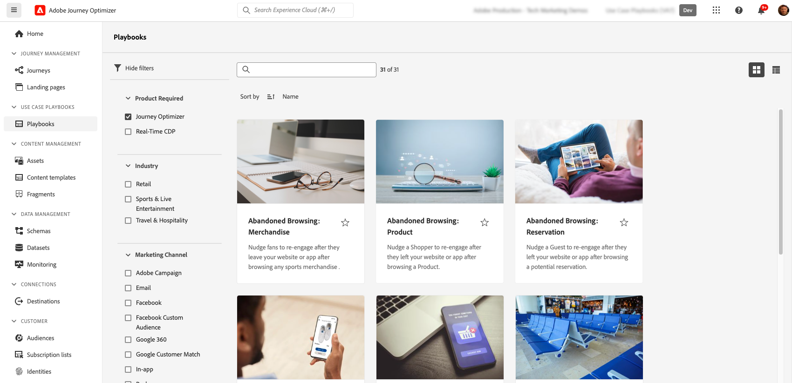

# AI en intelligente functies {#ai-features}

Adobe Journey Optimizer maakt gebruik van de kracht van kunstmatige intelligentie en het leren van machines om u te helpen uitzonderlijke klantervaringen te creëren, te optimaliseren en te leveren. Van het genereren van gepersonaliseerde inhoud tot het voorspellen van optimale verzendtijden, stroomlijnen AI-mogelijkheden uw workflow en maximaliseren de impact. De Playbooks van het Geval van het gebruik verstrekken pre-gebouwde malplaatjes om gemeenschappelijke marketing scenario&#39;s snel uit te voeren.

## AI-assistent {#ai-assistant}

AI Assistant is je gespreksgids voor Adobe Journey Optimizer. Met dit programma krijgt u direct antwoorden op productfuncties, inzichten in de werking van uw reizen en kunt u gemakkelijker door het platform navigeren.

### AI-assistent openen

Klik op het pictogram AI-assistent in de bovenste balk om het hulpdeelvenster aan de rechterkant van het scherm te openen.

>[!IMPORTANT]
>
>U moet met de [&#x200B; Generatieve AI Richtlijnen van de Gebruiker van Adobe Experience Cloud &#x200B;](https://experienceleague.adobe.com/nl/docs/experience-platform/ai-assistant/home){target="_blank"} akkoord gaan alvorens AI Medewerker te gebruiken.

### Wat kan AI Assistant doen

**Kennis van het Product** - stel vragen over de eigenschappen en de concepten van Adobe Journey Optimizer:

* &quot;Hoe kan ik een campagne opzetten in Adobe Journey Optimizer?&quot;
* &quot;Hoe maak ik een aangepaste handeling voor reizen?&quot;
* &quot;Hoeveel levende activiteiten kan ik in één zandbak hebben?&quot;

**Operationele Inzichten (Beta)** - krijg informatie in real time over uw reizen:

* &quot;Hoeveel reizen heb ik?&quot;
* &quot;Geef me een lijst van alle geplande reizen&quot;
* &quot;Hoeveel reizen zijn er gemaakt in de afgelopen 7 dagen?&quot;

>[!NOTE]
>
>De operationele inzichten zijn momenteel slechts beschikbaar voor **Schavens** en wijzen op gegevens van uw huidige zandbak.

### AI-assistent gebruiken

1. Voer uw vraag in in het tekstveld onder aan het deelvenster
2. Druk op Enter om uw query te verzenden
3. Het door AI gegenereerde antwoord bekijken
4. Klik **tonen bronnen** aan toegang verwante documentatie
5. Miniaturen omhoog/omlaag gebruiken om de responskwaliteit te beoordelen

{width="40%" align="left"}

[&#x200B; Leer meer over AI Medewerker in Experience Platform &#x200B;](https://experienceleague.adobe.com/nl/docs/experience-platform/ai-assistant/home){target="_blank"}

## Geavanceerde AI-agents voor optimalisatie van reizen {#ai-agents}

Adobe Journey Optimizer bouwt voort op de conversatiemogelijkheden van AI Assistant en biedt gespecialiseerde AI-agents die diepgaande analyses en activeerbare aanbevelingen bieden voor het optimaliseren en experimenteren van reizen.

### Journey Agent {#journey-agent}

Journey Agent beschikt over twee vaardigheden in AI Assistant: Analyseren en maken. Gebruik deze programma&#39;s om bestaande reizen te optimaliseren of nieuwe ritten te maken op basis van vragen over natuurlijke talen.

+++**Vereiste Toestemmingen**

* **de Reizen van de Mening** - de Inzichten van de mening in reizen direct in AI Medewerker
* **leidt de Reizen** - creeer nieuwe reizen direct in AI Medewerker
* **Segmenten van de Mening** - de inzichten van de mening in publiek en onderzoek bestaand publiek
* **beheer Segmenten** - creeer direct nieuw publiek in AI Medewerker
* **de Gebeurtenissen van de Reis van de Mening, Gegevensbronnen en Acties** - Vereist voor de Create vaardigheid om reisgebeurtenissen en douaneacties te zoeken

+++

#### Journey Analyse Skill {#journey-analyze-skill}

De [&#x200B; Reis analyseert Agent &#x200B;](https://experienceleague.adobe.com/nl/docs/experience-cloud-ai/experience-cloud-ai/agents/ajo-agent#journey-create-agent-skill-overview-and-user-guide){target="_blank"} helpt u vervoersprestaties door natuurlijke taalanalyse optimaliseren:

+++**Zeer belangrijke Mogelijkheden**

* **Analyse van de Fallout van de Reis** - identificeer waar en waarom de klanten tijdens reizen wegvallen, terugtrekkeringspatronen ontdekken
* **de Opsporing van de Overlap van het publiek** - analyseert publieksoverlap over veelvoudige reizen om vermoeidheid te verhinderen over-richt
* **de Detectie van het Conflict van het Programma** - identificeer timingconflicten tussen geplande reizen die het zelfde publiek richten
* **Operationele Inzichten** - krijg op snelle-gebaseerde inzichten zoals &quot;toon me alle levende reizen&quot;of &quot;die het publiek in meer dan rits wordt gebruikt&quot;

+++

+++**Prompts van de Steekproef**

* &quot;Een falloutanalyse uitvoeren voor de reis \[Naam reis\]&quot;
* &quot;Zijn er planningsconflicten voor de reis \[Naam reis\]?&quot;
* &quot;Toon me publiek overlappende conflicten voor reis \[Naam reis\]&quot;
* &quot;Welk publiek wordt in meer dan vijf reizen gebruikt?&quot;

+++

#### Reis maken Vaardigheid {#journey-create-skill}

De [&#x200B; Reis leidt Agent &#x200B;](https://experienceleague.adobe.com/nl/docs/experience-cloud-ai/experience-cloud-ai/agents/ajo-agent#journey-analyze-agent-skill-overview-and-user-guide){target="_blank"} hulp u reizen van natuurlijke taalherinneringen bouwt, die uw doelstellingen in gestructureerde reisconfiguraties vertalen:

+++**Zeer belangrijke Mogelijkheden**

* **Natuurlijke Reis van de Taal creatie** - beschrijf uw gewenste reis en heb het automatisch gecreeerd
* **gebeurtenis- en publiek-Gebaseerde Begin** - creeer gebeurtenis-teweeggebrachte, op publiek-gebaseerde, zaken-gebeurtenis, of de reizen van de publiekskwalificatie
* **Voorwaardelijke Logica** - Bouw gespleten wegen die op klantenattributen of gedrag worden gebaseerd
* **Meerkanaals Overseinen** - voeg e-mail, duw, en de acties van SMS toe
* **Plannend** - vorm begindata en timing tussen stappen

+++

+++**Prompts van de Steekproef**

* &quot;Maak een reis die begint wanneer een klant online een aankoop doet en een pushmelding verzendt.&quot;
* &quot;Bouw een reis die gericht is op het publiek van mijn dagelijkse wandelaars met drie e-mails over twee weken, vanaf 12/20.&quot;
* &quot;Maak een reis die begint wanneer een gebruiker mijn winkelplaats ingaat en die erop volgt gebaseerd of zij een geldig e-mailadres hebben.&quot;

+++

### Experimentatieagent {#experimentation-agent}

De [&#x200B; Agent van de Experimentatie &#x200B;](https://experienceleague.adobe.com/nl/docs/experience-cloud-ai/experience-cloud-ai/agents/agent-experiment){target="_blank"} moderniseert hoe u digitale experimenten over websites, e-mail, duwberichten, en toepassingen in werking stelt en beheert:

+++**Zeer belangrijke Mogelijkheden**

* **Analyse van Prestaties** - Duidelijke mening van wat in experimenten gebeurde
* **Generatie van Inzichten** - Verklaring van waarom de resultaten voorkwamen
* **Ontdekking van Kansen** - Begeleiding op volgende te nemen acties
* **Analyse van de Inhoud** - onderzoek overseinenelementen om te begrijpen waarom bepaalde behandelingen anderen overtroffen
* **generatie van de Aanbeveling** - stel nieuwe behandelingen of aanpassingen voor die op inzichten worden gebaseerd

+++

+++**Prompts van de Steekproef**

* &quot;Welke experimenten worden uitgevoerd voor \[naam campagne\]?&quot;
* &quot;Voor mijn \[naam van het experiment\], welke behandeling leidt?&quot;
* &quot;Wat hebben we geleerd van \[Naam van expert\]?&quot;
* &quot;Wat raad je aan om na dit experiment te doen?&quot;
* &quot;Welke gemeenschappelijke patronen komen uit recente tests voort?&quot;

+++

+++**Vereiste Toestemmingen**

* **Experimenten van de Mening** - de Inzichten van de Mening in experimenten in Medewerker AI
* **beheert Experimentele Meta-gegevens** - creeer nieuwe experimenten in Medewerker AI

**Nota:** Beschikbaar met de vergunning van Journey Optimizer Experimentation Accelerator.

+++

### Aanvullende AI-agents

**Audience Agent** - voor gesprekspublieksonderzoek en beheer over Adobe Experience Platform, met inbegrip van dubbele opsporing en grootte het volgen. [&#x200B; leer meer over Audience Agent &#x200B;](https://experienceleague.adobe.com/nl/docs/experience-cloud-ai/experience-cloud-ai/agents/audience){target="_blank"}

**Agent Orchestrator** - coördineert veelvoudige gespecialiseerde agenten om complexe, multi-step marketing uitdagingen op te lossen. Het orchestrator bepaalt automatisch welke agenten om hun werk efficiënt te impliceren en te rangschikken. [&#x200B; leer meer over Agent Orchestrator &#x200B;](https://experienceleague.adobe.com/nl/docs/experience-cloud-ai/experience-cloud-ai/agents/agent-orchestrator){target="_blank"}

## Genereren van inhoud op basis van AI {#content-generation}

Gebruik generatieve AI om inhoud op meerdere kanalen te maken en aan te passen, zodat uw content sneller wordt gemaakt en de consistentie van uw merk behouden blijft. AI Medewerker voor inhoudsgeneratie is beschikbaar voor [&#x200B; e-mail &#x200B;](../email/get-started-email.md), [&#x200B; duw berichten &#x200B;](../push/get-started-push.md), [&#x200B; SMS &#x200B;](../sms/get-started-sms.md), en [&#x200B; Web &#x200B;](../web/get-started-web.md) ervaringen - het helpen u onderwerplijnen, lichaamstekst, beelden, en volledige berichtvariaties produceren.

### Belangrijkste kenmerken

* **Volledige Generatie van de Inhoud** - produceer volledige inhoudservaringen (tekst en beelden) in één stroom voor e-mail, Web, landende pagina&#39;s, en duw. [&#x200B; produceer volledige inhoud met Medewerker AI &#x200B;](../content-management/generative-full-content.md)
* **Generatie van de Tekst** - creeer het dwingende exemplaar dat op uw merkstem en doelstellingen wordt gebaseerd. [&#x200B; produceer tekst met AI &#x200B;](../content-management/generative-text.md)
* **de Generatie van het Beeld** - produceer douanebeelden gebruikend Adobe Firefly. [&#x200B; produceer beelden met AI &#x200B;](../content-management/generative-image.md)
* **de Variaties van de Inhoud** - produceer veelvoudige variaties voor het testen A/B. [&#x200B; experiment van de Inhoud met AI &#x200B;](../content-management/generative-experimentation.md)
* **de Uitlijning van het Merk** - verzekert geproduceerde inhoud uw merkrichtlijnen aanpast. [&#x200B; evalueer brandgroepering &#x200B;](../content-management/brands-score.md)
* **de Steun van het Malplaatje** - hefboomwerking uw bestaande e-mailmalplaatjes. [&#x200B; Werk met inhoudsmalplaatjes &#x200B;](../content-management/content-templates.md)

### Aanbevolen procedures

* **ben specifiek** - verstrek duidelijke, gedetailleerde herinneringen voor betere resultaten. [&#x200B; leer snelle beste praktijken &#x200B;](../content-management/ai-assistant-prompting-guide.md)
* **uploadt merkactiva** - Gebruik PDFs, beelden, of de dossiers van het PIT (maximum 50MB) om merkconsistentie te handhaven
* **de douanesjablonen van het Gebruik** - de merkspecifieke malplaatjes van de hefboomwerking met maximaal 8-10 beelden
* **verstrekken terugkoppel** - de output van het Tarief helpen de modellen AI verbeteren
* **Overzicht alle inhoud** - herzie altijd AI-Gegenereerde inhoud voor nauwkeurigheid alvorens te publiceren

[Meer informatie over het genereren van AI-inhoud](../content-management/gs-generative.md)

## Send-Time optimalisatie {#send-time-optimization}

Gebruik AI om de optimale tijd te voorspellen om elk bericht te verzenden dat op individuele patronen van het klantengedrag wordt gebaseerd, die overeenkomst maximaliseren.

### Hoe het werkt

De Optimalisering van de Send-Tijd analyseert historische betrokkenheidsgegevens (opent en klikt) om te voorspellen wanneer elke klant het meest waarschijnlijk met uw berichten in dienst zal nemen. Het systeem plant automatisch levering binnen uw gespecificeerd tijdvenster.

### Wanneer gebruikt u het

| Best voor | Niet aanbevolen voor |
|----------|---------------------|
| Marketingcampagnes en nieuwsbrieven | Tijdgevoelige operationele berichten (orderbevestigingen, wachtwoordterugstellen) |
| Promotieberichten | Urgente meldingen (vertragingen in de vlucht, alarmmeldingen in noodgevallen) |
| Educatieve inhoud | Op gebeurtenissen gebaseerde berichten met specifieke tijdsvereisten |
| Betrokkenheidscampagnes | |

[Meer informatie over SendTime Optimization](../building-journeys/send-time-optimization.md)

## AI-modellen voor besluitvorming {#ai-decisioning}

Creeer intelligente rangschikkingsmodellen die automatisch optimaliseren welke aanbiedingen aan elke klant te tonen, die bedrijfsdoelstellingen maximaliseren.

### Modeltypen

**auto-optimalisering** - Leert van klanteninteractie om aanbiedingsprestaties in tijd automatisch te verbeteren

**Gepersonaliseerde optimalisering** - gebruikt de attributen en het gedrag van het klantenprofiel om de beste aanbieding voor elk individueel te voorspellen

### Vereisten

* Ten minste 2 aanbiedingen met voldoende interactiegegevens:
   * Meer dan 100 weergavegebeurtenissen
   * Gebeurtenissen van 5 of meer klikken
   * Within the last 14 days
* Maximaal 5 AI-classificatiemodellen per organisatie

[&#x200B; Leer meer over AI modellen voor besluit &#x200B;](../experience-decisioning/ranking/ai-models.md) | [&#x200B; creeer AI het rangschikken modellen &#x200B;](../experience-decisioning/ranking/create-ai-models.md)

## Experimenteer met inhoud met AI {#experimentation}

**de Versneller van de Experimenteer** helpt u experimenten sneller met AI-gedreven inzichten en aanbevelingen in werking stellen, die het winnen inhoudsvariaties identificeren sneller.

Belangrijkste mogelijkheden:

* Meerdere inhoudvariaties automatisch genereren
* AI-aanbevelingen ontvangen voor het ontwerpen van experimenten
* Vroege indicatoren van prestatietrends krijgen
* Tijd versnellen naar statistische significantie

[Meer informatie over de Versneller van de Experimenteer](../content-management/experiment-accelerator-gs.md)

## Playbooks voor gebruiksscenario&#39;s {#playbooks}

De Playbooks van het Geval van het gebruik zijn vooraf gebouwde werkschema&#39;s die u helpen gemeenschappelijke marketing scenario&#39;s snel uitvoeren. Elk playbook omvat gebruiksklare reizen, berichten, schema&#39;s, en segmenten.

### Hoe Playbooks werken

1. **doorblader** de playbook bibliotheek om gebruiksgevallen te vinden die uw doelstellingen aanpassen
2. **laat** playbook toe om alle vereiste middelen automatisch te produceren
3. **pas** de geproduceerde activa aan om uw merk en vereisten aan te passen
4. **stel** op om in een ontwikkelingszandbak te produceren of te testen

### Beschikbare afspeelboeken

Blader in Journey Optimizer naar veelgebruikte scenario&#39;s, zoals:

* Terugwinning van gekloonde karretjes
* Welkomstserie voor nieuwe klanten
* Overeenkomst na aankoop
* Verjaardag
* Aanwervingscampagnes

+++**Vereisten**

* Sandbox met de juiste machtigingen
* Kanaalconfiguraties voor e-mail, push en/of SMS
* Gebruikersmachtigingen voor het maken van reizen en berichten

+++

[&#x200B; Mening alle beschikbare playbooks &#x200B;](https://experienceleague.adobe.com/docs/experience-platform/use-case-playbooks/playbooks/playbooks-list.html?lang=nl-NL){target="_blank"} | [&#x200B; Leer meer in de documentatie van Experience Platform &#x200B;](https://experienceleague.adobe.com/docs/experience-platform/use-case-playbooks/playbooks/overview.html?lang=nl-NL){target="_blank"}

## Aanvullende AI-mogelijkheden {#additional-capabilities}

### Afbeelding naar HTML Converter

Transformeer statische afbeeldingsontwerpen (JPEG, PNG) in bewerkbare HTML-e-mailsjablonen met behulp van AI-omzettingstechnologie.

[Meer informatie over Afbeelding naar HTML](../content-management/image-to-html.md)

### GenStudio for Performance Marketing

Integreer met Adobe GenStudio for Performance Marketing voor het maken van e-mailinhoud voor AI en het importeren van sjablonen naar Journey Optimizer voor orchestratie. Exporteer Journey Optimizer-sjablonen naar GenStudio, genereer variaties met AI en breng ze terug voor implementatie. (Beperkte beschikbaarheid, alleen e-mailkanaal.)

[Meer informatie over GenStudio](../integrations/genstudio.md)

### Scorebord voor uitlijning van merk

Evalueer hoe goed uw inhoud zich op uw merkrichtlijnen gebruikend AI-Verwerkende het scoren richt die toon, stem, en overseinenconsistentie meet.

[Meer informatie over uitlijning van merken](../content-management/brands-score.md)

## Veelgestelde vragen {#faq}

+++**Welke toestemmingen ik voor AI eigenschappen nodig heb?**

* **[AI Medewerker voor inhoudsgeneratie](#content-generation)** - vereist &quot;Inhoud&quot;toestemming produceren
* **[AI Medewerker](#ai-assistant)** productkennis - vereist akkoord met de Generatieve Richtlijnen van de Gebruiker van Adobe AI
* **[Reis analyseert Agent](#journey-agent)** - vereist de toestemmingen van de Reizen van de Mening/van Beheren en van de Segmenten van de Mening/van Beheren
* **[Reis creeert Agent](#journey-create-agent)** - vereist leidt Reizen, de Gebeurtenissen van de Reis van de Mening/Gegevensbronnen/Acties, de Segmenten van de Mening, en beheert de toestemmingen van Segmenten
* **[de Agent van de Experimentatie](#experimentation-agent)** - vereist de Experimenten van de Mening en beheert de toestemmingen van Meta-gegevens van de Experimentatie

Alle AI-agents hebben toegang tot AI Assistant en toestemming voor Adobe Experience Cloud Generative AI-gebruikersrichtlijnen.

[Meer informatie over machtigingen](../administration/ootb-permissions.md)

+++

+++**is AI-Gegenereerde inhoud altijd nauwkeurig?**

Nee. Herzie altijd [&#x200B; AI-Gegenereerde inhoud &#x200B;](#content-generation) voor nauwkeurigheid en merkgeschiktheid. Gebruik de feedbackgereedschappen (duimen omhoog/omlaag) om de modellen te helpen verbeteren.

+++

+++**wat zijn de belangrijkste beperkingen?**

* **[Send-Time Optimalisering](#send-time-optimization)** - slechts beschikbaar voor e-mail en duw in reizen; vereist de opleidingsperiode van 30 dagen
* **[AI Inhoudsgeneratie](#content-generation)** - niet beschikbaar voor Directe Post, de Kaarten van de Inhoud, LIJN, of WhatsApp
* **[AI rangschikkende Modellen](#ai-decisioning)** - Maximum 5 modellen per organisatie; vereist minimuminteractiegegevens

+++

+++**hoe ik toegang tot deze eigenschappen krijg?**

De meeste AI-functies worden opgenomen in Adobe Journey Optimizer. Sommige mogelijkheden zoals [&#x200B; Send-Time Optimalisering &#x200B;](#send-time-optimization) of [&#x200B; AI Agenten &#x200B;](#ai-agents) kunnen enablement door Adobe vereisen. Neem contact op met uw Adobe-vertegenwoordiger voor meer informatie over uw specifieke licentie en beschikbare functies.

+++
