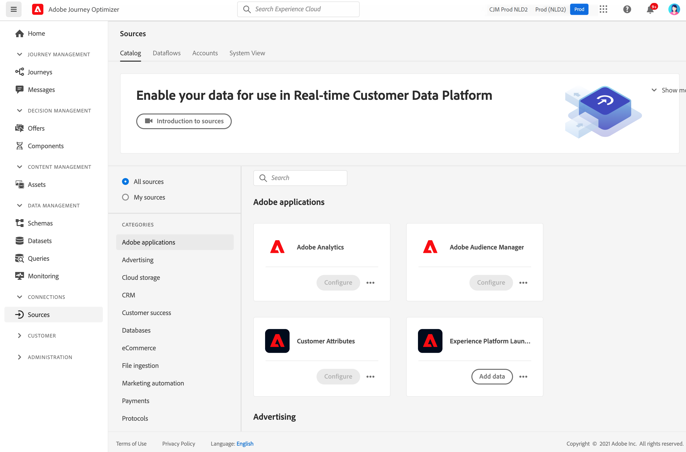

# Aan de slag met Bronconnectors {#sources-gs}

Adobe Journey Optimizer staat toe dat gegevens uit externe bronnen worden opgenomen terwijl u de mogelijkheid krijgt om inkomende gegevens te structureren, te labelen en te verbeteren met behulp van de services van het Platform. U kunt gegevens uit diverse bronnen invoeren, zoals Adobe-toepassingen, opslag in de cloud, databases en vele andere.

In deze video ziet u hoe u bronconnectors kunt configureren in Journey Optimizer:

>[!VIDEO](https://video.tv.adobe.com/v/335919?quality=12)

Leer meer hoe te om gegevens van externe bronnen met Bron schakelaars in te nemen [Adobe Experience Platform-documentatie](https://experienceleague.adobe.com/docs/experience-platform/sources/home.html?lang=nl){target=&quot;_blank&quot;}.
