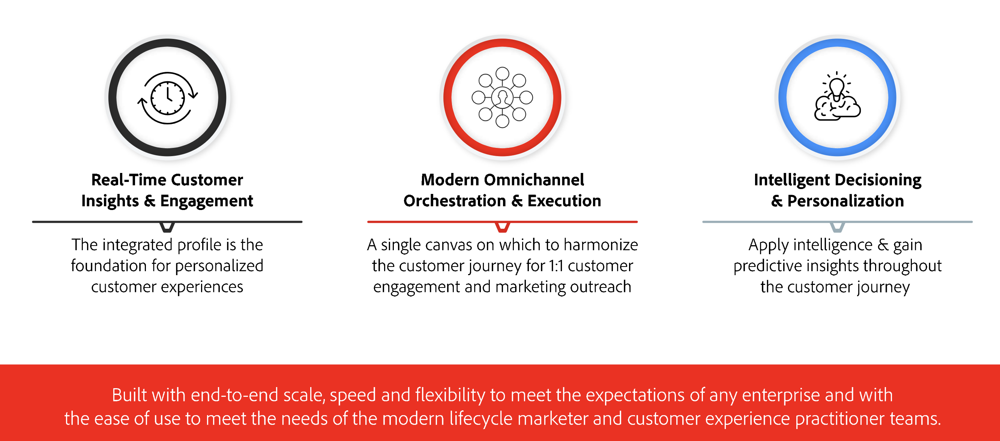

# Aan de slag met Journey Optimizer {#cjm-gs}

## Wat is [!DNL Adobe Journey Optimizer]?{#about-cjm}

[!DNL Adobe Journey Optimizer] helpt bedrijven om verbonden, contextafhankelijke en persoonlijke ervaringen aan hun klanten te bieden. De reis van de klant is het volledige proces van interactie van een klant met het merk, van het eerste ogenblik van contact tot de klant vertrekt. Het begint met de bewustmakingsfase, waarin de klant leert over het merk en begint met het engageren. De klant zal dan verder met het merk communiceren, online en fysieke sites bezoeken, aankopen doen, berichten verzenden of revisies verzenden.

[!DNL Adobe Journey Optimizer] is native gebaseerd op [!DNL Adobe Experience Platform] en combineert een uniform, realtime klantprofiel, een API-eerste open framework, gecentraliseerde offer decisioning en artificieel intelligentie (AI) en computerleren (ML) voor personalisatie en optimalisatie. Met Journey Optimizer kunnen merken op intelligente wijze bepalen wat de volgende beste interactie is met schaal, snelheid en flexibiliteit voor de hele reis van de klant. Met [!DNL Adobe Journey Optimizer] kunnen bedrijven zowel geplande marketingcampagnes (zoals wekelijkse promoties voor een detailhandel) als op maat gesneden individuele communicatie (zoals een pushmelding voor een item dat een klant van een loyauteit-app eerder heeft bekeken) binnen dezelfde toepassing maken en leveren.

➡️ [ ontdekt Journey Optimizer ](https://experienceleague.adobe.com/docs/journey-optimizer-learn/tutorials/introduction-to-journey-optimizer/introduction.html) {target="_blank"} (video)

## Gebruiksscenario’s {#use-cases}

* Marketers kunnen [!DNL Adobe Journey Optimizer] gebruiken om zowel individuele communicatie als op het publiek gebaseerde batchcommunicatie te verzenden. Een kledingwinkel verzendt bijvoorbeeld doorgaans enquêtes na aankoop naar alle klanten die de afgelopen week producten hebben aangeschaft. Als gevolg van het noodweer traden enkele transporten op. Aangezien de klanten niet hun zendingen hebben ontvangen, kan de kledingopslag hen van de geplande klantentevredenheid uitsluiten verzendt en in plaats daarvan een gepersonaliseerde e-mail die voor de vertraging verontschuldigt en een kortingscode met productaanbevelingen aanbiedt die op de vroegere aankopen van de klant worden gebaseerd.

  Marketers kunnen de toepassing ook gebruiken om op gedrag gebaseerde communicatie in real time te verzenden. Bijvoorbeeld, zou de zelfde detailhandelaar een loyale klant kunnen in dienst nemen die de parkeerplaats van de opslag in real time door hen een duw bericht over een trui trekt die terug in voorraad in de grootte van de klant is.

* Niet-marketeers, zoals operatieteams en klantenondersteuning die zich bezighouden met de klantervaring, kunnen [!DNL Adobe Journey Optimizer] gebruiken om diverse taken te beheren, zoals operationele meldingen of zelfs om het instapproces te volgen. Neem bijvoorbeeld een pretpark waar bezoekers van het park een mobiele app downloaden als onderdeel van hun parkervaring. Onderhoudspersoneel kan [!DNL Adobe Journey Optimizer] gebruiken om parkbezoekers op de hoogte te stellen van ritten die momenteel wegens onderhoud zijn gesloten.

## Belangrijkste mogelijkheden {#key-capabilities}

[!DNL Adobe Journey Optimizer] is een flexibele en schaalbare toepassing voor het maken en leveren van persoonlijke, verbonden en actuele ervaringen van klanten in elke app, elk apparaat of elk kanaal.

De belangrijkste mogelijkheden omvatten:

* **Echte Inzichten &amp; Betrokkenheid van de Klant in real time** - een geïntegreerd profiel gebruikt levende gegevens van alle bronnen over klantenaanraakpunten, met inbegrip van gedrag, transactie, financiële, en operationele gegevens om persoonlijke en contextuele ervaringen voor klanten in hun tijd te optimaliseren.

* **Modern Omnichannel Orchestration &amp; Execution** - één enkel canvas waarop om de klantenreis voor 1:1 klantenovereenkomst en marketing te harmoniseren en te optimaliseren klant outach-om brands te helpen meer waarde over de klantenlevenscyclus leveren. De reizen van de klant die in [!DNL Adobe Journey Optimizer] worden ontworpen kunnen dynamisch zijn en gebeurtenis gebaseerd om brands te helpen op signalen in real time reageren evenals die interactie met geplande campagnes te verbinden zodat kunnen de juiste besluiten over welke mededelingen worden gemaakt om een klant te verzenden, wanneer en door welke kanalen.

* **Intelligente Beslissing &amp; Personalization** - de merknamen kunnen gecentraliseerd besluit toepassen en kunstmatige intelligentie en machine het leren opnemen aan configuratieterugzicht door de klantenervaring, makend het gemakkelijker om besluiten te automatiseren en de ervaring op schaal te optimaliseren. Met beslissingsbevoegdheden worden gecentraliseerde aanbiedingen via kanalen op schaal [!DNL Adobe Journey Optimizer] mogelijk gemaakt.

## Architectuur {#architecture}

In het onderstaande diagram leert u de basisarchitectuur van [!DNL Adobe Journey Optimizer] , de integratiepunten en de relatie tussen [!DNL Journey Optimizer] en [!DNL Experience Platform] .

>[!NOTE]
>
> Algemene richtlijnen en procedures voor privacy in Adobe Experience Cloud zijn van toepassing op [!DNL Journey Optimizer] . [ Leer meer over de privacy van Adobe Experience Cloud ](https://www.adobe.com/privacy/experience-cloud.html).
> U moet zich ook bewust zijn van [ Gidsen voor de gegevens van het Profiel van de Klant in real time alvorens ](https://experienceleague.adobe.com/docs/experience-platform/profile/guardrails.html) te beginnen.

>[!MORELIKETHIS]
>
>* [ Belangrijkste stappen ](quick-start.md) te beginnen
>* [ reizen van het Ontwerp en verzend berichten ](../building-journeys/journey-gs.md)
>* [ Levende rapporten ](../reports/live-report.md)
>* [ het Overzicht van de Veiligheid van Journey Optimizer ](https://www.adobe.com/content/dam/cc/en/security/pdfs/AJO_SecurityOverview.pdf) (PDF)
