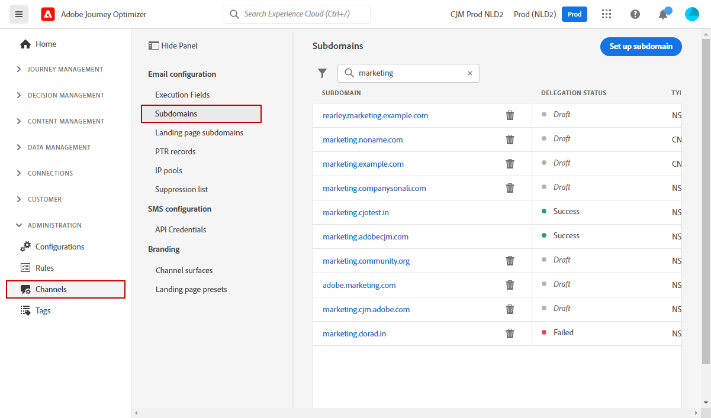

# Aan de slag voor systeembeheerders {#get-started-sys-admins}

Als Beheerder van het a **Systeem**, plaatst u opstelling het milieu van Journey Optimizer en beheert toegang om uw teams toe te laten om efficiënt en veilig te werken. U voert essentiële configuratiestappen uit zodat de [&#x200B; Ingenieur van Gegevens &#x200B;](data-engineer.md), [&#x200B; Ontwikkelaar &#x200B;](developer.md), en [&#x200B; Marketer &#x200B;](marketer.md) kan beginnen met het werken met [!DNL Adobe Journey Optimizer].

Uw primaire verantwoordelijkheden omvatten het instellen van gebruikersgroepen en machtigingen, het maken en beheren van sandboxen voor het partitioneren van gegevens en reizen voor verschillende gebruikersgroepen, en het configureren van leveringskanalen en voorinstellingen voor berichten om consistente branding te garanderen tussen de verschillende berichten en middelen die via Journey Optimizer worden geleverd. U zorgt ervoor dat de juiste mensen toegang hebben tot de juiste capaciteiten en tegelijkertijd de veiligheid en het bestuur behouden.

Deze functies kunnen worden beheerd door **[!UICONTROL Product administrators]** die toegang hebben tot het product Machtigingen. [&#x200B; leer meer over Toestemmingen &#x200B;](../../administration/permissions.md){target="_blank"}.

## Toegang en machtigingen instellen

Voer de volgende stappen uit om toegangsbeheer te configureren:

1. **creeer zandbakken** om uw instanties in afzonderlijke, geïsoleerde virtuele milieu&#39;s te verdelen. **Sandboxes** wordt gecreeerd in [!DNL Journey Optimizer]. Leer meer in de [&#x200B; zandbakken &#x200B;](../../administration/sandboxes.md) sectie.

   >[!NOTE]
   >Als a **Beheerder van het Systeem**, als u niet het **[!UICONTROL Sandboxes]** menu in [!DNL Journey Optimizer] kunt zien, moet u uw toestemmingen bijwerken. Leer hoe te om uw rol op [&#x200B; bij te werken deze pagina &#x200B;](../../administration/permissions.md#edit-product-profile).

1. **begrijp rollen**. Rollen zijn een reeks eenheidrechten die gebruikers toegang tot bepaalde functies of objecten in de interface biedt. Leer meer in de [&#x200B; uit-van-de-doos rollen &#x200B;](../../administration/ootb-product-profiles.md) sectie.

1. **plaats toestemmingen** voor rollen, met inbegrip van **Sandboxes**, en geef toegang tot uw teamleden door hen aan verschillende rollen toe te wijzen. Machtigingen zijn eenheidrechten waarmee u de machtigingen kunt definiëren die aan **[!UICONTROL Role]** zijn toegewezen. Elke toestemming wordt verzameld onder mogelijkheden, bijvoorbeeld Reis of Aanbiedingen, die de verschillende functionaliteiten of voorwerpen in [!DNL Journey Optimizer] vertegenwoordigen. Leer meer in de [&#x200B; niveaus van de Toestemming &#x200B;](../../administration/high-low-permissions.md) sectie.

1. **voorwerp-vlakke toegangsbeheer van het Gebruik** (facultatief). Pas toegangsetiketten op voorwerpen zoals reizen, campagnes, en kanaalconfiguraties toe om te controleren welke gebruikers tot specifieke middelen kunnen toegang hebben. Leer meer over [&#x200B; voorwerp-vlakke toegangsbeheer (OLAC) &#x200B;](../../administration/object-based-access.md).

Bovendien moet u gebruikers toevoegen die toegang tot de Hoofdzaak van Activa aan de **Hoofdzaak van Activa Consumenten** of/en **de Gebruikers van de Hoofdzaak van Activa** rollen nodig hebben. [&#x200B; las meer in de documentatie van de Hoofdzaak van Activa &#x200B;](https://experienceleague.adobe.com/docs/experience-manager-assets-essentials/help/deploy-administer.html?lang=nl-NL){target="_blank"}.

Wanneer u [!DNL Journey Optimizer] voor het eerst opent, beschikt u over een productiesandbox en kunt u een bepaald aantal IP&#39;s toewijzen, afhankelijk van uw contract.

## Kanalen en berichten configureren

Om [&#x200B; Marketers &#x200B;](marketer.md) toe te laten om berichten tot stand te brengen en te verzenden, toegang tot het **BEHEERSings** menu. Blader in het menu **[!UICONTROL Channels]** om de kanaalinstellingen te configureren.

>[!NOTE]
>Als Beheerder van het a **Systeem**, als u niet het **[!UICONTROL Channels]** menu in [!DNL Journey Optimizer] kunt zien, werk uw toestemmingen in het [&#x200B; &#x200B;](../../administration/permissions.md){target="_blank"} product van Toestemmingen bij.

Voer de volgende stappen uit:

1. **de configuraties van het het kanaalconfiguratie van de Opstelling**. Definieer alle technische parameters die vereist zijn voor e-mail, SMS, pushberichten en andere kanalen:

   * Bepaal **montages van het duw- bericht** in zowel [!DNL Adobe Experience Platform] als de Inzameling van Gegevens van Adobe Experience Platform. [Meer informatie](../../push/push-gs.md)

   * Creeer **kanaalconfiguraties** om alle technische parameters te vormen die voor e-mail, SMS, duw, in-app, Web, en andere kanalen worden vereist. [Meer informatie](../../configuration/channel-surfaces.md)

   * Vorm het **kanaal van SMS** aan opstelling alle technische parameters die voor SMS worden vereist. [Meer informatie](../../sms/sms-configuration.md)

   * Beheer het aantal dagen waarin **opnieuw probeert** alvorens e-mailadressen naar de onderdrukkingslijst te verzenden wordt uitgevoerd. [Meer informatie](../../configuration/manage-suppression-list.md)

1. **Afgevaardigde subdomeinen**: voor om het even welk nieuw subdomain dat in Journey Optimizer moet worden gebruikt, zal de eerste stap het moeten afvaardigen. [Meer informatie](../../configuration/about-subdomain-delegation.md)

   

1. **creeer IP pools**: verbeter uw e-mailleverbaarheid en reputatie door IP adressen te groeperen die met uw instantie worden voorzien. [Meer informatie](../../configuration/ip-pools.md)

   

1. **beheert de onderdrukking en de lijsten van gewenste personen**: verbeter uw leveringsbaarheid met onderdrukking en lijsten van gewenste personen

   * A [&#x200B; suppressielijst &#x200B;](../../reports/suppression-list.md) bestaat uit e-mailadressen die u van uw leveringen wilt uitsluiten, omdat het verzenden naar deze contacten uw verzendende reputatie en leveringspercentages zou kunnen kwetsen. U kunt alle e-mailadressen controleren die automatisch van het verzenden in een reis, zoals ongeldige adressen worden uitgesloten, adressen die constant elektronische stuiteren, en uw e-mailreputatie, en ontvangers die een spamklacht van één of andere soort tegen één van uw e-mailberichten negatief zouden kunnen beïnvloeden. Leer hoe te om de [&#x200B; suppressielijst &#x200B;](../../configuration/manage-suppression-list.md) te beheren en [&#x200B; opnieuw probeert &#x200B;](../../configuration/retries.md).

   

   * De [&#x200B; lijst van gewenste personen &#x200B;](../../configuration/allow-list.md) laat u toe om individuele e-mailadressen of domeinen te specificeren die de enige ontvangers of domeinen zullen zijn die worden gemachtigd om de e-mails te ontvangen u van een specifieke zandbak verzendt. Dit kan voorkomen dat u per ongeluk e-mailberichten naar de adressen van de echte klant stuurt wanneer u zich in een testomgeving bevindt. Leer hoe te [&#x200B; om de lijst van gewenste personen &#x200B;](../../configuration/allow-list.md) toe te laten.

   Leer meer over leveringsbaarheidsbeheer in [!DNL Adobe Journey Optimizer] [&#x200B; op deze pagina &#x200B;](../../reports/deliverability.md).

## Aanvullende mogelijkheden

Naarmate de behoeften van uw organisatie toenemen, dient u rekening te houden met de volgende geavanceerde mogelijkheden:

* **toestemmingsbeleid**: Als uw organisatie het Schild van de Gezondheidszorg of Privacy en het Schild van de Veiligheid heeft gekocht, creeer toestemmingsbeleid om klantenvoorkeur over kanalen te respecteren. [Meer informatie](../../action/consent.md)

* **het beleid van het Beheer van Gegevens**: Pas de etiketten en het beleid van het gegevensgebruik toe om te controleren hoe het gegeven in marketing acties wordt gebruikt. [Meer informatie](../../action/action-privacy.md)

* **IP warmup plannen**: Verhoog geleidelijk het verzenden van e-mail volumes om afzenderreputatie met e-mailleveranciers te bouwen. [Meer informatie](../../configuration/ip-warmup-gs.md)

## Samenwerken met andere rollen

Met uw administratieve werk kunnen alle teams slagen:

* **de Ingenieurs van Gegevens 1&rbrace; van de Steun [: De toestemmingen van de toelage voor gegevensbeheer, keurt zandbaktoegang goed, en coördineert op het beleid van het gegevensbehoud](data-engineer.md)**

* **laat [&#x200B; Ontwikkelaars](developer.md)** toe: Verstrek API geloofsbrieven, opstelling zandbakmilieu&#39;s voor het testen, en keur kanaalconfiguraties goed

* **machtigt [&#x200B; Marketers](marketer.md)**: Wijs aangewezen toestemmingen toe om reizen en campagnes tot stand te brengen, kanalen vormen zij, en steunende testende milieu&#39;s zullen gebruiken

## Bijwerken

Houd up-to-date met de nieuwste Journey Optimizer-platformupdates en beheerwijzigingen:

* **[de Nota&#39;s van de Versie](../../rn/release-notes.md)**: De nieuwe eigenschappen van het overzicht, platformupdates, veiligheidspatches, en configuratieveranderingen die elke maand worden vrijgegeven
* **[Updates van de Documentatie](../../rn/documentation-updates.md)**: De recente veranderingen van het spoor in configuratiegidsen, toestemmingsupdates, en nieuwe administratieve mogelijkheden
* **Berichten van het Product**: Laat berichten in uw [&#x200B; profiel van Adobe Experience Cloud &#x200B;](https://experience.adobe.com/preferences){target="_blank"} toe om kritieke alarm over te ontvangen:
   * Onderhoudsvensters voor systemen en geplande downtime
   * Beveiligingsupdates en -patches
   * Nieuwe beheerfuncties en wijzigingen in machtigingen
   * Updates van licenties en machtigingen
   * Kritieke productaankondigingen

  Om berichten toe te laten, klik uw profielpictogram in het hoogste recht van Adobe Experience Cloud, ga naar **Voorkeur > Meldingen**, en vorm uw het berichtvoorkeur van Journey Optimizer. Als beheerder, zou u alle kritieke systeemberichten moeten toelaten.

## Volgende stappen

Zodra het milieu wordt gevormd:

1. **verifieer opstelling**: Bevestig dat alle teamleden tot hun vereiste eigenschappen kunnen toegang hebben
2. **gebruik van de Monitor**: Gebruik de beleidsdashboards om systeemgebruik te volgen en kwesties te identificeren
3. **handhaaf toestemmingen**: Herzie en werk toestemmingen regelmatig bij aangezien de teamrollen evolueren
