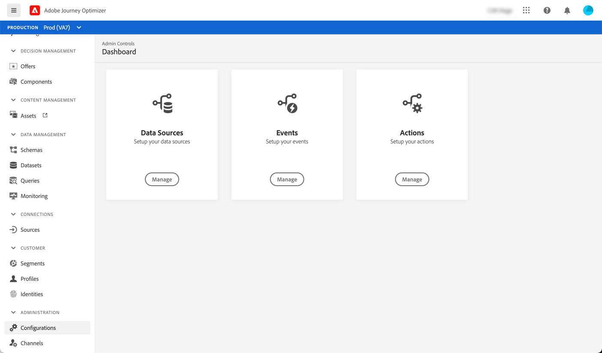

# Aan de slag voor Data Engineer {#data-engineer}

Als **Adobe Journey Optimizer Data Engineer**, gegevens van het klantprofiel voorbereiden en onderhouden om de ervaringen die worden georkestreerd door [!DNL Journey Optimizer], modelklant en bedrijfsgegevens in schema&#39;s en vormen bronschakelaars voor het opnemen van gegevens. U kunt beginnen te werken met [!DNL Adobe Journey Optimizer] eenmaal [Systeembeheerder](administrator.md) heeft u toegang verleend tot uw omgeving en uw omgeving voorbereid.

Leer hoe u **identificeer gegevens en creeer schema en dataset** om uw gegevens op deze pagina in Adobe Experience Platform te plaatsen.

>[!NOTE]
>
>Meer informatie over **gegevensinvoer** in [Adobe Experience Platform-documentatie](https://experienceleague.adobe.com/docs/experience-platform/ingestion/home.html){target=&quot;_blank&quot;}.

De stappen om een identiteitsnamespace en een dataset tot stand te brengen die voor profielen wordt toegelaten, en de testprofielen zijn gedetailleerd in de hieronder secties:

1. **Naamruimte maken**. In Adobe [!DNL Journey Optimizer], **Identiteiten** consumenten verbinden tussen apparaten en kanalen, is het resultaat een identiteitsgrafiek. De verbonden identiteitsgrafiek wordt gebruikt om ervaringen te personaliseren die op interactie over al uw bedrijfs touchpoints worden gebaseerd.  Meer informatie over identiteiten en naamruimten [op deze pagina](../get-started-identity.md).

1. **Een schema maken** en inschakelen voor profielen. Een schema is een set regels die de structuur en indeling van gegevens vertegenwoordigen en valideren. Op een hoog niveau, verstrekken de schema&#39;s een abstracte definitie van een real-world voorwerp (zoals een persoon) en schetsen welke gegevens in elke instantie van dat voorwerp (zoals voornaam, achternaam, verjaardag, etc.) zouden moeten worden omvat.  Meer informatie over schema&#39;s [op deze pagina](../get-started-schemas.md).

1. **Gegevenssets maken** en inschakelen voor profielen. Een dataset is een opslag en beheersconstructie voor een inzameling van gegevens, typisch een lijst, die een schema (kolommen) en gebieden (rijen) bevat. Datasets bevatten ook metagegevens die verschillende aspecten van de gegevens beschrijven die ze opslaan. Zodra een dataset wordt gecreeerd, kunt u het aan een bestaand schema in kaart brengen en gegevens toevoegen in het. Meer informatie over gegevenssets [op deze pagina](../get-started-datasets.md).

1. **Bronconnectors configureren**. Met de Adobe Reis Optimzer kunt u gegevens uit externe bronnen innemen en kunt u inkomende gegevens structureren, labelen en verbeteren met behulp van de services van Platforms. U kunt gegevens uit diverse bronnen invoeren, zoals Adobe-toepassingen, opslag in de cloud, databases en vele andere. Meer informatie over bronconnectors [op deze pagina](../get-started-sources.md).

1. **Testprofielen maken**. Testprofielen zijn vereist wanneer u de opdracht [testmodus](../../building-journeys/testing-the-journey.md) op reis, en [uw berichten bekijken en testen](../../messages/preview.md) vóór verzending. Stappen vaststellen om testprofielen te maken [op deze pagina](../../building-journeys/creating-test-profiles.md).

Bovendien moet u, om berichten in reizen te kunnen verzenden, vormen **[!UICONTROL Data Sources]**, **[!UICONTROL Events]** en **[!UICONTROL Actions]**. Meer informatie [in deze sectie](../../configuration/about-data-sources-events-actions.md).

* De **Gegevensbron** De configuratie staat u toe om een verbinding aan een systeem te bepalen om extra informatie terug te winnen die in uw reizen zal worden gebruikt. Meer informatie over gegevensbronnen [in deze sectie](../../datasource/about-data-sources.md).

* **Gebeurtenissen** u toestaan om uw reizen te activeren om berichten, in real time, naar het individu te verzenden dat de reis overgaat. In de gebeurtenisconfiguratie, vormt u de gebeurtenissen die in de reizen worden verwacht. De gegevens van de binnenkomende gebeurtenissen worden genormaliseerd volgens het Adobe Experience Data Model (XDM). Gebeurtenissen zijn afkomstig van de streamingopname-API’s voor geverifieerde en niet-geverifieerde gebeurtenissen (zoals Adobe Mobile SDK-gebeurtenissen). Meer informatie over gebeurtenissen [in deze sectie](../../event/about-events.md).

* [!DNL Journey Optimizer] wordt geleverd met ingebouwde berichtmogelijkheden: u kunt uw inhoud ontwerpen en uw bericht publiceren. Als u berichten verzendt via een systeem van derden, bijvoorbeeld Adobe Campaign, maakt u een **aangepaste handeling**. Meer informatie over handelingen in deze [in deze sectie](../../action/action.md).
