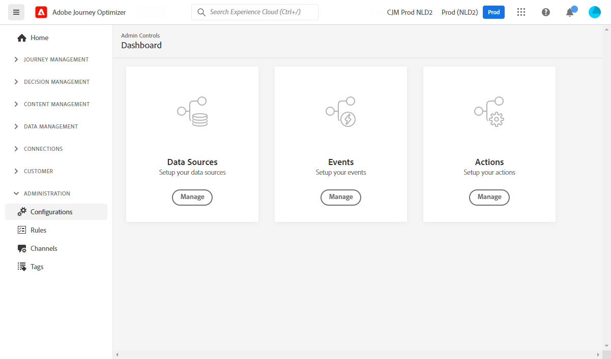

# Aan de slag voor Data Engineer {#data-engineer}

Als a **Architect van Gegevens** of **Ingenieur van Gegevens**, plaatst u en handhaaft de gegevens van het klantenprofiel en andere gegevensbronnen die de ervaringen aandrijven die door [!DNL Journey Optimizer] worden georkestreerd. Dit omvat het integreren van al uw klant en bedrijfsgegevens-of van Web, CRM, of off-line bron-in een verenigde 360 graadmening van de klant. U modelleert de gegevens van het klantenprofiel en bedrijfsgegevens in schema&#39;s, vormt bronschakelaars voor het opnemen van gegevens, en verzekert gegevensstromen regelmatig om klanteninzichten en overeenkomst in real time toe te laten. U kunt met [!DNL Adobe Journey Optimizer] beginnen te werken zodra de [&#x200B; Beheerder van het Systeem &#x200B;](administrator.md) u toegang verleende en uw milieu voorbereidde.

>[!NOTE]
>
>Leer meer over **gegevensopname** in [&#x200B; documentatie van Adobe Experience Platform &#x200B;](https://experienceleague.adobe.com/docs/experience-platform/ingestion/home.html?lang=nl-NL){target="_blank"}.

## Essentiële stappen voor gegevensconfiguratie

Voer de volgende stappen uit om de gegevensbasis voor Journey Optimizer in te stellen:

1. **creeer identiteitsnaamruimten**. In Adobe [!DNL Journey Optimizer], **Identiteiten** verbind consumenten over apparaten en kanalen, is het resultaat een identiteitsgrafiek. De verbonden identiteitsgrafiek wordt gebruikt om ervaringen te personaliseren die op interactie over al uw bedrijfs touchpoints worden gebaseerd. Leer meer over identiteiten en identiteit namespaces [&#x200B; op deze pagina &#x200B;](../../audience/get-started-identity.md).

   Bovendien vorm **supplementaire herkenningstekens** om het zelfde profiel toe te laten om veelvoudige reisinstanties in te gaan die op secundaire herkenningstekens zoals orde IDs of het boeken IDs worden gebaseerd. Leer over [&#x200B; supplementaire herkenningstekens &#x200B;](../../building-journeys/supplemental-identifier.md).

1. **creeer schema&#39;s** en laat hen voor profielen toe. Een schema is een set regels die de structuur en indeling van gegevens vertegenwoordigen en valideren. Op een hoog niveau, verstrekken de schema&#39;s een abstracte definitie van een echt-wereld voorwerp (zoals een persoon) en schetsen welke gegevens in elke instantie van dat voorwerp (zoals voornaam, achternaam, verjaardag, etc.) zouden moeten worden omvat.

   * Voor standaardreizen en campagnes: Gebruik [&#x200B; schema&#39;s XDM &#x200B;](../../data/get-started-schemas.md)
   * Voor Geordende campagnes: Creeer [&#x200B; relationele schema&#39;s &#x200B;](../../orchestrated/gs-schemas.md) om multi-entiteitsegmentatie toe te laten

1. **creeer datasets** en laat hen voor profielen toe. Een dataset is een opslag en beheersconstructie voor een inzameling van gegevens, typisch een lijst, die een schema (kolommen) en gebieden (rijen) bevat. Datasets bevatten ook metagegevens die verschillende aspecten van de gegevens beschrijven die ze opslaan. Zodra een dataset wordt gecreeerd, kunt u het aan een bestaand schema in kaart brengen en gegevens toevoegen in het. Leer meer over datasets [&#x200B; op deze pagina &#x200B;](../../data/get-started-datasets.md).

   Voor geavanceerde scenario&#39;s, bereidt **datasets voor runtime raadplegingen** voor om reisuitvoering met gegevens in real time van verslagdatasets te verrijken. Leer over [&#x200B; datasetraadpleging &#x200B;](../../building-journeys/dataset-lookup.md).

1. **vorm bronschakelaars**. Adobe Journey Optimizer staat toe dat gegevens uit externe bronnen worden opgenomen terwijl u de mogelijkheid krijgt om inkomende gegevens te structureren, te labelen en te verbeteren met behulp van de platformservices. U kunt gegevens invoeren uit verschillende bronnen, zoals Adobe-toepassingen, opslag in de cloud, databases en vele andere. Leer meer over de schakelaars van Source [&#x200B; op deze pagina &#x200B;](../get-started-sources.md).

1. **creeer testprofielen**. De profielen van de test worden vereist wanneer het gebruiken van de [&#x200B; testwijze &#x200B;](../../building-journeys/testing-the-journey.md) in een reis, en aan [&#x200B; voorproef en test uw berichten &#x200B;](../../content-management/preview-test.md) alvorens te verzenden. De stappen om testprofielen tot stand te brengen zijn gedetailleerd [&#x200B; op deze pagina &#x200B;](../../audience/creating-test-profiles.md).

1. **vorm gegevens verwerkte attributen** (facultatief). Maak afgeleide kenmerken van profielgegevens om segmentatie en personalisatie te vereenvoudigen. Berekende kenmerken berekenen automatisch complexe metingen zoals &quot;totale aankopen in de afgelopen 90 dagen&quot; of &quot;gemiddelde orderwaarde&quot;. Leer over [&#x200B; gegevens verwerkte attributen &#x200B;](../../audience/computed-attributes.md).

1. **de uitvoerdatasets van het Bericht** (facultatief). Wanneer de berichtuitvoer op het niveau van de kanaalconfiguratie wordt toegelaten, wordt de verzonden e-mail en inhoud van SMS automatisch uitgevoerd naar een specifieke dataset van Experience Platform voor naleving, archivering, of stroomafwaartse analyse. Leer over [&#x200B; berichtuitvoer &#x200B;](../../configuration/message-export.md).

Daarnaast moet u **[!UICONTROL Data Sources]** , **[!UICONTROL Events]** en **[!UICONTROL Actions]** configureren om berichten tijdens reizen te kunnen verzenden. Leer meer [&#x200B; in deze sectie &#x200B;](../../configuration/about-data-sources-events-actions.md).

* De **configuratie van Source van 0&rbrace; Gegevens &lbrace;staat u toe om een verbinding aan een systeem te bepalen om extra informatie terug te winnen die in uw reizen zal worden gebruikt.** Leer meer over Gegevensbronnen [&#x200B; in deze sectie &#x200B;](../../datasource/about-data-sources.md).

* **Gebeurtenissen** staan u toe om uw reizen unitatically te teweegbrengen om berichten, in real time, naar het individu te verzenden dat in de reis stroomt. In de gebeurtenisconfiguratie, vormt u de gebeurtenissen die in de reizen worden verwacht. De data van binnenkomende gebeurtenissen worden genormaliseerd volgens het Adobe Experience Data Model (XDM). Gebeurtenissen komen van de Streaming Ingestie-API&#39;s voor geverifieerde en niet-geverifieerde gebeurtenissen (zoals Adobe Mobile SDK-gebeurtenissen). Leer meer over gebeurtenissen [&#x200B; in deze sectie &#x200B;](../../event/about-events.md).

* [!DNL Journey Optimizer] wordt geleverd met ingebouwde berichtmogelijkheden: u kunt uw berichten binnen een reis maken en uw inhoud ontwerpen. Als u een derdesysteem gebruikt om uw berichten, bijvoorbeeld Adobe Campaign te verzenden, creeer a **douaneactie**. Leer meer over acties [&#x200B; in deze sectie &#x200B;](../../action/action.md).

## Reisgegevens bewaken en analyseren

Zodra de reizen lopen, kunt u de gebeurtenissen van de reisstap in het meer van Gegevens vragen om prestaties te controleren, kwesties problemen op te lossen, en klantengedrag te analyseren. Gebruik SQL-query&#39;s om te analyseren:

* Invoer- en aflooppatronen van profielen
* Foutpercentages en redenen voor verwijderen
* Prestaties van exporttaken van het publiek lezen
* Eigen maatstaven voor handelingsprestaties
* Frames en knelpunten voor reisinstanties

Onderzoek klaar-aan-gebruiks [&#x200B; vraagvoorbeelden voor reisanalyse &#x200B;](../../reports/query-examples.md) om met gegevensanalyse en het oplossen van problemen begonnen te worden.

## Samenwerken in verschillende rollen

Uw werk van de gegevensconfiguratie is essentieel voor andere teams:

>[!BEGINTABS]

>[!TAB  Werk met Beheerders ]

Werk met [&#x200B; Beheerders &#x200B;](administrator.md) op toegang en bestuur samen:

* Vereiste toestemmingen voor gegevensbeheer en schemaverwezenlijking verzoeken
* Coördinatie van sandboxtoegang voor ontwikkeling en testen
* Afstemmen op het beleid inzake gegevensbeheer en het beheer van toestemmingen
* Bespreek het beleid en de opslagvereisten voor gegevensopslag

>[!TAB  Werk met Ontwikkelaars ]

Werk met [&#x200B; Ontwikkelaars &#x200B;](developer.md) op gegevensstructuur en gebeurtenissen samen:

* Verstrek XDM schema&#39;s en gebeurtenisstructuren zij moeten uitvoeren
* Bepaal welke gebeurtenissen moeten worden verzonden en hun vereiste ladingsformaat
* Uitlijnen op vereisten voor gegevensverzameling en kwaliteitsnormen voor gegevens
* Gebeurtenislevering en gegevensinvoer tegelijk testen

>[!TAB  Werk met Marketers ]

Werk met [&#x200B; Marketers &#x200B;](marketer.md) op publiek en gegevens samen:

* Berekende kenmerken maken voor personalisatie en segmentatie
* Bouw publiek op basis van hun campagne- en reisvereisten
* Relationele schema&#39;s voor geordende campagnes configureren
* Ondersteuning voor segmentering van meerdere entiteiten voor geavanceerde gebruiksgevallen

>[!ENDTABS]
