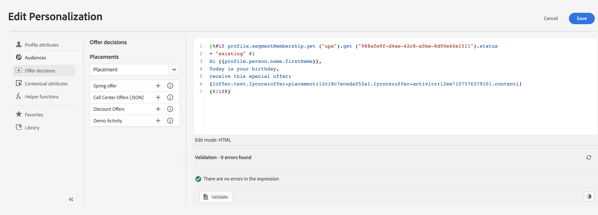
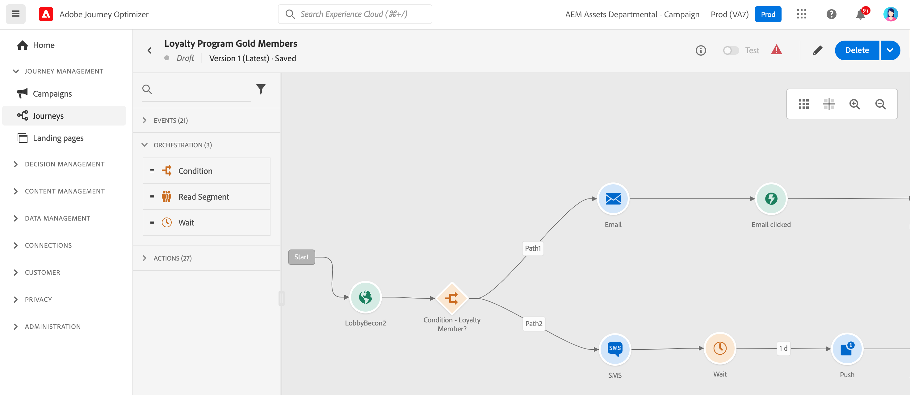

# Aan de slag met Marketers {#get-started-marketers}

Als a **Markering** of **BedrijfsPraktijk**, ontwerpt u klantenreizen om persoonlijke, contextafhankelijke ervaringen aan klanten te leveren. U kunt alle verschillende onderdelen van deze persoonlijke reizen maken en beheren, inclusief e-mail- en pushberichten, aanbiedingen en beslissingscomponenten om de inhoud van berichten op intelligente wijze aan te passen. Journey Optimizer biedt een uniforme gebruikerservaring waarbij u volledige gebruiksgevallen van begin tot eind op één plaats kunt implementeren. U kunt beginnen met [!DNL Adobe Journey Optimizer] te werken zodra de [&#x200B; Beheerder van het Systeem &#x200B;](administrator.md) en de [&#x200B; Ingenieur van Gegevens &#x200B;](data-engineer.md) u toegang en bereidde uw milieu verlenen.

## Aan de slag met de belangrijkste

Journey Optimizer brengt realtime klantinzichten, moderne omnichannel orchestratie en intelligente besluitvorming samen in één toepassing. Maak persoonlijke, verbonden klantervaringen via e-mail, SMS, push, in-app, web, inhoudskaarten en meer.

Journey Optimizer biedt twee krachtige orkestbenaderingen:

* **Reizen**: Reëel-tijd, één-aan-één overeenkomst waar elke klant zich door bij hun eigen tempo beweegt, die door gedrag of gebeurtenissen wordt teweeggebracht
* **Geordende Campagnes**: Complexe, multi-step partijcampagnes op schaal waar het publiek samen door werkschema-perfect voor merk in werking gestelde campagnes zoals seizoensbevorderingen, productlanceringen, of op rekening-gebaseerde mededelingen vooruitgaat

Het werk met uw [&#x200B; Beheerders &#x200B;](administrator.md) om toegang en met [&#x200B; Ingenieurs van Gegevens &#x200B;](data-engineer.md) aan opstellingspubliek, gegevens, en relationele schema&#39;s voor geavanceerde segmentatie te verkrijgen.

Voer de volgende kernstappen uit om ervaringen op te bouwen:

1. **creeer publiek**. Bouw publiek door segmentdefinities, upload Csv- dossiers, of gebruik publiekssamenstelling. Journey Optimizer biedt meerdere manieren om de juiste klanten te bereiken. Leer meer over [&#x200B; publiek &#x200B;](../../audience/about-audiences.md) en [&#x200B; creërend segmentdefinities &#x200B;](../../audience/creating-a-segment-definition.md).

1. **inhoud van het Ontwerp**. Maak aansprekende berichten via alle kanalen, waaronder e-mail, SMS, push, in-app, web en inhoudskaarten:
   * Gebruik de **Medewerker AI** om e-mailinhoud, onderwerplijnen, en beelden te produceren die op uw merkrichtlijnen worden gebaseerd. [&#x200B; Leer over AI inhoudsgeneratie &#x200B;](../../content-management/gs-generative.md)
   * **personaliseer berichten** met klantengegevens, dynamische inhoud, en voorwaardelijke logica. [&#x200B; Leer over verpersoonlijking &#x200B;](../../personalization/personalize.md)
   * **herhaal over contextuele gegevens** om dynamische lijsten van gebeurtenissen, douaneacties, en datasetraadplegingen te tonen. [&#x200B; Leer over het herhalen van contextuele gegevens &#x200B;](../../personalization/iterate-contextual-data.md)
   * Creeer herbruikbare **inhoudsmalplaatjes** en **fragmenten** om brandconsistentie te handhaven. [&#x200B; Werk met malplaatjes &#x200B;](../../content-management/content-templates.md)
   * Lever blijvende, niet-opdringerige **inhoudskaarten** binnen mobiele apps en websites. In tegenstelling tot pushberichten blijven inhoudskaarten zichtbaar tot ze worden verwijderd. [&#x200B; leer over inhoudskaarten &#x200B;](../../content-card/create-content-card.md)
   * Beheer activa met **de integratie van Adobe Experience Manager Assets**. [&#x200B; Leer over activa &#x200B;](../../integrations/assets.md)

   

1. **voeg aanbiedingen en besluit** toe. Lever de beste aanbieding aan elke klant op het juiste ogenblik gebruikend AI-GEDreven besluit. Leer over [&#x200B; het Beheer van het Besluit &#x200B;](../../offers/get-started/starting-offer-decisioning.md) en [&#x200B; Ervaring Beslissing &#x200B;](../../experience-decisioning/gs-experience-decisioning.md).

   

1. **test en bevestigt**. Inhoud voorvertonen en testen voordat deze wordt verzonden:
   * Gebruik **testprofielen** aan voorproefverpersoonlijking en controle het teruggeven over apparaten
   * Testen met **steekproefgegevens** van Csv/JSON- dossiers
   * De voorproef **e-mailteruggevende** over populaire e-mailcliënten
   * De tests en experimenten van de looppas **A/B** om inhoudvariaties te optimaliseren. Gebruik multi-gewapende bandiexperimentatie om automatisch meer verkeer aan het winnen variaties in real time toe te wijzen. [&#x200B; Leer over experimenteren &#x200B;](../../content-management/content-experiment.md)
   * Opstelling **goedkeuringswerkschema&#39;s** voor campagnes en reizen (vereist extra vergunning). [&#x200B; leer over goedkeuringen &#x200B;](../../test-approve/gs-approval.md)

   Leer hoe te [&#x200B; berichten &#x200B;](../../content-management/preview-test.md) testen en bevestigen.

1. **bouwt klantenreizen**. Maak real-time, persoonlijke ervaringen met de reiscanvas:

   * De reizen van de trekker met **gebeurtenissen** (klantenacties) of **publiek** (partij verzendt)
   * Voeg **voorwaarden** toe om gepersonaliseerde wegen tot stand te brengen die op klantengegevens worden gebaseerd
   * Het gebruik **wacht activiteiten** om perfecte timing tussen berichten te creëren
   * Verzend berichten over **veelvoudige kanalen** binnen één reis
   * Pas **A/B het testen** toe en optimaliseer verzend tijden om overeenkomst te maximaliseren
   * De raadpleging van de dataset van het gebruik **&lbrace;om reizen met gegevens in real time van Adobe Experience Platform te verrijken.** [&#x200B; leer over datasetraadpleging &#x200B;](../../building-journeys/dataset-lookup.md)
   * De supplementaire herkenningstekens van de hefboomwerking **&#x200B;**&#x200B;om het zelfde profiel toe te staan om veelvoudige reisinstanties (b.v., verschillende orden of het boeken in te gaan). [&#x200B; leer over supplementaire herkenningstekens &#x200B;](../../building-journeys/supplemental-identifier.md)

   

   Leer hoe te [&#x200B; reizen &#x200B;](../../building-journeys/journey-gs.md) te ontwerpen en uit te voeren en [&#x200B; gevallen van het reisgebruik &#x200B;](../../building-journeys/jo-use-cases.md) te onderzoeken. Begrijp [&#x200B; ingang/uitgangscriteria &#x200B;](../../building-journeys/entry-exit-criteria-guide.md) om profielstroom te controleren.

1. **Lancering orchestrated campagnes**. Ontwerp complexe, uit meerdere stappen bestaande batchcampagnes op schaal met een visueel canvas:

   * Bouw **publiek op bestelling** onmiddellijk gebruikend relationele vragen om klantengegevens met rekeningen, aankopen, abonnementen, en andere entiteiten te verbinden
   * Creeer **multi-entiteitsegmentatie** voor nauwkeurige het richten (b.v., &quot;klanten met abonnementen die in 30 dagen&quot;verlopen of &quot;rekeningen met recente high-value aankopen&quot;)
   * Krijg **pre-send zicht** met nauwkeurige publiekscijfers alvorens te lanceren
   * Het ontwerp **multi-step werkschema&#39;s** voor seizoensgebonden bevorderingen, productlanceringen, loyaliteitsaanbiedingen, of op rekening-gebaseerde marketing
   * Plan campagnes om onmiddellijk, op specifieke tijden, of op terugkomende programma&#39;s (dagelijks, wekelijks, maandelijks) te lopen
   * Het publiek van het proces op **partijwijze** waar alle profielen samen door het werkschema vooruitgaan

   Leer hoe te [&#x200B; beginnen met Geordende campagnes &#x200B;](../../orchestrated/gs-orchestrated-campaigns.md) en begrijpen wanneer [&#x200B; gebruikscampagnes vs reizen &#x200B;](../../orchestrated/orchestrated-campaigns-faq.md).

1. **Monitor en optimaliseer**. Prestaties bijhouden en resultaten in de loop der tijd verbeteren:
   * Bewaak **levende reis** prestaties en identificeer knelpunten
   * Analyseer **tarieven en betrokkenheidsmetriek 0&rbrace; berichtlevering &lbrace;**
   * Gebruik **rapporterend dashboards** met de integratie van Customer Journey Analytics
   * De omzetting van het spoor **&#x200B;**&#x200B;en bedrijfseffect
   * Beheer **berichtfrequentie en rangschikking** met de regels van het conflictenbeheer om overmededeling te verhinderen. [&#x200B; Leer over conflictbeheer &#x200B;](../../conflict-prioritization/gs-conflict-prioritization.md)

   Leer hoe te [&#x200B; monitorprestaties &#x200B;](../../reports/report-gs-cja.md).

## Aanbevolen procedures voor succes

### Inhoud maken

* **Begin met malplaatjes**: Gebruik pre-gebouwde malplaatjes en inhoudsfragmenten om verwezenlijking te versnellen en consistentie te handhaven
* **Test vroeg, test vaak**: altijd voorproef inhoud over apparaten en gebruik testprofielen om verpersoonlijking te bevestigen
* **Hefboomwerking AI** verstandig: De Medewerker van AI van het gebruik voor aanvankelijke concepten en variaties, maar herzie altijd en verfijnen voor uw merkstem
* **houd het eenvoudig**: Duidelijke, beknopte berichten met sterke vraag-aan-actie presteren beter dan complexe lay-outs

### Reisontwerp

* **bepaalt duidelijke doelstellingen**: Vestig succesmetriek alvorens uw reis te bouwen
* **Kaart de klantenervaring**: visualiseer de volledige reis vóór implementatie
* **Gebruik wacht activiteiten strategisch**: Geef klanten tijd om zich in te zetten alvorens follow-ups te verzenden
* **de uitgangsstrategieën van het Plan**: Bepaal wanneer en waarom de klanten de reis zouden moeten weggaan
* **Test op ontwerp wijze**: Valideer reislogica met droge looppas alvorens te activeren

[Tips en trucs leren over reizen](../../building-journeys/entry-exit-criteria-guide.md#best-practices)

### Campagne-orkestatie

* **kies de juiste benadering**: De Reizen van het gebruik voor real time, gedrag-teweeggebrachte ervaringen; gebruik Geordende campagnes voor geplande, partijcampagnes
* **bepalen duidelijke campagnedoelstellingen**: Vestig doelstellingen alvorens multi-step werkschema&#39;s te ontwerpen
* **Begin met proefpubliek**: Valideer tellingen en segmenteringslogica alvorens het schrapen
* **Relationele gegevens van de Hefboomwerking**: Gebruik multi-entiteitssegmentatie om klantengegevens met rekeningen, aankopen, abonnementen voor nauwkeurige het richten te verbinden
* **houd segmentatie eenvoudig**: Optimaliseer prestaties en transparantie met duidelijke, houdbare regels
* **Gebruik verenigbare het noemen**: Maak campagnebeheer gemakkelijker met duidelijke noemende overeenkomsten

### Doelgerichtheid publiek

* **Bedachtzaam Segment**: Creeer specifieke, handelende publiekssegmenten die op duidelijke criteria worden gebaseerd
* **verfrist zich regelmatig**: Zorgen publiek huidig door aangewezen evaluatieschema&#39;s te plaatsen
* **de grootte en de precisie van het Saldo**: Het publiek van het doel groot genoeg voor statistische betekenis maar specifiek genoeg voor relevantie
* **de verrijkingsattributen van het Gebruik**: De hefboomwerking verwerkte attributen en verrijkingsgegevens voor diepere verpersoonlijking

### Frequentiebeheer

* **respecteer klantenvoorkeur**: Eerbiedig opt-outs en communicatie voorkeur
* **vastgestelde frequentiecappen**: De regelreeksen van het gebruik om berichtvermoeidheid over kanalen te verhinderen
* **gecoördineerde campagnes**: Het conflictbeheer van het gebruik om klanten te verzekeren ontvangt het juiste bericht in de juiste tijd
* **Overeenkomst van de Monitor**: Controle voor tekenen van vermoeidheid (het verminderen van open tarieven, het verhogen van unsubscribes)

[Meer informatie over frequentiecortering](../../conflict-prioritization/channel-capping.md)

## Gebruiksgevallen verkennen

Leer praktische voorbeelden die de mogelijkheden van Journey Optimizer demonstreren:

**de gebruiksgevallen van de Reis** (real time, één-aan-één):

* **Welkome reeksen**: Aan boord nieuwe klanten met gepersonaliseerde, multi-step reizen. [&#x200B; het gebruiksgeval van de Mening &#x200B;](https://experienceleague.adobe.com/en/docs/journey-optimizer-learn/tutorials/use-cases/customer-onboarding)
* **Verlaten kartterugwinning**: Draai klanten opnieuw in dienst die punten in hun kar verlieten. [&#x200B; het gebruiksgeval van de Mening &#x200B;](https://experienceleague.adobe.com/en/docs/journey-optimizer-learn/tutorials/use-cases/abandoned-cart)
* **Event-gedreven overseinen**: Reageer aan klantenacties in real time
* **campagnes van de Verjaardag**: Verzend gepersonaliseerde verjaardagsberichten die door profieldata worden teweeggebracht
* **Aanbevelingen van het Product**: Suggestie relevante producten die op het doorbladeren en aankoopgeschiedenis worden gebaseerd

**Geordende de gevallen van het campagnegebruik** (partij, één-aan-vele):

* **seizoensgebonden bevorderingen**: De gecoördineerde campagnes van de lancering over klantensegmenten (b.v., vakantieverkoop, rug-aan-school)
* **de lanceringen van het Product**: Zet nieuwe producten aan gericht publiek met gesequentieerd overseinen aan
* **het programma van de Loyalty biedt** aan: Beloon klanten van hoge waarde met gelaagde aanbiedingen die op aankoopgeschiedenis worden gebaseerd
* **op rekening-gebaseerde marketing**: De rekeningen van het doel met specifieke kenmerken en verwante contacten
* **de vernieuwingen van het Abonnement**: Bereik klanten met abonnementen die binnenkort gebruikend multi-entiteitvragen verlopen
* **campagnes van de re-overeenkomst**: De achterzijde van Win inactieve klanten met gerichte aanbiedingen op partijwijze. [&#x200B; het gebruiksgeval van de Mening &#x200B;](https://experienceleague.adobe.com/en/docs/experience-platform/rtcdp/use-cases/personalization-insights-engagement/use-cases-luma)

**patronen van de Reis:**

* [&#x200B; verzendt berichten naar abonnees &#x200B;](../../building-journeys/message-to-subscribers-uc.md): De abonnementenlijsten van het doel met gepersonaliseerde inhoud
* [&#x200B; Meerkanaals overseinen &#x200B;](../../building-journeys/journeys-uc.md): Combineer e-mail en duw met reactiegebeurtenissen
* [&#x200B; Web-dag-slechts e-mail &#x200B;](../../building-journeys/weekday-email-uc.md): De mededelingen van het programma gebruikend op tijd-gebaseerde voorwaarden

Blader de volledige [&#x200B; de gevalenbibliotheek van het reisgebruik &#x200B;](../../building-journeys/jo-use-cases.md) en leer meer over [&#x200B; Geordende campagnes &#x200B;](../../orchestrated/gs-orchestrated-campaigns.md).

## Samenwerken in verschillende rollen

Uw marketingwerk heeft betrekking op andere teams:

>[!BEGINTABS]

>[!TAB  Werk met de Ingenieurs van Gegevens ]

Werk met [&#x200B; Ingenieurs van Gegevens &#x200B;](data-engineer.md) op gegevens en publieksconfiguraties samen:

* Nieuwe berekende kenmerken aanvragen voor personalisatie en segmentatie
* Coördinatie van relationele schema&#39;s voor geordende campagnes
* Feedback geven op de kwaliteit en nauwkeurigheid van de gegevens van het publiek
* Uitlijnen op gegevensvereisten voor meerdere entiteiten voor geavanceerde segmentatie

>[!TAB  Werk met Ontwikkelaars ]

Werk met [&#x200B; Ontwikkelaars &#x200B;](developer.md) bij gebeurtenis het volgen en implementatie samen:

* Uitlijnen op welke gebruikersinteractie gebeurtenissen moet activeren
* Mobiele en webimplementaties testen voordat deze worden gestart
* Bijhouden valideren voor prestaties van inhoud en betrokkenheid van gebruikers
* Problemen met berichtlevering of personalisatie oplossen

>[!TAB  Werk met Beheerders ]

Werk met [&#x200B; Beheerders &#x200B;](administrator.md) op toegang en configuraties samen:

* Kanaalconfiguraties aanvragen voor uw campagnes en reizen
* Toegang tot licenties voor geordende campagnes en andere functies bevestigen
* Problemen met machtigingen of toegang rapporteren
* Coördinatie van nieuwe functies en testomgevingen

>[!ENDTABS]

## Volgende stappen

1. **Begin klein**: Creeer een eenvoudige welkome reis of enig-bericht campagne om het platform te leren
2. **AI van de Leverage van 0&rbrace;: De Medewerker van AI van het gebruik om vragen te stellen en inhoudsverwezenlijking te versnellen**
3. **sluit zich aan bij de gemeenschap**: Verbind met andere gebruikers van Journey Optimizer in de [&#x200B; Gemeenschap van Experience League &#x200B;](https://experienceleaguecommunities.adobe.com/t5/journey-optimizer/ct-p/journey-optimizer){target="_blank"}
4. **Onderzoek leerprogramma&#39;s**: Bekijk geleidelijke video&#39;s op [&#x200B; Experience League &#x200B;](https://experienceleague.adobe.com/docs/journey-optimizer-learn/tutorials/overview.html){target="_blank"}
