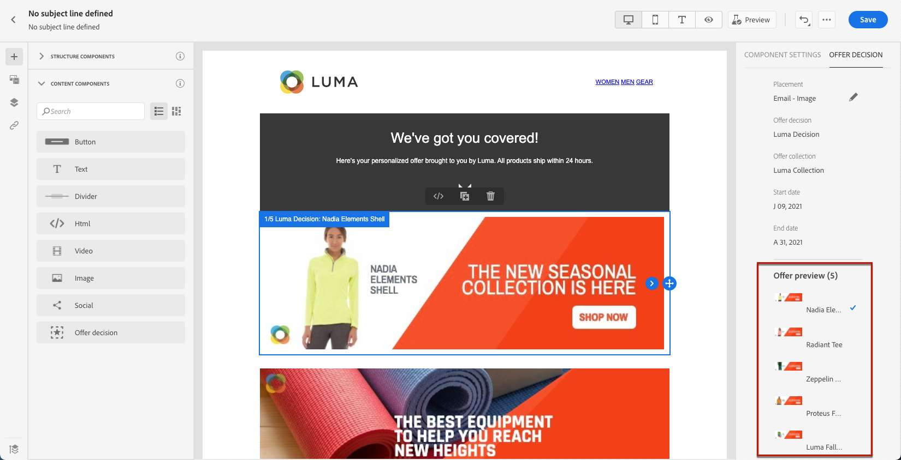

# Aan de slag met Marketers {#get-started-marketers}

Als **Marketer** of **Reiswerker**, bent u verantwoordelijk voor het maken van aanbiedingen en reizen en het ontwerpen van inhoud. U kunt beginnen te werken met [!DNL Adobe Journey Optimizer] eenmaal [Systeembeheerder](administrator.md) en de [Gegevensengineer](data-engineer.md) heeft u toegang verleend tot uw omgeving en uw omgeving voorbereid.

Raadpleeg de volgende secties voor het instellen van uw eerste reis, het toevoegen van aanbiedingen en middelen en het verzenden van berichten:

1. **Segmenten maken**. Met Journey Optimizer kunt u publiekssegmenten rechtstreeks vanuit het **Segmenten** en ze te gebruiken voor uw reizen.  Meer informatie over segmenten [op deze pagina](../../segment/about-segments.md). Ontdek hoe u segmenten kunt maken [in deze steekproef](../../segment/creating-a-segment.md).

1. **Verpersoonlijking en dynamische inhoud toevoegen**. Gebruik Journey Optimizer-personalisatie en dynamische inhoudmogelijkheden om uw boodschap aan te passen aan uw publiek. Meer informatie over [personalisatie](../../personalization/personalize.md) en [dynamische inhoud](../../personalization/get-started-dynamic-content.md).

   

1. **Elementen maken en beheren**. [!DNL Adobe Experience Manager Assets Essentials] biedt één gecentraliseerde opslagplaats voor elementen die u kunt gebruiken om uw berichten te vullen. Meer informatie [in deze sectie](../../design/assets-essentials.md).

1. **Aanbiedingen toevoegen**. Gebruiken [!DNL Journey Optimizer] om uw klanten de beste aanbieding en ervaring op alle aanraakpunten op het juiste moment te bieden. Als u ze eenmaal hebt ontworpen, richt u zich op uw publiek met persoonlijke aanbiedingen. Meer informatie over Beslissingsbeheer [in deze sectie](../../offers/get-started/starting-offer-decisioning.md).

   

1. **Testen en valideren**. Nadat de inhoud is gedefinieerd, kunt u testprofielen gebruiken om deze voor te vertonen en te testen. Als u [persoonlijke inhoud](../../personalization/personalize.md)kunt u met testprofielgegevens controleren hoe deze inhoud in het bericht wordt weergegeven. Bovendien kunt u uw **Litmus** account [!DNL Journey Optimizer] om direct een voorvertoning van uw **e-mailrendering** in populaire e-mailclients. U kunt er dan voor zorgen dat uw e-mailinhoud er goed uitziet en goed werkt in elk Postvak IN. Leer hoe u uw berichten kunt testen en valideren [in deze sectie](../../design/preview.md).

1. **Klantreizen ontwerpen** om persoonlijke, contextafhankelijke ervaringen te bieden. [!DNL Journey Optimizer] kunt u in real time het gebruikscase van het orkestgebruik met contextuele gegevens bouwen die in gebeurtenissen of gegevensbronnen worden opgeslagen. Ontwerp multistep geavanceerde scenario&#39;s aangedreven door de volgende mogelijkheden:

   * In real time verzenden **unitaire levering** geactiveerd wanneer een gebeurtenis wordt ontvangen, of **in batch** Adobe Experience Platform-segmenten gebruiken.

   * Hefboomwerking **contextafhankelijke gegevens** uit gebeurtenissen, informatie van Adobe Experience Platform of gegevens van externe API-services.

   * Gebruik de **ingebouwde kanaalhandelingen** (E-mail, SMS, Push) voor het verzenden van berichten die zijn ontworpen in [!DNL Journey Optimizer] of maak **aangepaste handelingen** als u een systeem van derden gebruikt om uw berichten te verzenden.

   * Met de **reisontwerper**, maak uw meerstapse gebruiksscenario&#39;s: U kunt eenvoudig een entry-gebeurtenis of een lezen-segmentactiviteit slepen en neerzetten, voorwaarden toevoegen en gepersonaliseerde berichten verzenden.

   

   Leer hoe u reizen ontwerpt en uitvoert [in deze sectie](../../building-journeys/journey-gs.md)

1. **Berichten en reizen volgen**. Om ervoor te zorgen dat uw berichten succesvol worden uitgevoerd, verzonden en geleverd, [!DNL Journey Optimizer] biedt mogelijkheden om de berichten te controleren die momenteel worden gepubliceerd en teweeggebracht. Leer hoe u de prestaties kunt controleren [in deze sectie](../../reports/global-report.md).
