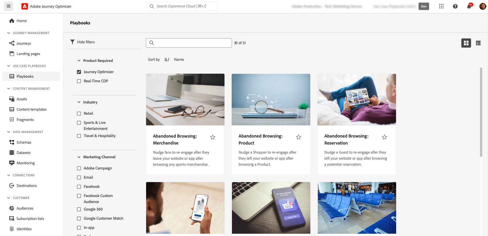

# Playbooks voor gebruiksscenario&#39;s {#playbooks}

## Wat zijn Use Case Playbooks? {#gs}

Afspeelboeken met hoofdletters gebruiken zijn vooraf gedefinieerde workflows die veelvoorkomende gebruiksgevallen aanpakken die u kunt uitvoeren met Adobe Experience Platform en Journey Optimizer.

{width="85%"}

Elk playbook verstrekt een uitvoerig overzicht, met inbegrip van intent, doelstellingen, gerichte karakters en middelen nodig om het uit te voeren. Bovendien is een mindmap beschikbaar in elk playbook om klantenaanraakpunten in real time verbonden aan playbook visueel te vertegenwoordigen.

{width="85%"}

## Vereisten {#prerequisites}

De volgende configuratiestappen worden vereist alvorens met de Playbooks van het Geval van het Gebruik te werken. De gedetailleerde informatie over elke stap is beschikbaar in de documentatie van de Playbooks van het Geval van het Gebruik [&#x200B; begonnen &#x200B;](https://experienceleague.adobe.com/docs/experience-platform/use-case-playbooks/playbooks/get-started.html?lang=nl-NL){target="_blank"} pagina krijgen.

* Een sandbox maken
* Gebruikersmachtigingen configureren
* Journey Optimizer-kanaalconfiguraties configureren voor e-mail-, push- en SMS-berichten

## Een afspeelboek openen en inschakelen {#access}

Als u toegang wilt tot afspeelboeken, navigeert u naar het menu **[!UICONTROL Playbooks]** in de linkernavigatielijn. De bibliotheek bevat verschillende afspeelboeken die met Adobe Journey Optimizer zijn geïmplementeerd. Gebruik de beschikbare filters naast de zoekbalk om deze gemakkelijk te openen. Een uitvoerige lijst van playbooks van Journey Optimizer is beschikbaar in de [&#x200B; documentatie van de Playbooks van het Geval van het Gebruik &#x200B;](https://experienceleague.adobe.com/docs/experience-platform/use-case-playbooks/playbooks/playbooks-list.html?lang=nl-NL){target="_blank"}.

{width="85%"}

Nadat u het afspeelboek hebt gekozen dat het beste bij uw behoeften past, kunt u het inschakelen. Dit leidt tot een geval van playbook en produceert automatisch de middelen nodig om uw specifiek gebruiksgeval te steunen. De middelen omvatten de activa van Journey Optimizer zoals reizen, berichten, evenals de activa van Adobe Experience Platform zoals schema&#39;s of segmenten.

>[!NOTE]
>
>Het doel van deze voorwerpen is u te helpen alle middelen begrijpen die nodig zijn om uw specifiek gebruiksgeval uit te voeren. Ze bevatten geen gegevens en worden gemaakt in ontwikkelingssandboxen.

Als u uw gebruiksscenario wilt implementeren, navigeert u naar elk object om dit aan uw wensen aan te passen. U kunt ook de URL van de pagina met de instantie van het afspeelboek delen met uw team om samen te werken aan de implementatie van het gebruiksscenario.

Daarnaast kunt u de elementen van de afspeelboeken importeren in andere sandboxen. Hierdoor kunt u de gegenereerde elementen uitlijnen met uw bestaande elementen en ervoor zorgen dat deze compatibel zijn met uw gegevens, voor het geval u al uw eigen schema&#39;s, velden en veldgroepen hebt ingesteld. Deze stappen zijn gedetailleerd in de documentatie van de Playbooks van het Geval van het Gebruik: [&#x200B; publiceer playbook-Geproduceerde activa aan andere zandbakken &#x200B;](https://experienceleague.adobe.com/docs/experience-platform/use-case-playbooks/playbooks/data-awareness.html?lang=nl-NL){target="_blank"}.

## Uw eigen afspeelboeken maken (persoonlijke bèta) {#create}

>[!AVAILABILITY]
>
>Het gebruik van hoofdletters en kleine letters is momenteel alleen beschikbaar voor een set organisaties als een persoonlijke bèta. Neem contact op met uw Adobe-vertegenwoordiger voor toegang.

Naast het gebruik van vooraf gedefinieerde afspeelboeken, kunt u ook uw eigen afspeelboeken maken en delen in Adobe Experience Platform.

U kunt metagegevens definiëren met behulp van AI-ondersteuning of handmatige invoer, technische elementen zoals schema&#39;s, segmenten en uw afspeelboeken delen met verschillende IMS-organisaties.

Voor meer informatie over om playbooks tot stand te brengen en te delen, verwijs naar de documentatie van de Playbooks van het Geval van het Gebruik: [&#x200B; Auteur en deel uw eigen playbooks gebruikend AI Medewerker &#x200B;](https://experienceleague.adobe.com/docs/experience-platform/use-case-playbooks/playbooks/author.html?lang=nl-NL#sharing-playbooks-sandboxes){target="_blank"}.
