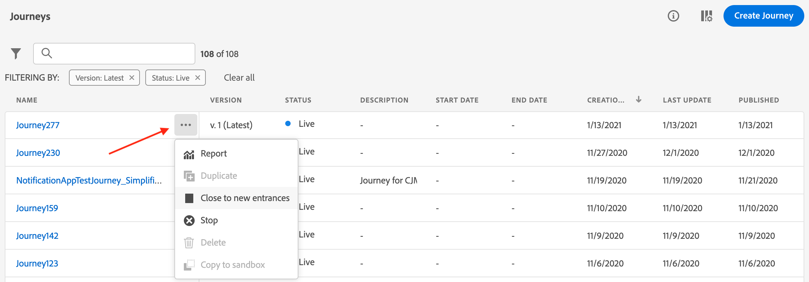

# Zoeken, filteren en ordenen {#search-filter-organize}

Naarmate uw Adobe Journey Optimizer-projecten groeien, is het van essentieel belang om inhoud te zoeken en te organiseren voor een efficiënt werk. Op deze pagina ziet u hoe u snel ritten, campagnes en middelen kunt zoeken aan de hand van universele zoekopdracht, lijsten kunt filteren om de focus op specifieke items te plaatsen en uw werk kunt ordenen met tags en categorieën. Met deze gereedschappen kunt u door grote hoeveelheden inhoud navigeren, consistentie tussen teams behouden en uw dagelijkse workflows stroomlijnen.

## Zoeken {#unified-search}

Vanuit de Adobe Journey Optimizer-interface gebruikt u de uniforme Adobe Experience Cloud-zoekfunctie in het midden van de bovenste balk om elementen, reizen, gegevenssets en meer te zoeken in uw sandboxen.

Voer inhoud in om de beste resultaten weer te geven. Help-artikelen over de ingevoerde trefwoorden worden ook weergegeven in de resultaten.

Pers **gaat** binnen om tot alle resultaten en filter door bedrijfsvoorwerp toegang te hebben.

## Filterlijsten {#filter-lists}

In de meeste lijsten, gebruik de onderzoeksbar om specifieke punten te vinden, en het filtreren criteria te bepalen.

Filters zijn toegankelijk door op het filterpictogram linksboven in een lijst te klikken. Met het filtermenu kunt u de weergegeven elementen filteren op basis van verschillende criteria: u kunt ervoor kiezen alleen elementen van een bepaald type of een bepaalde status weer te geven, de elementen die u hebt gemaakt of de elementen die in de afgelopen 30 dagen zijn gewijzigd. Welke opties beschikbaar zijn, is afhankelijk van de context.

Bovendien kunt u Verenigde markeringen gebruiken om een lijst afhankelijk van de markeringen te filtreren die aan een voorwerp worden toegewezen. Op dit moment zijn er tags beschikbaar voor reizen en campagnes. [ leer hoe te met markeringen ](#tags) werken

>[!NOTE]
>
>De weergegeven kolommen kunnen worden gepersonaliseerd met de configuratieknop rechtsboven van de lijsten. Personalisatie wordt voor elke gebruiker opgeslagen.

In de lijsten, kunt u basisacties op elk element uitvoeren. U kunt bijvoorbeeld een item dupliceren of verwijderen.

## Werken met Unified-tags {#tags}

>[!CONTEXTUALHELP]
>id="ajo_campaigns_tags"
>title="Tags"
>abstract="Met dit veld kunt u Adobe Experience Platform Unified Tags aan uw campagne toewijzen. Op deze manier kunt u ze gemakkelijk classificeren en de zoekopdracht in de lijst met campagnes verbeteren."

Met Adobe Experience Platform [ Verenigde Markeringen ](https://experienceleague.adobe.com/docs/experience-platform/administrative-tags/overview.html), kunt u uw voorwerpen van Journey Optimizer gemakkelijk classificeren om onderzoek van de lijsten te verbeteren.

Als u betekenisvolle tags toevoegt aan het publiek in Journey Optimizer, kunt u later filteren en zoeken om het publiek gemakkelijker te vinden. De markeringen kunnen ook worden gebruikt om publiek in relevante, doorzoekbare omslagen te organiseren, gepersonaliseerde aanbiedingen en ervaringen tot stand te brengen, en in ervaring besluitvormingsregels te gebruiken.

### Tags toevoegen aan een object {#add-tags}

In het veld **[!UICONTROL Tags]** kunt u codes voor het object definiëren. Tags zijn beschikbaar voor de volgende objecten:

* [Campagnes](../campaigns/create-campaign.md)
* [Beslissingsitems](../experience-decisioning/items.md)
* [Fragmenten](../content-management/fragments.md)
* [Journeys](../building-journeys/journey-properties.md)
* [Landingspagina&#39;s](../landing-pages/create-lp.md)
* [Abonnementenlijsten](../landing-pages/subscription-list.md)
* [Sjablonen](../content-management/content-templates.md)
* [Kanaalconfiguraties](../configuration/channel-surfaces.md#channel-config-tags)

U kunt een bestaande tag selecteren of een nieuwe tag maken. Volg de onderstaande stappen om dit te doen.

1. Typ de naam van het gewenste label en/of selecteer het in de lijst.

   

   >[!NOTE]
   >
   > Tags zijn niet hoofdlettergevoelig.

1. Als de tag die u zoekt niet beschikbaar is, klikt u op **[!UICONTROL Create ""]** om een nieuwe te definiëren. Deze wordt automatisch toegevoegd aan het huidige object en wordt beschikbaar voor alle andere objecten.

   

1. De lijst met de geselecteerde of gemaakte tags wordt weergegeven onder het veld **[!UICONTROL Tags]** . U kunt zo veel tags definiëren als nodig is.

>[!NOTE]
> 
> Als u een object dupliceert of een nieuwe versie maakt, blijven de tags behouden.

### Filteren op labels {#filter-on-tags}

In elke objectlijst wordt een specifieke kolom weergegeven, zodat u de tags eenvoudig kunt visualiseren.

Een filter is ook beschikbaar voor alleen weergaveobjecten met bepaalde tags.

U kunt tags toevoegen aan of verwijderen uit elk type reis of campagne (live, concept, enz.). Klik hiertoe op het pictogram **[!UICONTROL More actions]** naast het object en selecteer **[!UICONTROL Edit tags]** .

### Tags beheren {#manage-tags}

Beheerders kunnen tags verwijderen en deze op categorieën indelen via het menu **[!UICONTROL Tags]** onder **[!UICONTROL ADMINISTRATION]** . Leer meer over markeringsbeheer in de [ Verenigde documentatie van Markeringen ](https://experienceleague.adobe.com/docs/experience-platform/administrative-tags/ui/managing-tags.html).

>[!NOTE]
>
> Tags die rechtstreeks vanuit het veld **[!UICONTROL Tags]** in Journey Optimizer worden gemaakt, worden automatisch toegevoegd aan de ingebouwde categorie &quot;Niet-gecategoriseerd&quot;.
