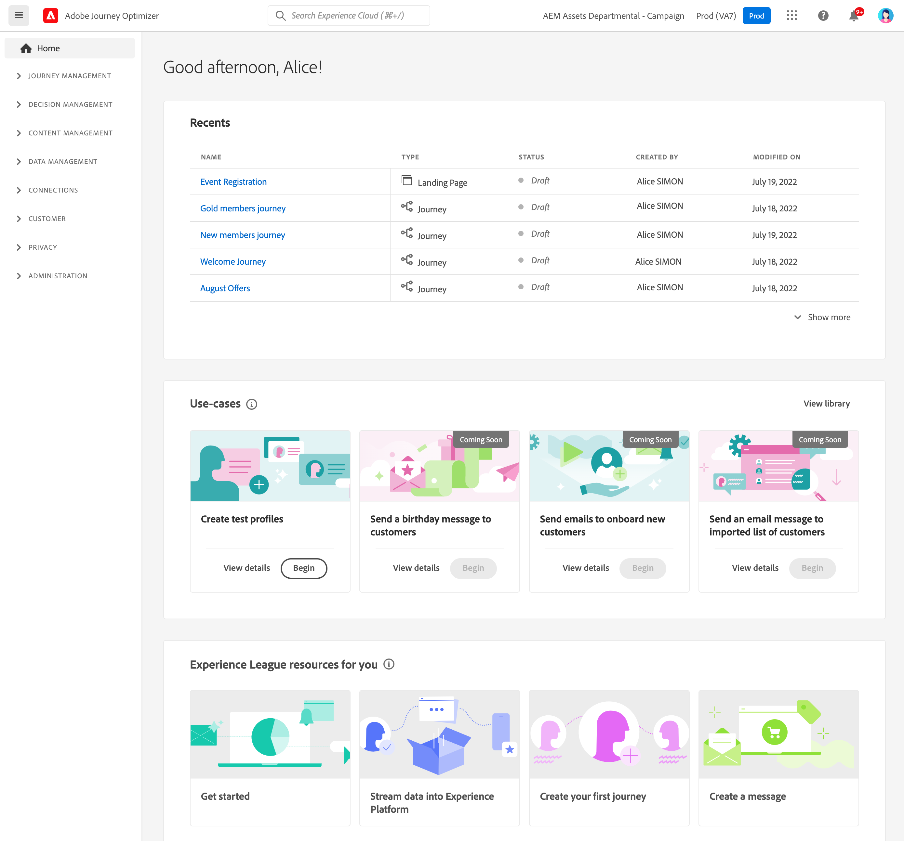
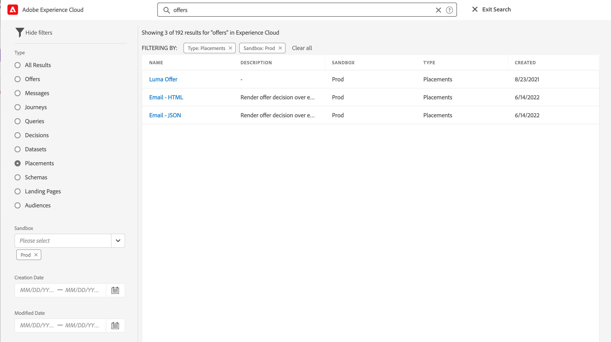

# Gebruikersinterface {#cjm-user-interface}

Verbinden met [Adobe Experience Cloud](http://experience.adobe.com) en blader naar [!DNL Journey Optimizer].

Belangrijke concepten bij het bladeren in de gebruikersinterface komen veel voor in Adobe Experience Platform. Zie [Adobe Experience Platform-documentatie](https://experienceleague.adobe.com/docs/experience-platform/landing/platform-ui/ui-guide.html#adobe-experience-platform-ui-guide){target=&quot;_blank&quot;} voor meer informatie.

De componenten en mogelijkheden die beschikbaar zijn in de gebruikersinterface zijn afhankelijk van uw [machtigingen](../administration/permissions.md) en op uw [licentiepakket](https://helpx.adobe.com/legal/product-descriptions/adobe-journey-optimizer.html){target=&quot;_blank&quot;}. Neem voor alle vragen contact op met uw Adobe Customer Success Manager.

>[!NOTE]
>
>Deze documentatie wordt vaak bijgewerkt om de laatste wijzigingen in de gebruikersinterface van het product te weerspiegelen. Sommige schermafbeeldingen kunnen echter enigszins afwijken van uw gebruikersinterface.

## Linkernavigatie {#left-nav}

Gebruik de koppelingen aan de linkerkant om te bladeren in mogelijkheden.

>[!NOTE]
>
>Welke mogelijkheden beschikbaar zijn, is afhankelijk van uw machtigingen en licentieovereenkomst.

U vindt onder de volledige lijst met services en mogelijkheden in de linkernavigatie en koppelingen naar de bijbehorende documentatie.

**Home**

[!DNL Journey Optimizer] de homepage bevat zeer belangrijke verbindingen en middelen om te beginnen. De **[!UICONTROL Recents]** de lijst bevat snelkoppelingen naar de onlangs gemaakte of bijgewerkte berichten, gebeurtenissen en reizen. In deze lijst staan de datum en status van het maken en wijzigen van de bestanden.

**[!UICONTROL JOURNEY MANAGEMENT]**

* **[!UICONTROL Journeys]** - Maak, configureer en orkestreer uw klantritten. [Meer informatie](../building-journeys/journey-gs.md#jo-build)

* **[!UICONTROL Messages]** - Maak, ontwerp, test en publiceer e-mail- en pushberichten. [Meer informatie](../messages/get-started-content.md)

**[!UICONTROL DECISION MANAGEMENT]**

* **[!UICONTROL Offers]** - Heb toegang tot uw recente bronnen en datasets van dit menu. In deze sectie kunt u nieuwe voorstellen maken. [Meer informatie](../offers/offer-library/creating-personalized-offers.md)

* **[!UICONTROL Components]** - Plaatsen, regels en tags maken. [Meer informatie](../offers/offer-library/key-steps.md)

**[!UICONTROL CONTENT MANAGEMENT]**

* **[!UICONTROL Assets]** - [!DNL Adobe Experience Manager Assets Essentials] is een gecentraliseerde opslagplaats van activa die u kunt gebruiken om uw berichten te bevolken. [Meer informatie](../design/assets-essentials.md)

**[!UICONTROL DATA MANAGEMENT]**

* **[!UICONTROL Schemas]** - Gebruik Adobe Experience Platform om schema&#39;s van het Model van de Gegevens van de Ervaring (XDM) in een interactief visueel canvas tot stand te brengen en te beheren genoemd de Redacteur van het Schema. [Meer informatie](get-started-schemas.md)

* **[!UICONTROL Datasets]** - Alle gegevens die in Adobe Experience Platform worden opgenomen, blijven bestaan in het Data Lake als datasets. Een dataset is een opslag en beheersconstructie voor een inzameling van gegevens, typisch een lijst, die een schema (kolommen) en gebieden (rijen) bevat. [Meer informatie](get-started-datasets.md)

* **[!UICONTROL Queries]** - Gebruik Adobe Experience Platform Query Service om query&#39;s te schrijven en uit te voeren, eerder uitgevoerde query&#39;s weer te geven en toegang te krijgen tot query&#39;s die zijn opgeslagen door gebruikers binnen uw organisatie. [Meer informatie](get-started-queries.md)

* **[!UICONTROL Monitoring]** - Gebruik dit menu om uw gegevensinvoer in de gebruikersinterface van Adobe Experience Platform te controleren. [Meer informatie](https://experienceleague.adobe.com/docs/experience-platform/ingestion/quality/monitor-data-ingestion.html){target=&quot;_blank&quot;}

**[!UICONTROL CONNECTIONS]**

* **[!UICONTROL Sources]** - Gebruik dit menu om gegevens uit diverse bronnen in te voeren, zoals Adobe-toepassingen, opslag in de cloud, databases en meer, en om inkomende gegevens te structureren, labelen en verbeteren. [Meer informatie](get-started-sources.md)

**[!UICONTROL CUSTOMER]**

* **[!UICONTROL Segments]** - Maak en beheer Experience Platforms segmentdefinities en gebruik deze voor uw reizen. [Meer informatie](../segment/about-segments.md)

* **[!UICONTROL Profiles]** - Het profiel van de Klant in real time leidt tot een holistische mening van elk van uw individuele klanten, die gegevens van veelvoudige kanalen met inbegrip van online, off-line, CRM, en derdegegevens combineren. [Meer informatie](../segment/get-started-profiles.md)

* **[!UICONTROL Identities]** - Adobe Experience Platform Identity Service beheert de identificatie van uw klanten over het hele apparaat, over het kanaal en bijna in realtime in een identiteitsgrafiek in Adobe Experience Platform. [Meer informatie](../segment/get-started-identity.md)

**[!UICONTROL ADMINISTRATION]**

* **[!UICONTROL Journey Administration]** - Gebruik dit menu om te configureren [gebeurtenissen]../event/about-events.md), [gegevensbronnen](../datasource/about-data-sources.md) en [handelingen](../action/action.md) om te gebruiken voor uw reizen.

* **[!UICONTROL Sandboxes]** - Adobe Experience Platform biedt sandboxen die één instantie in afzonderlijke virtuele omgevingen verdelen om toepassingen voor digitale ervaringen te ontwikkelen en te ontwikkelen. [Meer informatie](../administration/sandboxes.md)

<!--
* **[!UICONTROL Alerts]** - The user interface allows you to view a history of received alerts based on metrics revealed by Adobe Experience Platform Observability Insights. The UI also allows you to view, enable, and disable available alert rules. [Learn more](https://experienceleague.adobe.com/docs/experience-platform/observability/alerts/overview.html){target="_blank"}
-->

## Gebruiksgevallen in producten {#in-product-uc}

Hefboomwerking [!DNL Adobe Journey Optimizer] Gebruik gevallen op de startpagina en geef een paar snelle invoer voor een reis naar de klant.

Beschikbare gebruiksgevallen zijn:

* **Testprofielen maken** om testprofielen te maken met onze CSV-sjabloon om persoonlijke berichten en reizen te testen. Leer hoe u deze gebruiksaanwijzing implementeert [op deze pagina](../segment/creating-test-profiles.md#use-case-1).
* **Klanten een verjaardagsbericht sturen**, om automatisch een e-mail te verzenden om uw klanten op hun verjaardag te wensen. (binnenkort beschikbaar)
* **E-mails naar nieuwe klanten aan boord sturen**, om eenvoudig maximaal twee e-mails te verzenden om uw nieuw geregistreerde klanten te verwelkomen. (binnenkort beschikbaar)
* **Pushberichten verzenden naar geïmporteerde lijst met klanten**, om snel een pushmelding te verzenden naar een lijst met klanten die zijn geïmporteerd uit een CSV-bestand. (binnenkort beschikbaar)

Klikken **[!UICONTROL View details]** voor meer informatie over elk geval van gebruik.

Klik op de knop **[!UICONTROL Begin]** om het gebruik te starten.

U hebt toegang tot uitvoerbare gebruiksgevallen via het dialoogvenster **[!UICONTROL View use case library]** knop.

## Toegankelijkheid{#accessibility}

De toegankelijkheidsfuncties in [!DNL Adobe Journey Optimizer] zijn overgenomen van Adobe Experience Platform:

* Toegankelijkheid toetsenbord
* Kleurcontrast
* Validatie van vereiste velden

[Meer informatie](https://experienceleague.adobe.com/docs/experience-platform/accessibility/features.html){target=&quot;_blank&quot;} in Adobe Experience Platform-documentatie.

U kunt deze algemene sneltoetsen gebruiken in [!DNL Journey Optimizer]:

| Actie | Sneltoets |
| --- | --- |
| Tussen gebruikersinterface-elementen, -secties en -menugroepen verplaatsen | Tabtoets |
| Ga achterwaarts tussen gebruikersinterface-elementen, -secties en -menuproepen | Shift + Tab |
| Binnen secties verplaatsen om focus in te stellen op afzonderlijke elementen | Pijl |
| Een element dat de focus heeft selecteren of wissen | Enter of spatiebalk |
| Een selectie annuleren, een deelvenster samenvouwen of een dialoogvenster sluiten | Esc |

[Meer informatie](https://experienceleague.adobe.com/docs/experience-platform/accessibility/custom.html){target=&quot;_blank&quot;} in Adobe Experience Platform-documentatie.

U kunt deze sneltoetsen gebruiken in specifieke delen van Journey Optimizer:

<table>
  <thead>
    <tr>
      <th>Interface-element</th>
      <th>Actie</th>
      <th>Sneltoets</th>
    </tr>
  </thead>
  <tr>
    <td>Lijst met reizen, handelingen, gegevensbronnen of gebeurtenissen</td>
    <td>Een reis, handeling, gegevensbron of gebeurtenis maken</td>
    <td>C</td>
  </tr>
  <tr>
    <td rowspan="3">Reis canvas in conceptstatus</td>
    <td>Voeg een activiteit van het linkerpalet bij de eerste beschikbare positie toe, van boven tot onder</td>
    <td>Dubbelklik op de activiteit</td>
  </tr>
  <tr>
    <td>Alle activiteiten selecteren</td>
    <td>Ctrl + A (Windows) Command + A (Mac)</td>
  </tr>
  <tr>
    <td>Geselecteerde activiteiten verwijderen</td>
    <td>Verwijder of Backspace en ga vervolgens in om de verwijdering te bevestigen</td>
  </tr>
  <tr>
  <td rowspan="3">

Configuratievenster van deze elementen:

<ul>
  <li>Activiteit in een reis</li>
  <li>Gebeurtenis</li>
  <li>Gegevensbron</li>
  <li>Actie</li>
</ul>

</td>
    <td>Ga naar het volgende veld dat moet worden geconfigureerd</td>
    <td>Tabtoets</td>
  </tr>
  <tr>
    <td>Wijzigingen opslaan en het configuratievenster sluiten</td>
    <td>Enter</td>
  </tr>
  <tr>
    <td>Wijzigingen negeren en het configuratievenster sluiten</td>
    <td>Esc</td>
  </tr>
  <tr>
    <td rowspan="4">Reizen in testmodus</td>
    <td>De testmodus in- of uitschakelen</td>
    <td>T</td>
  </tr>
  <tr>
    <td>Een gebeurtenis activeren tijdens een op een gebeurtenis gebaseerde reis</td>
    <td>E</td>
  </tr>
  <tr>
    <td>

Een gebeurtenis activeren in een op segmenten gebaseerde reis waarvoor de **[!UICONTROL Single profile at a time]** optie is ingeschakeld

</td>
    <td>P</td>
  </tr>
  <tr>
    <td>De testlogboeken weergeven</td>
    <td>L</td>
  </tr>
<!-- //Ajouter ce raccourci quand il marchera (actuellement, le raccourci Ctrl/Cmd+F du navigateur a priorité sur celui de AJO).//
  <tr>
    <td>Page with a search bar</td>
    <td>Select the search bar</td>
    <td>Ctrl/Command + F</td>
  </tr>
-->
  <tr>
    <td>Tekstveld</td>
    <td>Alle tekst in het geselecteerde veld selecteren</td>
    <td>Ctrl + A (Windows) Command + A (Mac)</td>
  </tr>
  <tr>
    <td rowspan="2">Pop-upvenster</td>
    <td>Wijzigingen opslaan of de handeling bevestigen</td>
    <td>Enter</td>
  </tr>
  <tr>
    <td>Sluit het venster</td>
    <td>Esc</td>
  </tr>
  <tr>
    <td>Eenvoudige expressie-editor</td>
    <td>Een veld selecteren en toevoegen</td>
    <td>Dubbelklikken op een veld</td>
  </tr>
  <tr>
    <td>Bladeren door XDM-velden</td>
    <td>Alle velden van een knooppunt selecteren</td>
    <td>Het bovenliggende knooppunt selecteren</td>
  </tr>
  <tr>
    <td>Payloadvoorbeeld</td>
    <td>Selecteer de lading</td>
    <td>Ctrl + A (Windows) Command + A (Mac)</td>
  </tr>
</table>

## Hulp en ondersteuning zoeken {#find-help}

Toegang tot Adobe Journey Optimizer-sleutelHelp-pagina&#39;s in de onderste sectie van de startpagina.

Gebruik de **Help** voor toegang tot Help-pagina&#39;s, contact opnemen met ondersteuning en feedback delen. U kunt Help-artikelen en video&#39;s zoeken in het zoekveld.

## Ondersteunde browsers {#browsers}

Adobe [!DNL Journey Optimizer] -interface is ontworpen om optimaal te werken in de nieuwste versie van Google Chrome. Mogelijk kunt u problemen ondervinden bij het gebruik van bepaalde functies in oudere versies of andere browsers.

## Taalvoorkeuren {#language-pref}

De gebruikersinterface is momenteel beschikbaar in de volgende talen:

* Engels
* Frans
* Duits

Uw standaardinterfacetaal wordt bepaald door de aangewezen taal die in uw gebruikersprofiel wordt gespecificeerd.

De taal wijzigen:

* Klikken **Voorkeuren** vanaf uw avatar, rechtsboven.
   
* Klik vervolgens op de taal die onder uw e-mailadres wordt weergegeven
* Selecteer uw voorkeurstaal en klik op **Opslaan**. U kunt een tweede taal selecteren als de component die u gebruikt niet in uw voorste taal is gelokaliseerd.
   

## Zoeken{#unified-search}

Overal van de interface van Adobe Journey Optimizer, gebruik het Verenigde de onderzoeksvermogen van Adobe Experience Cloud op het centrum van de hoogste bar om activa, reizen, datasets, berichten, en meer over uw zandbakken te vinden.

Voer inhoud in om de beste resultaten weer te geven. Help-artikelen over de ingevoerde trefwoorden worden ook weergegeven in de resultaten.

Druk **Enter** om tot alle resultaten toegang te hebben en filter door bedrijfsvoorwerp.

## Filterlijsten{#filter-lists}

In de meeste lijsten, staat een onderzoeksbar u toe om naar een specifiek punt te zoeken en het filtreren criteria te selecteren.

Filters zijn toegankelijk door op het filterpictogram linksboven in de lijst te klikken. Met het filtermenu kunt u de weergegeven elementen filteren op basis van verschillende criteria. U kunt ervoor kiezen om alleen elementen van een bepaald type of een bepaalde status weer te geven, zoals de elementen die u hebt gemaakt of de elementen die in de afgelopen 30 dagen zijn gewijzigd. Welke opties beschikbaar zijn, is afhankelijk van de context.

In de lijst met ritten kunt u de ritten filteren op basis van hun status, type en versie van de **[!UICONTROL Status and version filters]**. Het type kan zijn: **[!UICONTROL Unitary event]**, **[!UICONTROL Segment qualification]**, **[!UICONTROL Read segment]**, **[!UICONTROL Business event]** of **[!UICONTROL Burst]**. U kunt ervoor kiezen alleen reizen weer te geven die een specifieke gebeurtenis, veldgroep of handeling uit de **[!UICONTROL Activity filters]** en **[!UICONTROL Data filters]**. De **[!UICONTROL Publication filters]** Hiermee kunt u een publicatiedatum of een gebruiker selecteren. U kunt bijvoorbeeld kiezen of u de nieuwste versies wilt weergeven van live reizen die gisteren zijn gepubliceerd. [Meer informatie](../building-journeys/using-the-journey-designer.md).

>[!NOTE]
>
>De weergegeven kolommen kunnen worden gepersonaliseerd met de configuratieknop rechtsboven van de lijsten. Personalisatie wordt voor elke gebruiker opgeslagen.

Gebruik de **[!UICONTROL Last update]** en **[!UICONTROL Last update by]** kolommen om te controleren wanneer de laatste update van uw reizen is gebeurd en wie het heeft gered.

In de configuratievensters Gebeurtenis, Gegevensbron en Actie, **[!UICONTROL Used in]** in het veld wordt het aantal ritten weergegeven dat van die specifieke gebeurtenis, veldgroep of handeling gebruikmaakt. U kunt klikken op de knop **[!UICONTROL View journeys]** om de lijst met corresponderende journey’s weer te geven.

In de verschillende lijsten kunt u standaardacties op elk element uitvoeren. U kunt bijvoorbeeld een item dupliceren of verwijderen.

