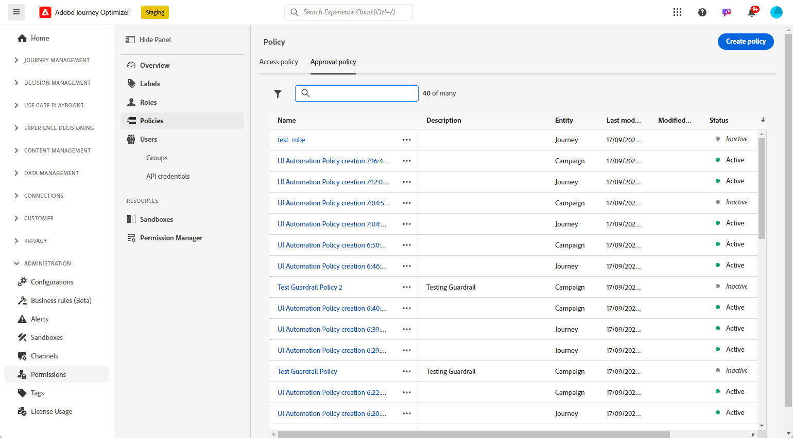
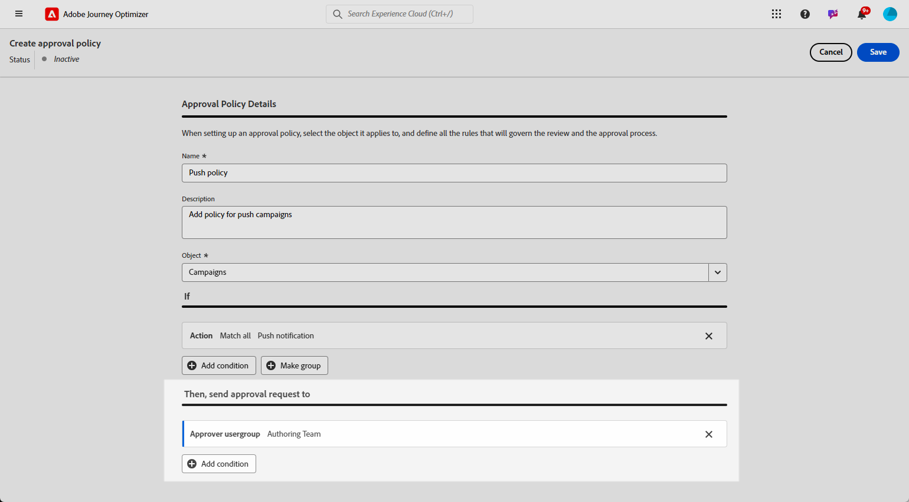
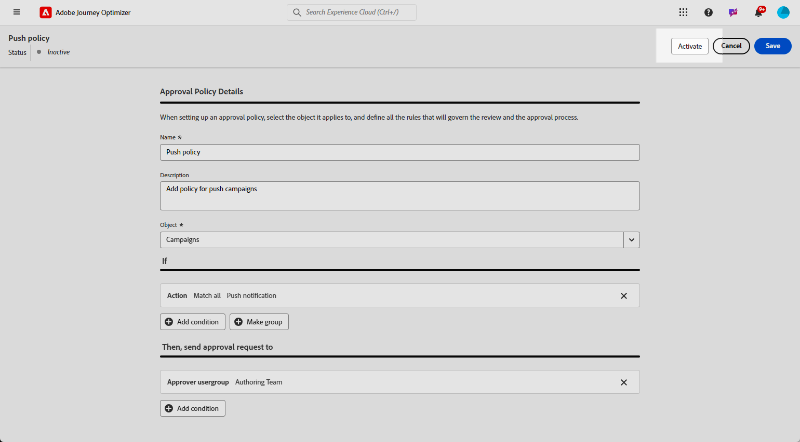

# Goedkeuringsbeleid maken en beheren {#approval-policies}

>[!CONTEXTUALHELP]
>id="ajo_approval_policy_request_approval"
>title="Goedkeuring aanvragen"
>abstract="Goedkeuring aanvragen"

>[!CONTEXTUALHELP]
>id="ajo_approval_policy_request_change"
>title="Verzoek wijzigen"
>abstract="Verzoek wijzigen"

>[!NOTE]
>
>Voor het maken van goedkeuringsbeleid hebt u in Adobe Experience Platform systeem- of productbeheerdersrechten nodig. [Meer informatie](https://experienceleague.adobe.com/en/docs/experience-platform/access-control/home)

Met het goedkeuringsbeleid kunnen beheerders een validatieproces voor reizen en campagnes instellen. Dit systeem schetst specifieke voorwaarden die bepalen of een reis of campagne goedkeuring vereist. Dit beleid kan in ingewikkeldheid variëren. Ze kunnen gewoon verlangen dat alle campagnes worden gecontroleerd door een bepaalde gebruiker of een bepaald team, of ze kunnen criteria vaststellen op basis van wie de campagne heeft gemaakt.

U kunt goedkeuringsbeleid richten gebruikend flexibele criteria zoals markeringen, campagne/reis namen, kanaaltypes, of verzoekersinformatie. U kunt bijvoorbeeld goedkeuring vereisen voor alle objecten met het label &quot;hoog risico&quot;, of voor elke campagne die overeenkomt met een specifiek naamgevingspatroon.

## Goedkeuringsbeleid maken {#create-policies}

>[!CONTEXTUALHELP]
>id="ajo_permissions_approval_policy"
>title="Nieuw goedkeuringsbeleid"
>abstract="In dit scherm, ga de naam in en selecteer de context voor het goedkeuringsbeleid, dan bouwt de voorwaarden om te bepalen wie de goedkeuringsverzoek in werking kan stellen en wie het kan bevestigen."

Voer de volgende stappen uit om een goedkeuringsbeleid te maken:

1. Open in het menu **[!UICONTROL Administration]** in [!DNL Journey Optimizer] eerst **[!UICONTROL Permissions]** en daarna **[!UICONTROL Policies]** .

   

1. Klik op **[!UICONTROL Create]** op het tabblad **[!UICONTROL Approval Policy]** , kies **[!UICONTROL Approval Policy]** en klik op **[!UICONTROL Confirm]** .

1. Voer een **[!UICONTROL Name]** en **[!UICONTROL Description]** in voor het beleid.

1. Selecteer of het beleid van toepassing is op **[!UICONTROL Journeys]** of **[!UICONTROL Campaigns]** .

1. Schakel **[!UICONTROL Block self-approval]** in om te voorkomen dat ontwikkelaars van reizen/campagnes hun eigen objecten goedkeuren.

   

U kunt nu de voorwaarden verfijnen om op te geven wie het goedkeuringsverzoek kan starten en wie het kan valideren.

## Voorwaarden instellen voor goedkeuringsbeleid {#conditions}

Het goedkeuringsbeleid biedt flexibele opties voor het toewijzen van doelen, zodat deze aansluiten op uw beheerbehoeften. U kunt goedkeuringsbeleid tot stand brengen dat op diverse criteria wordt gebaseerd, die omvatten:

* **Campagne/de namen van de Reis**: De specifieke voorwerpen van het doel door naam
* **Markeringen**: Pas beleid op alle campagnes of reizen met een specifieke markering toe
* **types van Kanaal**: Vereis goedkeuring voor specifieke acties (e-mail, SMS, duw, enz.)
* **types van Campagne**: Plaats verschillende regels voor [&#x200B; Actie vs. API-teweeggebrachte campagnes &#x200B;](../campaigns/get-started-with-campaigns.md#campaign-types)
* **Eisen**: Bepaal beleid dat op wie tot de campagne of de reis leidt wordt gebaseerd

Voer de volgende stappen uit om de voorwaarden te definiëren die aan een goedkeuringsbeleid zijn gekoppeld:

1. Open uw **[!UICONTROL Approval policy]**.

1. Klik in het menu **[!UICONTROL If]** op **[!UICONTROL Add condition]** om te definiëren welk object of welke gebruiker een goedkeuringsaanvraag activeert.

1. Kies de juiste **[!UICONTROL Category]** , **[!UICONTROL Matching Rule]** en **[!UICONTROL Options]** .

   Bijvoorbeeld &quot;als de Actie om het even welke Directe Post&quot;aanpast of &quot;als de Gebruikersbenaming van de Aanvrager John Doe.&quot;aanpast

   

   +++ Meer informatie over beschikbare rubrieken en opties
   <table>
    <tr>
      <th>Categorie</th>
      <th>Optie</th>
    </tr>
    <tr>
      <td rowspan="3">Type campagne</td>
      <td>Gepland (marketing)</td>
    </tr>
    <tr>
    <td>API-geactiveerd (marketing)</td>
    </tr>
    <tr>
    <td>API-geactiveerd (transactioneel)</td>
    </tr>
    <tr>
    <td rowspan="8">Actie</td>
    <td>In-app</td>
    </tr>
    <tr>
    <td>Pushmelding</td>
   </tr>
    <tr>
    <td>Sms</td>
    </tr>
    <tr>
    <td>Email</td>
    </tr>
    <tr>
    <td>Direct mail</td>
    </tr>
    <tr>
    <td>Web</td>
    </tr>
    <tr>
    <td>Op code gebaseerd</td>
    </tr>
    <tr>
    <td>Inhoudskaart</td>
    </tr>
    <tr>
    <td>Tags</td>
    <td>Naam van de tag die wordt gebruikt om uw publiek in te delen. </td>
    </tr>
    <tr>
    <td>Objectnaam</td>
    <td>Naam van het object.</td>
    </tr>
    <tr>
    <td>Gebruikersnaam aanvrager</td>
    <td>Naam en e-mailadres van de aangewezen aanvrager</td>
    </tr>
    <tr>
    <td>Gebruikersgroep aanvrager</td>
    <td>Naam van de gebruikersgroep met aangewezen aanvragers</td>
    </tr>
    </table>

1. Als u meer criteria wilt toevoegen, klikt u op **[!UICONTROL Add condition]** om extra regels te definiëren en selecteert u **[!UICONTROL And]** of **[!UICONTROL Or]** om op te geven hoe de voorwaarden worden verbonden.

1. Klik in het menu **[!UICONTROL Then, send approval request to]** op **[!UICONTROL Add condition]** om te definiëren welke gebruiker de goedkeuringsaanvraag kan accepteren.

1. Kies in de vervolgkeuzelijst **[!UICONTROL Category]** of u een gebruikersgroep of een individuele gebruiker wilt kiezen.

1. Selecteer vervolgens in de vervolgkeuzelijst **[!UICONTROL Option]** de specifieke gebruikersgroep of gebruiker.

   De geselecteerde gebruiker of gebruikersgroep is verantwoordelijk voor de validatie van de goedkeuringsaanvraag.

   

1. Als u meer criteria wilt toevoegen, klikt u op **[!UICONTROL Add condition]** om extra regels te definiëren en selecteert u **[!UICONTROL And]** of **[!UICONTROL Or]** om op te geven hoe de voorwaarden worden verbonden.

1. Als uw beleid volledig is geconfigureerd, klikt u op **[!UICONTROL Save]** .

U kunt nu uw goedkeuringsbeleid activeren om het toe te passen.

## Goedkeuringsbeleid activeren en beheren {#activate-policies}

Als u het goedkeuringsbeleid wilt toepassen, moet u het activeren. Voer de volgende stappen uit om dit te doen:

1. Open uw **[!UICONTROL Approval policy]**.

1. Klik vervolgens op **[!UICONTROL Activate]** om de geconfigureerde voorwaarden toe te passen op uw omgeving.

   >[!NOTE]
   >
   >Nadat het beleid is geactiveerd, kan het niet meer worden bewerkt. Als u voorwaarden wilt wijzigen, deactiveert u eerst het beleid.

   

1. Open in het menu **[!UICONTROL Policy]** de geavanceerde opties naar **[!UICONTROL Edit]** , **[!UICONTROL Deactivate]** of **[!UICONTROL Duplicate]** het beleid.

   
