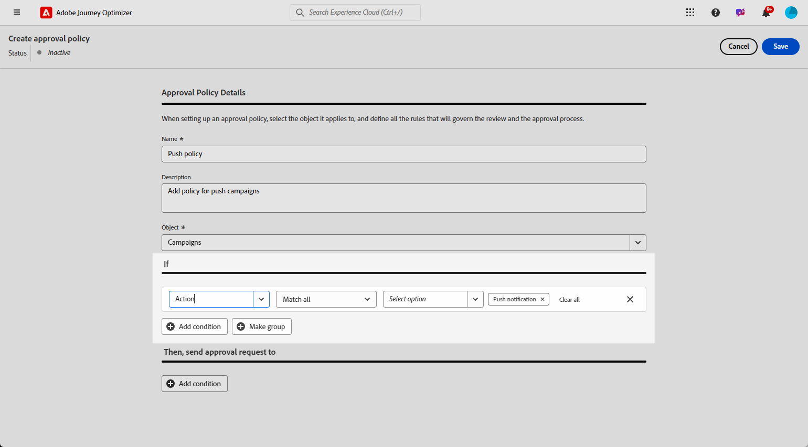

# Goedkeuringsbeleid maken en beheren {#approval-policies}

>[!AVAILABILITY]
>
> Het goedkeuringsbeleid is momenteel alleen beschikbaar voor een aantal organisaties (beperkte beschikbaarheid). Neem contact op met uw Adobe als u toegang wilt.

Met het goedkeuringsbeleid kunnen beheerders een validatieproces voor reizen en campagnes instellen. Dit systeem schetst specifieke voorwaarden die bepalen of een reis of campagne goedkeuring vereist. Dit beleid kan in ingewikkeldheid variëren, van eenvoudig het vereisen van alle campagnes om door een bepaalde gebruiker of een team worden herzien, tot het bepalen van criteria die op wie de campagne hebben gecreeerd worden gebaseerd.

## Goedkeuringsbeleid maken {#create-policies}

1. Open **[!UICONTROL Permissions]** then **[!UICONTROL Policies]** via het menu **[!UICONTROL Administration]** .

   

1. Klik op **[!UICONTROL Create]** op het tabblad **[!UICONTROL Approval Policy]** , kies **[!UICONTROL Approval Policy]** en klik op **[!UICONTROL Confirm]** .

1. Voer een **[!UICONTROL Name]** en **[!UICONTROL Description]** in voor het beleid.

1. Selecteer of het beleid van toepassing is op **[!UICONTROL Journeys]** of **[!UICONTROL Campaigns]** .

   

U kunt nu de voorwaarden verfijnen en opgeven wie de goedkeuringsaanvraag moet starten en wie de aanvraag moet valideren.

## Voorwaarden instellen voor goedkeuringsbeleid {#conditions}

1. Open uw **[!UICONTROL Approval policy]**.

1. Klik in het menu **[!UICONTROL If]** op **[!UICONTROL Add condition]** om te definiëren welk object of welke gebruiker een goedkeuringsaanvraag activeert.

1. Kies de juiste **[!UICONTROL Category]** , **[!UICONTROL Matching Rule]** en **[!UICONTROL Options]** .

   Bijvoorbeeld &quot;als de Actie om het even welke Directe Post&quot;aanpast of &quot;als de Gebruikersbenaming van de Aanvrager John Doe.&quot;aanpast

   

+++ Meer informatie over beschikbare rubrieken en opties
   <table>
    <tr>
      <th>Categorie</th>
      <th>Optie</th>
    </tr>
    <tr>
      <td rowspan="3">Type campagne</td>
      <td>Gepland (marketing)</td>
    </tr>
    <tr>
    <td>API-geactiveerd (marketing)</td>
    </tr>
    <tr>
    <td>API-geactiveerd (transactioneel)</td>
    </tr>
    <tr>
    <td rowspan="8">Actie</td>
    <td>In-app</td>
    </tr>
    <tr>
    <td>Pushmelding</td>
   </tr>
    <tr>
    <td>Sms</td>
    </tr>
    <tr>
    <td>Email</td>
    </tr>
    <tr>
    <td>Direct mail</td>
    </tr>
    <tr>
    <td>Web</td>
    </tr>
    <tr>
    <td>Op code gebaseerd</td>
    </tr>
    <tr>
    <td>Inhoudskaart</td>
    </tr>
    <tr>
    <td>Gebruikersnaam aanvrager</td>
    <td>Naam en e-mailadres van de ontwerper</td>
    </tr>
    <tr>
    <td>Gebruikersgroep aanvrager</td>
    <td>Naam van de gebruikersgroep van ontworpen aanvragers</td>
    </tr>
    </table>

1. Als u meer criteria wilt toevoegen, klikt u op **[!UICONTROL Add condition]** om extra regels te definiëren en selecteert u **[!UICONTROL And]** of **[!UICONTROL Or]** om op te geven hoe de voorwaarden worden verbonden.

1. Klik in het menu **[!UICONTROL Then, send approval request to]** op **[!UICONTROL Add condition]** om te definiëren welke gebruiker de goedkeuringsaanvraag kan accepteren.

1. Kies in de vervolgkeuzelijst **[!UICONTROL Category]** of u een gebruikersgroep of een individuele gebruiker wilt kiezen.

1. Selecteer vervolgens in de vervolgkeuzelijst **[!UICONTROL Option]** de specifieke gebruikersgroep of gebruiker.

   De geselecteerde gebruiker of gebruikersgroep is verantwoordelijk voor de validatie van de goedkeuringsaanvraag.

   

1. Als u meer criteria wilt toevoegen, klikt u op **[!UICONTROL Add condition]** om extra regels te definiëren en selecteert u **[!UICONTROL And]** of **[!UICONTROL Or]** om op te geven hoe de voorwaarden worden verbonden.

1. Als uw beleid volledig is geconfigureerd, klikt u op **[!UICONTROL Save]** .

U kunt nu uw goedkeuringsbeleid activeren om het toe te passen.

## Goedkeuringsbeleid activeren en beheren {#activate-policies}

1. Open uw **[!UICONTROL Approval policy]**.

1. Klik vervolgens op **[!UICONTROL Activate]** om de geconfigureerde voorwaarden toe te passen op uw omgeving.

   >[!NOTE]
   >
   >Nadat het beleid is geactiveerd, kan het niet meer worden bewerkt. Als u voorwaarden wilt wijzigen, deactiveert u eerst het beleid.

   

1. Open in het menu **[!UICONTROL Policy]** de geavanceerde opties naar **[!UICONTROL Edit]** , **[!UICONTROL Deactivate]** of **[!UICONTROL Duplicate]** het beleid.

   

