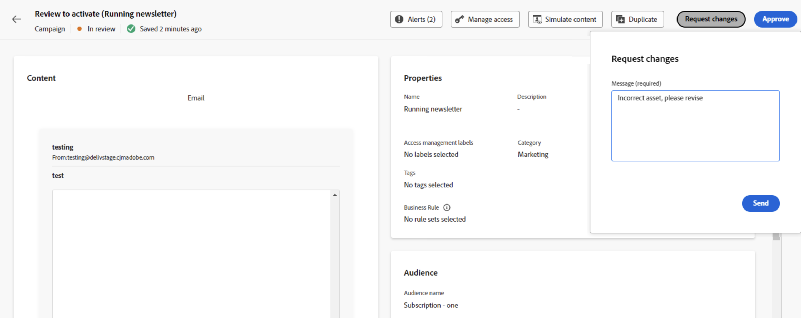

# Een aanvraag bekijken en goedkeuren {#approve-requests}

Als een goedkeuringsbeleid van toepassing is op een reis of campagne, moet het ter goedkeuring worden voorgelegd om te worden gepubliceerd. Hiervoor stuurt de maker van de reis/campagne een aanvraag naar de fiatteur(s) die in het goedkeuringsbeleid is gedefinieerd en krijgt de reis/campagne de status **[!UICONTROL In review]** .

Als u als fiatteur bent geselecteerd, ontvangt u een melding via e-mail en een Journey Optimizer-waarschuwing. Deze waarschuwing is toegankelijk wanneer u in het tabblad **[!UICONTROL Requests]** op het belpictogram rechtsboven in het scherm klikt.

Als u de reis/campagne wilt bekijken, opent u deze vanuit de e-mail of waarschuwing en controleert u de instellingen zoals het publiek, de inhoud of de instellingen.
Zodra gedaan, kunt u of [ goedkeuren en de reis/de campagne ](#approve) publiceren, of [ verzoekveranderingen alvorens het ](#changes) te activeren.

>[!NOTE]
>
>Het reviseren van een campagne is een alleen-lezen stap: u kunt alle instellingen visualiseren, maar er kunt geen actie op uitvoeren.
>
>Voordat u een reis of campagne gaat reviseren, moet u controleren of u over de vereiste machtigingen beschikt.

## Een reis/campagne goedkeuren en publiceren {#approve}

Als een reis of campagne klaar is om live te gaan, kunt u deze goedkeuren door op de knop **[!UICONTROL Approve]** te klikken.

Klik in het venster dat wordt weergegeven op **[!UICONTROL Approve and activate]** om de rit/campagne live te zetten.

## Wijzigingen in een reis/campagne aanvragen {#changes}

Als er wijzigingen nodig zijn in een reis of campagne die ter goedkeuring is verzonden, kunt u een verzoek naar de maker sturen zodat deze de noodzakelijke wijzigingen aanbrengt.

Klik hiertoe op de knop **[!UICONTROL Request changes]** . Geef in de deelvensters die worden geopend een bericht met uw verzoek op en klik op **[!UICONTROL Send]** om uw verzoek in te dienen.

Nadat de aanvraag is verzonden, wordt de maker van de reis/campagne via e-mail op de hoogte gebracht en wordt een Journey Optimizer-waarschuwing weergegeven. De campagne keert terug naar de status &quot;Concept&quot;. Nadat de wijzigingen zijn geïntegreerd, kan de maker van de reis/campagne deze opnieuw ter goedkeuring voorleggen.

>[!NOTE]
>
> Als u geen goedkeuringsmelding ontvangt via een e-mail, moet u uw abonnementsvoorkeuren bijwerken in uw Experience Cloud-profielen. [Meer informatie](https://experienceleague.adobe.com/en/docs/core-services/interface/features/account-preferences)
