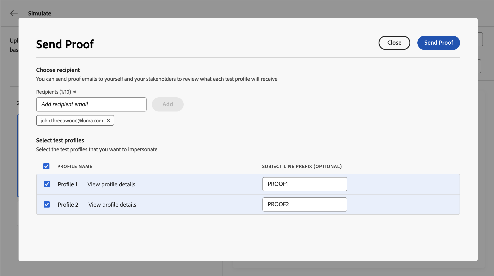

# Inhoudsvariaties simuleren {#custom-profiles}

>[!CONTEXTUALHELP]
>id="ajo_simulate_sample_profiles"
>title="Simuleren met behulp van voorbeeldinvoer"
>abstract="In dit scherm kunt u verschillende varianten van uw inhoud testen door waarden voor verpersoonlijkingsgebieden door een malplaatje CSV of JSON te verstrekken, of door de waarden manueel in te gaan."

In [!DNL Journey Optimizer] kunt u verschillende variaties van uw inhoud voorvertonen met voorbeeldinvoergegevens die zijn geüpload vanuit een CSV- of JSON-bestand of die handmatig zijn toegevoegd.

Alle kenmerken die in de inhoud voor personalisatie worden gebruikt, worden automatisch door het systeem gedetecteerd en kunnen voor uw tests worden gebruikt om meerdere varianten te maken. Een variant verwijst naar een versie van de inhoud met verschillende waarden voor de kenmerken ervan.

>[!NOTE]
>
>Varianten dienen alleen als testdoeleinden voor de huidige inhoud. Ze worden niet opgeslagen in Adobe Experience Platform, maar in uw gebruikersbrowsersessie. Dit houdt in dat ze niet worden weergegeven wanneer ze worden afgemeld of wanneer er vanaf een ander apparaat wordt gewerkt.

## Afbeeldingen en beperkingen {#limitations}

Overweeg de volgende instructies en voorwaarden voordat u begint met het testen van de inhoud met behulp van voorbeeldinvoergegevens.

* **Kanalen** - het Simuleren van inhoudsvariaties is beschikbaar voor:

   * de kanalen voor e-mail-, sms- en pushmeldingen;
   * alle binnenkomende kanalen (Web, code-gebaseerde ervaring, In-app, de kaarten van de Inhoud).

* **Gesteunde mogelijkheden** - de variaties van de inhoud kunnen met [!DNL Journey Optimizer] meertalige inhoud en inhoud experimenteren mogelijkheden worden gebruikt. Zo kunt u berichten in meerdere talen testen en inhoud optimaliseren door te experimenteren.

  U kunt inhoudsvariaties ook gebruiken om uw inhoudssjablonen te testen.

  >[!NOTE]
  >
  >Momenteel zijn inbox rendering en spamrapporten niet beschikbaar in de huidige ervaring. Als u deze functies wilt gebruiken, selecteert u de knop **[!UICONTROL Simulate content]** in de inhoud om toegang te krijgen tot de vorige gebruikersinterface.

* **Attributen** - zowel worden profiel als contextafhankelijke attributen gesteund.

* **de types van Gegevens** - slechts worden de volgende gegevenstypes gesteund wanneer het ingaan van gegevens voor uw varianten: aantal (geheel en decimaal), koord, boolean en datumtype. Voor elk ander gegevenstype wordt een fout weergegeven.

* **Aantal varianten** - u kunt tot 30 varianten toevoegen om uw inhoud te testen, of gebruikend een dossier, of manueel.

## Inhoudsvariaties toevoegen en voorvertonen

Als u variaties voor uw inhoud wilt maken en deze wilt voorvertonen, klikt u op de knop **[!UICONTROL Simulate content]** en kiest u **[!UICONTROL Simulate content variations]** .


De belangrijkste stappen om uw inhoud te testen zijn als volgt:

1. **voegt Varianten** toe - voeg tot 30 varianten met steekproefinputgegevens toe, of door een dossier te uploaden, of door gegevens manueel toe te voegen. [&#x200B; Leer hoe te om variabelen toe te voegen &#x200B;](#profiles)
1. **de inhoudsvariaties van de Voorproef** - controleer de voorproef van uw inhoud gebruikend de verschillende varianten. [&#x200B; Leer hoe te om uw inhoud &#x200B;](#preview) voor te vertonen
1. **verzend e-mailproefdrukken** - voor e-mailinhoud, verzend tot 10 proefdrukken naar e-mailadressen gebruikend de verschillende varianten. [&#x200B; Leer hoe te om proefdrukken &#x200B;](#proofs) te verzenden

### Varianten toevoegen {#profiles}

Wanneer u de ervaring met inhoudvariaties opent, worden alle aanpassingsvelden die in de inhoud worden gebruikt, automatisch gedetecteerd en weergegeven in een lijst met lege varianten.

Als uw e-mail bijvoorbeeld twee verpersoonlijkingsvelden &#39;Stad&#39; en &#39;Balans programmapunten&#39; bevat, worden deze weergegeven in de lijst. In eerste instantie worden geen waarden ingevoerd en wordt er geen gepersonaliseerde inhoud weergegeven in het voorvertoningsvenster.


De waarde van een variant bewerken:

1. Klik op de knop voor ovaal naast de variant.
1. Selecteer **[!UICONTROL Edit]** om aangepaste waarden voor elk verpersoonlijkingsveld op te geven.
1. Het voorvertoningsvenster wordt bijgewerkt om te tonen hoe de inhoud wordt weergegeven met de ingevoerde waarden.

Een nieuwe variant toevoegen:

1. Klik op de knop **[!UICONTROL Create sample input]**.
1. Er wordt een nieuwe, lege variant weergegeven die alle gedetecteerde personalisatievelden bevat.
1. Bewerk indien nodig de nieuwe variant.


U kunt ook een bestand met vooraf gedefinieerde varianten en waarden uploaden om het proces te versnellen.

1. Klik op **[!UICONTROL Download sample]** om een bestandssjabloon te downloaden.
1. Kies een bestandsindeling: CSV, JSON of JSONLINES.
1. Open het sjabloonbestand en vul de gewenste waarden in voor elk profielkenmerk. De sjabloon bevat een kolom voor elk profielkenmerk dat in uw inhoud wordt gebruikt voor personalisatie.

   JSON-voorbeeldsyntaxis:

   ```
   {
   "profile": {
       "attributes": {
       "person": {
           "name": {
               "lastName": "Doe",
               "firstName": "John"
               }
           }
       }
   }
   }
   ```

1. Wanneer het bestand gereed is, klikt u op **[!UICONTROL Upload Input Data]** om het te laden.
1. Na het uploaden wordt een nieuwe variant toegevoegd aan de lijst voor elk item in het bestand.

   

Nadat u varianten hebt toegevoegd, kunt u deze gebruiken om een voorvertoning van de inhoud weer te geven in het rechterdeelvenster en om e-mailproefdrukken te verzenden.

### Inhoudsvariaties voorvertonen {#preview}

Als u de inhoud wilt voorvertonen met een variant, selecteert u de desbetreffende variant in de lijst om de inhoud in het voorvertoningsvenster bij te werken met de informatie die u voor deze variant hebt ingevoerd.

In het onderstaande voorbeeld hebben we twee varianten toegevoegd voor de onderwerpregel van de e-mail:

| Selectie van variant 1 | Selectie van variant 2 |
|----------|-------------|
|  |  |

Voor meertalige inhoud en experimenten is een vervolgkeuzelijst beschikbaar voor het schakelen tussen de verschillende taalvarianten of behandelingen.


U kunt een variant op elk gewenst moment verwijderen met de ellipknop in de rechterbovenhoek en door **[!UICONTROL Remove]** te selecteren. Als u informatie voor een variant wilt bewerken, klikt u op de knop voor weglatingsteken en selecteert u **[!UICONTROL Edit]** .

### Proefdrukken verzenden {#proofs}

Met Journey Optimizer kunt u proefdrukken naar e-mailadressen verzenden en tegelijkertijd een of meerdere varianten nabootsen die u in het simulatiescherm hebt toegevoegd. De stappen zijn als volgt:

1. Controleer of er varianten zijn toegevoegd om de inhoud te testen en klik op de knop **[!UICONTROL Send Proof]** .

1. Voer in het veld **[!UICONTROL Recipients]** het e-mailadres in waarnaar u de proefdruk wilt verzenden en klik vervolgens op **[!UICONTROL Add]** . Herhaal de bewerking om de proefdruk naar extra e-mailadressen te verzenden. U kunt maximaal tien proefontvangers toevoegen.

1. Selecteer in het onderste gedeelte van het scherm de variant die u wilt gebruiken in de proefdruk. U kunt meerdere varianten selecteren. In dat geval bevat het e-mailbericht evenveel proefdrukken als geselecteerde varianten.

   Selecteer de koppeling **[!UICONTROL View profile details]** voor meer informatie over een variant. Op deze manier kunt u de informatie die u in het vorige scherm hebt ingevoerd, weergeven voor de verschillende varianten.

   

1. Klik op de knop **[!UICONTROL Send Proof]** om de proefdruk te verzenden.

1. Klik op de knop **[!UICONTROL View proofs]** in het scherm Inhoud simuleren om het verzenden van de proefdrukken bij te houden.


