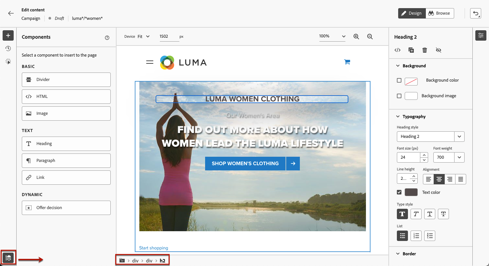
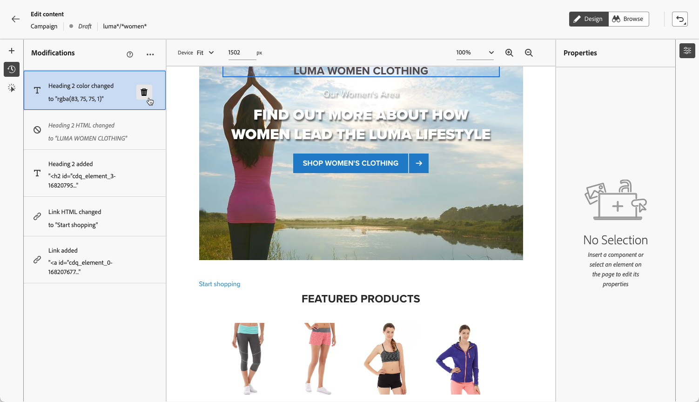

# Webpagina&#39;s van auteurs {#author-web}

>[!AVAILABILITY]
>
>De functie Webkanaal is momenteel beschikbaar als bètaversie om alleen gebruikers te selecteren.

In [!DNL Journey Optimizer] Webcreatie wordt aangedreven door de browser van Adobe Experience Cloud Visual Helper chrome uitbreiding. [Meer informatie](visual-editing-helper.md)

Webpagina&#39;s openen en ontwerpen in het dialoogvenster [!DNL Journey Optimizer] gebruikersinterface, volg de voorwaarden die in [deze sectie](create-web.md#prerequesites).

## Webpagina-inhoud bewerken {#edit-web-content}

Nadat u een webactie hebt gemaakt vanuit de campagne, kunt u de inhoud bewerken met de webontwerper. Hiervoor voert u de volgende stappen uit.

1. Van de **[!UICONTROL Action]** tabblad van de campagne, selecteert u **[!UICONTROL Edit content]** om uw webcampagne te gaan ontwerpen. [Meer informatie](create-web.md#configure-web-campaign)

1. Als u een pagina&#39;s maakte die regel aanpassen, moet u om het even welke URL ingaan die deze regel aanpast. De wijzigingen worden toegepast op alle pagina&#39;s die aan de regel voldoen.

   >[!NOTE]
   >
   >Als u één URL hebt ingevoerd als het weboppervlak, wordt de aan te passen URL al ingevuld.

   

1. De inhoud van de pagina wordt weergegeven.

   >[!CAUTION]
   >
   >De webpagina moet worden geïmplementeerd met de functie [Adobe Experience Platform Web SDK](https://experienceleague.adobe.com/docs/platform-learn/implement-web-sdk/overview.html){target=&quot;_blank&quot;}.

1. Klikken **[!UICONTROL Open web designer]** om het te bewerken. [Meer informatie](author-web.md)

   

1. De webontwerper wordt weergegeven.

   

1. Selecteer een element op het canvas, zoals een afbeelding, knop, alinea, tekst, container, kop, koppeling, enzovoort. en gebruik:

   * Het contextafhankelijke menu voor het bewerken van de inhoud, lay-out, het invoegen van koppelingen of personalisatie, enz.

      

   * De pictogrammen boven in het rechterdeelvenster om elk element te bewerken, te dupliceren, te verwijderen of te verbergen.

      

   * Het rechterdeelvenster dat dynamisch verandert volgens het geselecteerde element. U kunt bijvoorbeeld de achtergrond, typografie, rand, grootte, positie, tussenruimte, effecten of inline stijlen van een element bewerken.

      

## Inhoudscomponenten gebruiken {#content-components}

1. Van de **[!UICONTROL Components]** kunt u de volgende componenten aan uw webpagina toevoegen en deze naar wens bewerken:

   * [Scheidingslijn](../design/content-components.md#divider)
   * [HTML](../design/content-components.md#HTML)
   * [Afbeelding](../design/content-components.md#image)
   * Kop - Het gebruik van deze component lijkt op het gebruik van de **[!UICONTROL Text]** in de e-mailontwerper. [Meer informatie](../design/content-components.md#text)
   * Alinea - Het gebruik van deze component lijkt op het gebruik van de component **[!UICONTROL Text]** in de e-mailontwerper. [Meer informatie](../design/content-components.md#text)
   * Koppeling - Leer hoe u de opmaak van koppelingen kunt definiëren in [deze sectie](../design/styling-links.md)
   * [Offertebeslissing](../design/deliver-personalized-offers.md)

   

1. Houd de muisaanwijzer boven de pagina en klik op de knop **[!UICONTROL Insert before]** of **[!UICONTROL Insert after]** om de component toe te voegen aan een bestaand element op de pagina.

   

1. Bewerk in de container die voor deze component wordt weergegeven de inhoud van de component naar wens.

   

1. Pas de stijlen aan die vanuit de **[!UICONTROL Container]** aan de rechterkant, zoals achtergrond, tekstkleur, rand, grootte, positie, enz. afhankelijk van de geselecteerde component.

   

## Navigeren door de webontwerper

### Breedkruimels gebruiken

1. Selecteer een willekeurig element op het canvas.

1. Klik op de knop **[!UICONTROL Expand/Collapse Breadcrumbs]** aan de linkerbenedenzijde van het scherm om snel informatie over het geselecteerde element weer te geven.

   

1. Wanneer u de muisaanwijzer boven de broodkruimels houdt, wordt het bijbehorende element gemarkeerd in de editor.

1. Met deze editor kunt u eenvoudig naar elk bovenliggend, verwant of onderliggend element in de visuele editor navigeren.

### Wisselen naar modus Bladeren {#browse-mode}

U kunt de standaardinstelling wijzigen **[!UICONTROL Design]** aan de **[!UICONTROL Browse]** met de toegewezen knop.

Van de **[!UICONTROL Browse]** kunt u vanuit het geselecteerde oppervlak dat u wilt aanpassen naar de exacte pagina navigeren.

Dit is vooral handig wanneer u werkt met pagina&#39;s die zich achter verificatie bevinden of die niet vanaf het begin bij een bepaalde URL beschikbaar zijn. U kunt bijvoorbeeld verifiëren, naar uw accountpagina of naar uw winkelwagenpagina gaan en vervolgens teruggaan naar **[!UICONTROL Design]** om de wijzigingen op de gewenste pagina uit te voeren.

### De apparaatgrootte wijzigen

U kunt de apparaatgrootte wijzigen in een vooraf gedefinieerde grootte, zoals **[!UICONTROL Tablet]** of **[!UICONTROL Mobile landscape]** of definieer een aangepaste grootte. Voer het gewenste aantal pixels in om een aangepaste grootte te definiëren.

U kunt de zoomfocus ook wijzigen van 25% in 400%.

## Wijzigingen beheren {#manage-modifications}

U kunt eenvoudig alle componenten, aanpassingen en stijlen beheren die u aan uw webpagina hebt toegevoegd.

1. Selecteer **[!UICONTROL Modifications]** om het corresponderende venster links weer te geven.

   

1. U kunt alle wijzigingen bekijken die u op de pagina hebt aangebracht.

1. Selecteer een ongewenste wijziging en klik op het verwijderpictogram om deze te verwijderen.

   

   >[!CAUTION]
   >
   >Ga voorzichtig te werk wanneer u een actie verwijdert, aangezien dit van invloed kan zijn op volgende acties.

1. U kunt handelingen ook annuleren en opnieuw uitvoeren met de opdracht **[!UICONTROL Undo/Redo]** op de rechterbovenhoek van het scherm.

   

   Klik en houd de knoop om tussen te schakelen **[!UICONTROL Undo]** en **[!UICONTROL Redo]** opties. Klik vervolgens op de knop zelf om de gewenste actie toe te passen.

## Voeg personalisatie en aanbiedingen toe

Als u verpersoonlijking wilt toevoegen, selecteert u een container en selecteert u het verpersoonlijkingspictogram in de contextafhankelijke menubalk die wordt weergegeven. Voeg uw wijzigingen toe met de Expressieeditor. [Meer informatie](../personalization/personalization-build-expressions.md)

Gebruik de **[!UICONTROL Offer decision]** in te voegen component [aanbiedingen](../offers/get-started/starting-offer-decisioning.md) in uw webpagina&#39;s. Het proces is hetzelfde als wanneer [een voorstel toevoegen aan een e-mailbericht](../design/deliver-personalized-offers.md). Het zal Beslissingsbeheer gebruiken om de beste aanbieding aan uw klanten te kiezen.

## De webcampagne testen {#test-web-campaign}

Volg onderstaande stappen om een voorvertoning van uw gewijzigde webervaring weer te geven.

>[!CAUTION]
>
>U moet testprofielen beschikbaar hebben om te simuleren welke aanbiedingen aan hen zullen worden geleverd. Leer hoe u [testprofielen maken](../segment/creating-test-profiles.md).

1. Van één van beide **[!UICONTROL Edit content]** scherm of webontwerper, selecteer **[!UICONTROL Simulate content]**.

   

1. Klikken **[!UICONTROL Manage test profiles]** om een of meer testprofielen te selecteren.
1. Er wordt een voorvertoning van de gewijzigde webpagina weergegeven.

   

1. U kunt de test-URL ook kopiëren om deze in een browser te plakken of openen in de standaardbrowser.
