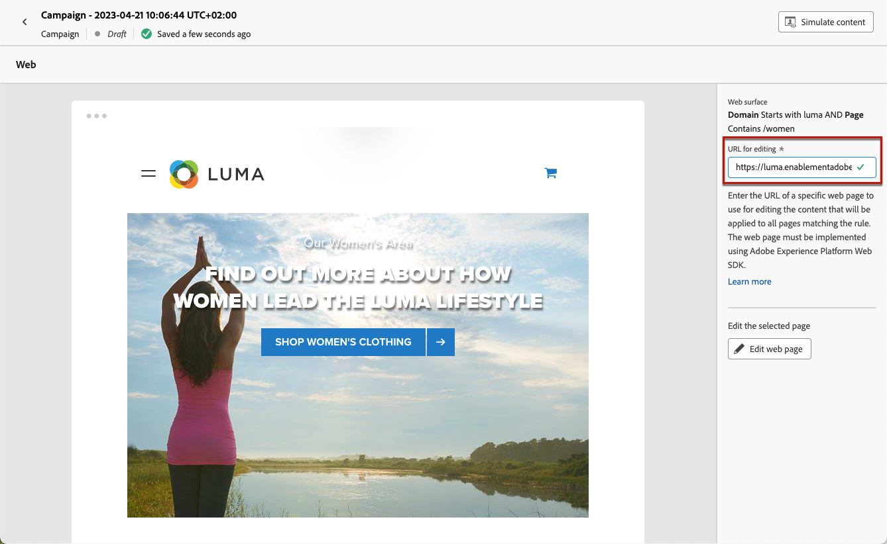
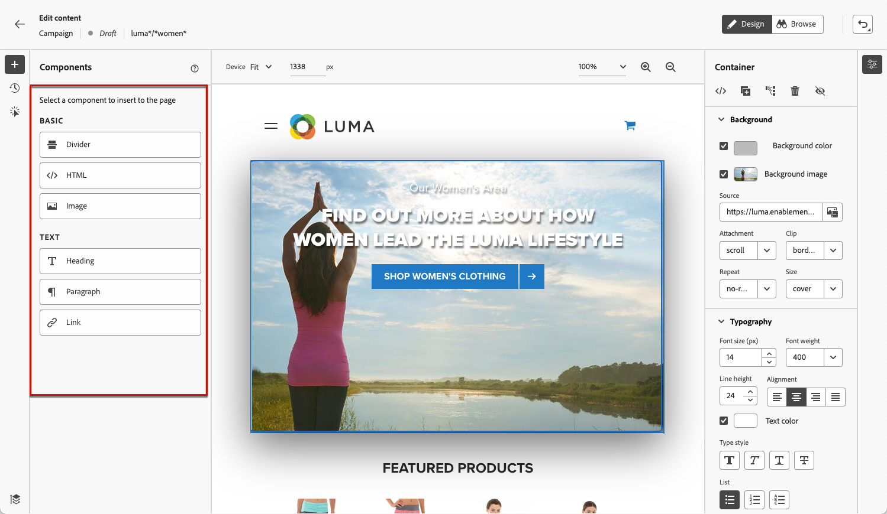
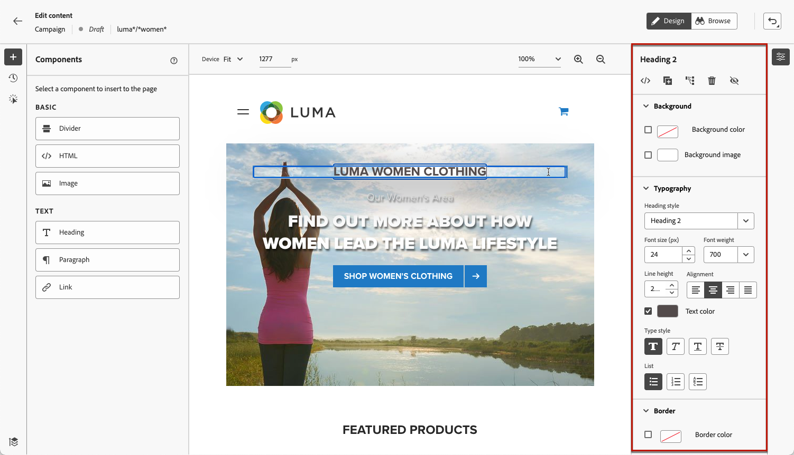
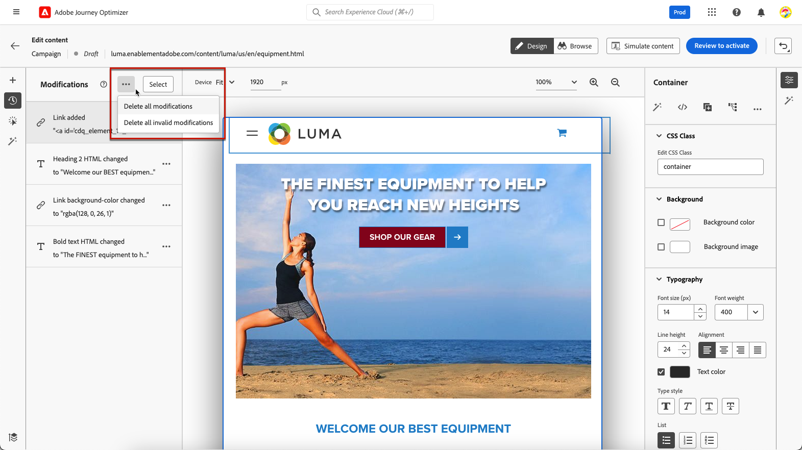

# Webpagina&#39;s van auteurs {#author-web}

Eenmaal [een webactie toevoegen](create-web.md#create-web-campaign) voor uw campagne kunt u de inhoud van uw site bewerken met de webontwerper.

In [!DNL Journey Optimizer], webauthoring wordt aangedreven door de **Adobe Experience Cloud Visual Helper** chrome browserextensie. [Meer informatie](web-prerequisites.md#visual-authoring-prerequisites)

>[!CAUTION]
>
>Webpagina&#39;s openen en ontwerpen in het dialoogvenster [!DNL Journey Optimizer] gebruikersinterface, zorg ervoor u de eerste vereisten volgt die in worden vermeld [deze sectie](web-prerequisites.md).

[Leer hoe u een webcampagne maakt in deze video](#video)

## Webpagina-inhoud bewerken {#edit-web-content}

>[!CONTEXTUALHELP]
>id="ajo_web_url_to_edit_surface"
>title="Bevestig de URL die u wilt bewerken"
>abstract="Bevestig de URL van de specifieke webpagina die u wilt gebruiken voor het bewerken van de inhoud die wordt toegepast op het hierboven gedefinieerde weboppervlak. De webpagina moet worden geïmplementeerd met de Adobe Experience Platform Web SDK."
>additional-url="https://experienceleague.adobe.com/docs/platform-learn/implement-web-sdk/overview.html" text="Meer informatie"

>[!CONTEXTUALHELP]
>id="ajo_web_url_to_edit_rule"
>title="Voer de URL in die u wilt bewerken"
>abstract="Voer de URL in van een specifieke webpagina die u wilt gebruiken voor het bewerken van de inhoud die wordt toegepast op alle pagina&#39;s die aan de regel voldoen. De webpagina moet worden geïmplementeerd met Adobe Experience Platform Web SDK."
>additional-url="https://experienceleague.adobe.com/docs/platform-learn/implement-web-sdk/overview.html" text="Meer informatie"

Volg onderstaande stappen om uw webcampagne te ontwerpen.

1. Van de **[!UICONTROL Action]** tabblad van het dialoogvenster [campagne](create-web.md#create-web-campaign), selecteert u **[!UICONTROL Edit content]**.<!--change screen with rule-->

   

1. Als u een pagina&#39;s maakte die regel aanpassen, moet u om het even welke URL ingaan die deze regel aanpast: de wijzigingen worden toegepast op alle pagina &#39; s die aan de regel voldoen . De inhoud van de pagina wordt weergegeven.

   >[!NOTE]
   >
   >Als u één URL hebt ingevoerd als het weboppervlak, wordt de aan te passen URL al ingevuld.

   

   >[!CAUTION]
   >
   >De webpagina moet de [Adobe Experience Platform Web SDK](https://experienceleague.adobe.com/docs/platform-learn/implement-web-sdk/overview.html){target="_blank"}. [Meer informatie](web-prerequisites.md#implementation-prerequisites)

1. Klikken **[!UICONTROL Edit web page]** om te beginnen met ontwerpen. De webontwerper wordt weergegeven.

   

   >[!NOTE]
   >
   >Als u probeert een website te laden die niet kan worden geladen, wordt een bericht weergegeven waarin u wordt gesuggereerd dat u de [Visuele bewerkingsfunctie voor de browserextensie van Helper](#install-visual-editing-helper). Zie enkele tips voor het oplossen van problemen in [deze sectie](web-prerequisites.md#troubleshooting).

1. Selecteer een element op het canvas, zoals een afbeelding, knop, alinea, tekst, container, kop, koppeling, enzovoort. [Meer informatie](#content-components)

1. Gebruik:

   * Het contextafhankelijke menu voor het bewerken van de inhoud, lay-out, het invoegen van koppelingen of personalisatie, enz.

     

   * De pictogrammen boven in het rechterdeelvenster om elk element te bewerken, te dupliceren, te verwijderen of te verbergen.

     

   * Het rechterdeelvenster dat dynamisch verandert volgens het geselecteerde element. U kunt bijvoorbeeld de achtergrond, typografie, rand, grootte, positie, tussenruimte, effecten of inline stijlen van een element bewerken.

     

>[!NOTE]
>
>De webinhoudontwerper is meestal vergelijkbaar met de e-mailontwerper. Meer informatie over [inhoud ontwerpen met [!DNL Journey Optimizer]](../email/get-started-email-design.md).

## Componenten gebruiken {#content-components}

>[!CONTEXTUALHELP]
>id="ajo_web_designer_components"
>title="Componenten aan uw webpagina toevoegen"
>abstract="U kunt een aantal componenten aan uw webpagina toevoegen en deze naar wens bewerken."

1. Van de **[!UICONTROL Components]** Selecteer een item aan de linkerkant. U kunt de volgende componenten aan uw webpagina toevoegen en deze naar wens bewerken:

   * [Scheidingslijn](../email/content-components.md#divider)
   * [HTML](../email/content-components.md#HTML)
   * [Afbeelding](../email/content-components.md#image)
   * Kop - Het gebruik van deze component lijkt op het gebruik van de **[!UICONTROL Text]** in de e-mailontwerper. [Meer informatie](../email/content-components.md#text)
   * Alinea - Het gebruik van deze component lijkt op het gebruik van de component **[!UICONTROL Text]** in de e-mailontwerper. [Meer informatie](../email/content-components.md#text)
   * Koppeling
   * [Offertebeslissing](../email/add-offers-email.md)

   

1. Houd de muisaanwijzer boven de pagina en klik op de knop **[!UICONTROL Insert before]** of **[!UICONTROL Insert after]** om de component toe te voegen aan een bestaand element op de pagina.

   

   >[!NOTE]
   >
   >Als u de selectie van een component wilt opheffen, klikt u op de knop **[!UICONTROL ESC]** in de contextafhankelijke blauwe banner die boven op het canvas wordt weergegeven.

1. Bewerk de component naar wens rechtstreeks in de inhoud van de pagina.

   

1. Pas de stijlen aan die vanuit het contextafhankelijke venster aan de rechterkant worden weergegeven, zoals achtergrond, tekstkleur, rand, grootte, positie, enz. - afhankelijk van de geselecteerde component.

   

## Voeg personalisatie en aanbiedingen toe

Als u verpersoonlijking wilt toevoegen, selecteert u een container en selecteert u het verpersoonlijkingspictogram in de contextafhankelijke menubalk die wordt weergegeven. Voeg uw wijzigingen toe met de Expressieeditor. [Meer informatie](../personalization/personalization-build-expressions.md)

Gebruik de **[!UICONTROL Offer decision]** in te voegen component [aanbiedingen](../offers/get-started/starting-offer-decisioning.md) in uw webpagina&#39;s. Het proces is hetzelfde als wanneer [een voorstel toevoegen aan een e-mailbericht](../email/add-offers-email.md). Het zal Beslissingsbeheer gebruiken om de beste aanbieding aan uw klanten te kiezen.

## Wijzigingen beheren {#manage-modifications}

>[!CONTEXTUALHELP]
>id="ajo_web_designer_modifications"
>title="Eenvoudig al uw wijzigingen beheren"
>abstract="Met dit deelvenster kunt u door alle aanpassingen en stijlen navigeren die u aan uw webpagina hebt toegevoegd en deze beheren."

U kunt eenvoudig alle componenten, aanpassingen en stijlen beheren die u aan uw webpagina hebt toegevoegd.

1. Selecteer **[!UICONTROL Modifications]** pictogram om het corresponderende venster links weer te geven.

   

1. U kunt alle wijzigingen bekijken die u op de pagina hebt aangebracht.

1. Selecteer een ongewenste wijziging en klik op het verwijderpictogram om deze te verwijderen.

   

   >[!CAUTION]
   >
   >Ga voorzichtig te werk wanneer u een actie verwijdert, aangezien dit van invloed kan zijn op volgende acties.

1. Gebruik de **[!UICONTROL More actions]** boven op de knop **[!UICONTROL Modifications]** om alle wijzigingen tegelijk te verwijderen.

   

1. Van de **[!UICONTROL More actions]** kunt u ook alleen de ongeldige wijzigingen verwijderen. Dit houdt in dat de wijzigingen die zijn overschreven door andere wijzigingen, worden genegeerd. Als u bijvoorbeeld de kleur van een tekst wijzigt en die tekst verwijdert, wordt de kleurwijziging ongeldig omdat de tekst niet meer bestaat.

1. U kunt handelingen ook annuleren en opnieuw uitvoeren met de opdracht **[!UICONTROL Undo/Redo]** op de rechterbovenhoek van het scherm.

   

   Klik en houd de knoop om tussen te schakelen **[!UICONTROL Undo]** en **[!UICONTROL Redo]** opties. Klik vervolgens op de knop zelf om de gewenste actie toe te passen.

## Klikspatiëring gebruiken {#use-click-tracing}

Dankzij deze functie in de webontwerper kunt u elk element van uw website selecteren en de klikken op dat element bijhouden.

Zodra uw campagne live is, kunt u het aantal klikken voor elk element in het campagnewebrapport controleren. Deze informatie kan nuttig zijn om de ervaring van gebruikers van uw website te verbeteren. Als de [webrapporten](../reports/campaign-global-report.md#web-tab) om aan te tonen dat veel gebruikers op een element klikken dat niet echt klikbaar is, kunt u een verbinding aan dat element willen toevoegen.

1. Selecteer een element op de pagina en kies **[!UICONTROL Click track element]** in het contextmenu.

   

   >[!NOTE]
   >
   >Alle items die u kunt klikken, kunnen worden geselecteerd.

1. De bijbehorende bijgehouden actie wordt automatisch weergegeven in het dialoogvenster **[!UICONTROL Click track]** aan de linkerkant.

   

1. Voeg een betekenisvol label toe om al uw bijgehouden elementen te beheren en deze gemakkelijk in de rapporten te vinden. De **[!UICONTROL CSS selector]** in het veld wordt informatie weergegeven om het geselecteerde element te zoeken.

1. Herhaal bovenstaande stappen om zoveel andere elementen te selecteren als u nodig hebt voor het klikken op bijhouden. De bijbehorende acties worden allemaal weergegeven in het linkerdeelvenster.

   

1. Als u klikt op bijhouden op een element wilt verwijderen, selecteert u het bijbehorende verwijderingspictogram.

Zodra uw campagne actief is, kunt u het campagnerapport controleren **[!UICONTROL Web]** om het aantal indrukken te vergelijken, klik tarief en aantal kliks door element. [Meer informatie](../reports/campaign-global-report.md#web-tab)

## Navigeren door de webontwerper {#navigate-web-designer}

### Breedkruimels gebruiken {#breadcrumbs}

1. Selecteer een willekeurig element op het canvas.

1. Klik op de knop **[!UICONTROL Expand/Collapse Breadcrumbs]** aan de linkerbenedenzijde van het scherm om snel informatie over het geselecteerde element weer te geven.

   

1. Wanneer u de muisaanwijzer boven de broodkruimels houdt, wordt het bijbehorende element gemarkeerd in de editor.

1. Met deze editor kunt u eenvoudig naar elk bovenliggend, verwant of onderliggend element in de visuele editor navigeren.

### Wisselen naar modus Bladeren {#browse-mode}

>[!CONTEXTUALHELP]
>id="ajo_web_designer_browse"
>title="De modus Bladeren gebruiken"
>abstract="In deze modus kunt u naar de exacte pagina navigeren vanuit het geselecteerde oppervlak dat u wilt aanpassen."

U kunt de standaardinstelling wijzigen **[!UICONTROL Design]** aan de **[!UICONTROL Browse]** met de toegewezen knop.

Van de **[!UICONTROL Browse]** kunt u vanuit het geselecteerde oppervlak dat u wilt aanpassen naar de exacte pagina navigeren.

Dit is vooral handig wanneer u werkt met pagina&#39;s die zich achter verificatie bevinden of die niet vanaf het begin bij een bepaalde URL beschikbaar zijn. U kunt bijvoorbeeld verifiëren, naar uw accountpagina of naar uw winkelwagenpagina gaan en vervolgens teruggaan naar **[!UICONTROL Design]** om de wijzigingen op de gewenste pagina uit te voeren.

### De apparaatgrootte wijzigen {#change-device-size}

U kunt de apparaatgrootte van de webontwerpweergave wijzigen in een vooraf gedefinieerde grootte, zoals **[!UICONTROL Tablet]** of **[!UICONTROL Mobile landscape]** of definieer een aangepaste grootte door het gewenste aantal pixels in te voeren.

U kunt de zoomfocus ook wijzigen van 25% in 400%.

De mogelijkheid om de apparaatgrootte te wijzigen is ontworpen voor responsieve sites die goed worden weergegeven op verschillende apparaten, vensters en schermgrootten. Responsieve sites worden automatisch aangepast en aangepast aan elke schermgrootte, zoals desktops, laptops, tablets of mobiele telefoons.

>[!CAUTION]
>
>U kunt een webervaring bewerken met een specifieke apparaatgrootte. Nochtans, zolang de selecteurs het zelfde zijn, zijn deze veranderingen op alle grootte en apparaten, niet alleen de apparatengrootte van toepassing dat u binnen werkt. Op dezelfde manier worden de wijzigingen toegepast op alle schermgrootten, en niet alleen op de desktopweergave wanneer u een ervaring bewerkt in de normale weergave.
>
>Momenteel [!DNL Journey Optimizer] ondersteunt geen paginawijzigingen die specifiek zijn voor het apparaatformaat. Dit betekent dat als u bijvoorbeeld een aparte mobiele website met een aparte sitestructuur hebt, u de wijzigingen specifiek voor uw mobiele site in een andere campagne moet doorvoeren.

## De webcampagne testen {#test-web-campaign}

>[!CONTEXTUALHELP]
>id="ajo_web_designer_preview"
>title="Een voorvertoning van uw webbeleving bekijken"
>abstract="Bekijk een simulatie van hoe uw webervaring eruit zal zien."

Volg onderstaande stappen om een voorvertoning van uw gewijzigde webervaring weer te geven.

>[!CAUTION]
>
>U moet testprofielen beschikbaar hebben om te simuleren welke aanbiedingen aan hen zullen worden geleverd. Leer hoe u [testprofielen maken](../audience/creating-test-profiles.md).

1. Selecteer in het scherm Inhoud bewerken in de webcampagne de optie **[!UICONTROL Simulate content]**.

   <!---->

   

1. Klikken **[!UICONTROL Manage test profiles]** om een of meer testprofielen te selecteren.
1. Er wordt een voorvertoning van de gewijzigde webpagina weergegeven.

   

1. U kunt de URL ook openen in de standaardbrowser of de test-URL kopiëren en in een browser plakken. Op deze manier kunt u de koppeling delen met uw team en belanghebbenden die de nieuwe webervaring in een browser kunnen bekijken voordat de campagne live gaat.

   >[!NOTE]
   >
   >Wanneer het kopiëren van testURL, is de getoonde inhoud die voor het testprofiel wordt gepersonaliseerd dat wordt gebruikt toen de inhoudsimulatie werd geproduceerd in [!DNL Journey Optimizer].

## Hoe kan ik-video{#video}

In de onderstaande video ziet u hoe u een webervaring kunt ontwerpen met de webontwerper in [!DNL Journey Optimizer] campagnes.

>[!VIDEO](https://video.tv.adobe.com/v/3418803/?quality=12&learn=on)
