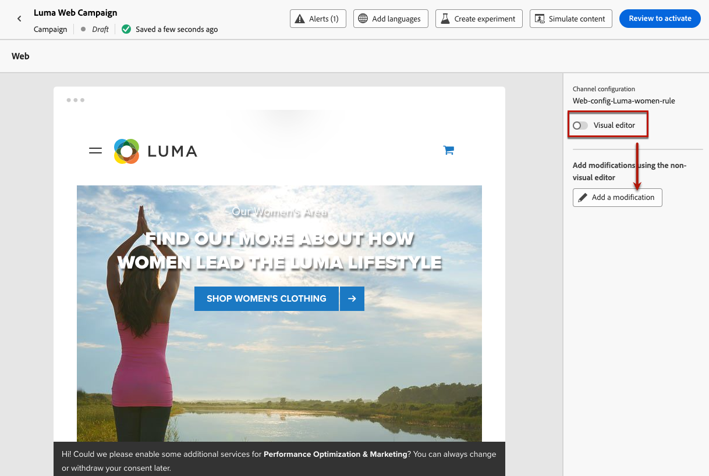
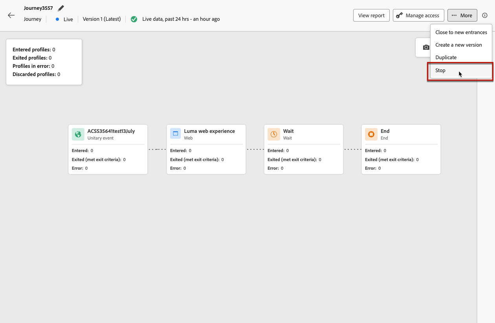

# Webervaringen maken {#create-web}

Met [!DNL Journey Optimizer] kunt u de webervaring die u aan uw klanten levert, aanpassen via binnenkomende reizen of campagnes.

## Een webervaring definiëren via een reis of campagne {#create-web-experience}

>[!CONTEXTUALHELP]
>id="ajo_web_surface"
>title="Een webconfiguratie definiëren"
>abstract="Een webconfiguratie kan overeenkomen met één pagina-URL of meerdere pagina&#39;s, zodat u inhoudwijzigingen kunt doorvoeren op een of meerdere webpagina&#39;s."

>[!CONTEXTUALHELP]
>id="ajo_web_surface_rule"
>title="Een overeenkomende regel voor pagina&#39;s maken"
>abstract="Met een regel voor pagina&#39;s die overeenkomen met een regel, kunt u bijvoorbeeld meerdere URL&#39;s met dezelfde regel als doel instellen. Dit is bijvoorbeeld het geval als u de wijzigingen wilt toepassen op een hoofdbanner op een hele website of een bovenste afbeelding wilt toevoegen die op alle productpagina&#39;s van een website wordt weergegeven."

Volg onderstaande stappen om uw webervaring op te bouwen via een campagne of een reis.

>[!NOTE]
>
>Als dit uw eerste keer is creërend een Webervaring, zorg ervoor u de eerste vereisten volgt die in [ worden beschreven deze sectie ](web-prerequisites.md).

>[!BEGINTABS]

>[!TAB  voeg een Webervaring aan een reis toe ]

Om de activiteit van het a **Web** aan een reis toe te voegen, volg deze stappen:

1. [ creeer een reis ](../building-journeys/journey-gs.md).

1. Begin uw reis met een [ Gebeurtenis ](../building-journeys/general-events.md) of a [ gelezen activiteit van het publiek ](../building-journeys/read-audience.md).

1. Sleep een **[!UICONTROL Web]** -activiteit vanuit de **[!UICONTROL Actions]** -sectie van het palet.

   

   >[!NOTE]
   >
   >Aangezien **Web** een binnenkomende ervaringsactiviteit is, komt het met een 3 dagen **wachten** activiteit. [Meer informatie](../building-journeys/wait-activity.md#auto-wait-node)

1. Voer een **[!UICONTROL Label]** en **[!UICONTROL Description]** in voor uw bericht.

1. Selecteer of creeer de [ configuratie van het Web ](web-configuration.md) aan gebruik.

   

1. Selecteer de knop **[!UICONTROL Edit content]** en bewerk de inhoud naar wens. [Meer informatie](#edit-web-content)

1. Indien nodig voltooit u de reisflow door extra handelingen of gebeurtenissen te slepen en neer te zetten. [Meer informatie](../building-journeys/about-journey-activities.md)

1. Zodra uw Webervaring klaar is, voltooi de configuratie en publiceer uw reis om het te activeren. [Meer informatie](../building-journeys/publish-journey.md)

Voor meer informatie over hoe te om een reis te vormen, verwijs naar [ deze pagina ](../building-journeys/journey-gs.md).

>[!TAB  creeer een Webcampagne ]

Volg onderstaande stappen om uw webervaring op te bouwen via een campagne.

1. Maak een campagne. [Meer informatie](../campaigns/create-campaign.md)

1. Selecteer het type campagne dat u wilt uitvoeren

   * **Gepland - Op de markt brengend**: voer onmiddellijk de campagne of op een gespecificeerde datum uit. Geplande campagnes zijn gericht op het verzenden van marketingberichten. Zij worden gevormd en uitgevoerd van het gebruikersinterface.

   * **API-teweeggebracht - Marketing/Transactioneel**: voer de campagne uit gebruikend een API vraag. API-getriggerde campagnes zijn gericht op het verzenden van marketingberichten of transactiemeldingen, d.w.z. berichten die worden verzonden na een actie van een individu: wachtwoordinstelling, winkelwagentje enz. [ Leer hoe te om een campagne teweeg te brengen gebruikend APIs ](../campaigns/api-triggered-campaigns.md)

1. Voltooi de stappen om een Webcampagne, zoals de campagneeigenschappen, [ publiek ](../audience/about-audiences.md), en [ programma ](../campaigns/create-campaign.md#schedule) tot stand te brengen.

1. Selecteer de handeling **[!UICONTROL Web]** .

1. Selecteer of maak de webconfiguratie. [ leer meer over Webconfiguratie ](web-configuration.md)

   

1. Klik op de knop **[!UICONTROL Edit content]** om de inhoud naar wens te bewerken. [Meer informatie](#edit-web-content)

   <!---->

Voor meer informatie over hoe te om een campagne te vormen, verwijs naar [ deze pagina ](../campaigns/get-started-with-campaigns.md).

➡️ [ Leer hoe te om een Webcampagne in deze video ](#video) tot stand te brengen

>[!ENDTABS]

## Webinhoud bewerken {#edit-web-content}

>[!CONTEXTUALHELP]
>id="ajo_web_url_to_edit_surface"
>title="Bevestig de URL die u wilt bewerken"
>abstract="Bevestig de URL van de specifieke webpagina die u wilt gebruiken voor het bewerken van de inhoud die wordt toegepast op de hierboven gedefinieerde webconfiguratie. De webpagina moet worden geïmplementeerd met de Adobe Experience Platform Web SDK."
>additional-url="https://experienceleague.adobe.com/docs/platform-learn/implement-web-sdk/overview.html" text="Meer informatie"

>[!CONTEXTUALHELP]
>id="ajo_web_url_to_edit_rule"
>title="Voer de te bewerken URL in"
>abstract="Voer de URL in van een specifieke webpagina die u wilt gebruiken voor het bewerken van de inhoud die wordt toegepast op alle pagina&#39;s die aan de regel voldoen. De webpagina moet worden geïmplementeerd met Adobe Experience Platform Web SDK."
>additional-url="https://experienceleague.adobe.com/docs/platform-learn/implement-web-sdk/overview.html" text="Meer informatie"

Zodra u [ een Webactie ](#create-web-experience) aan een reis of een campagne toevoegde, kunt u de inhoud van uw plaats uitgeven gebruikend of:

* de [ Webontwerper ](web-visual-editor.md), aan auteur uw ervaring gebruikend een visuele redacteur;
* of de [ niet-visuele redacteur ](web-non-visual-editor.md).

Volg onderstaande stappen om uw webervaring te ontwerpen.

1. Selecteer **[!UICONTROL Action]** op het tabblad **[!UICONTROL Web]** van de campagne of de **[!UICONTROL Edit content]** activiteit tijdens de rit.

   

1. Het scherm van de uitgave toont. U kunt:

   * Klik op de knop **[!UICONTROL Edit web page]** om uw inhoud te ontwerpen met de webontwerper voor een visuele ervaring. [Meer informatie](web-visual-editor.md)

     

   * Schakel de optie **[!UICONTROL Visual editor]** uit als u de niet-visuele versiemodus wilt gebruiken en klik op **[!UICONTROL Add a modification]** als u uw webinhoud wilt bewerken zonder de visuele editor te laden. [Meer informatie](web-non-visual-editor.md)

     

## De webervaring testen {#test-web-experience}

>[!CONTEXTUALHELP]
>id="ajo_web_designer_preview"
>title="Een voorvertoning van uw webbeleving bekijken"
>abstract="Bekijk een simulatie van hoe uw webervaring eruit zal zien."

Zodra u [ uw Webervaring ](web-visual-editor.md) gebruikend de Webontwerper creeerde, kunt u testprofielen gebruiken om uw gewijzigde Web-pagina&#39;s voor te vertonen. Als u persoonlijke inhoud hebt ingevoegd, kunt u met behulp van de gegevens van het testprofiel controleren hoe deze inhoud wordt weergegeven.

Om dit te doen, klik **[!UICONTROL Simulate content]** van of het reis of campagne geef inhoudsscherm uit, dan voeg een testprofiel toe om uw Web-pagina te controleren gebruikend de gegevens van het testprofiel.

U kunt de URL ook in de standaardbrowser openen of de test-URL kopiëren en in een browser plakken. Op deze manier kunt u de koppeling delen met uw team en belanghebbenden die de nieuwe webervaring in een browser kunnen bekijken voordat de campagne live gaat.

>[!NOTE]
>
>Wanneer u de test-URL kopieert, wordt de inhoud weergegeven die is gepersonaliseerd voor het testprofiel dat wordt gebruikt toen de inhoudsimulatie werd gegenereerd in [!DNL Journey Optimizer] .

De gedetailleerde informatie over hoe te om testprofielen en voorproef uw inhoud te selecteren is beschikbaar in de [ sectie van het Beheer van de Inhoud ](../content-management/preview-test.md).

## Omleiden naar URL {#web-redirect-to-url}

>[!CONTEXTUALHELP]
>id="ajo_web_designer_redirect"
>title="Omleiden naar een andere URL"
>abstract="Voer een bestaande URL in waar u de bezoekers van uw pagina wilt omleiden."

Wanneer u een webervaring maakt, kunt u bezoekers omleiden naar een andere bestaande URL in plaats van een nieuwe variatie in de webontwerper te ontwerpen.

Gebruikend deze capaciteit, kunt u het experiment van de a [ Inhoud in werking stellen ](../content-management/content-experiment.md) vergelijkend twee verschillende ervaringen in plaats van enkel het veranderen van een paar elementen binnen een pagina.

Maak bijvoorbeeld een webcampagne met twee behandelingen:

* In **Behandeling A**, auteur een Webervaring die de Webontwerper voor de helft van uw gerichte bevolking gebruikt.

* In **Behandeling B**, selecteer de **[!UICONTROL Redirect to URL]** optie voor de andere helft van de gerichte bevolking. Voer de URL in van een pagina met een ander ontwerp dat u buiten [!DNL Journey Optimizer] hebt gemaakt.

  

  >[!NOTE]
  >
  >De voorvertoning van de website wordt niet meer weergegeven en de schakelknop **[!UICONTROL Visual editor]** is uitgeschakeld.

Zodra uw webcampagne live is, kunt u bijhouden hoe de webervaring die u in [!DNL Journey Optimizer] hebt geschreven, functioneert voor de bezoekers van uw pagina ten opzichte van de bezoekers van de externe bestemmingspagina. Leer hoe te met het [ experimenteren campagnerapport ](../reports/campaign-global-report-cja-experimentation.md)

## Uw webbeleving live maken {#web-experience-live}

>[!IMPORTANT]
>
> Als uw campagne onderworpen is aan een goedkeuringsbeleid, zult u goedkeuring moeten vragen om uw ervaringen van het Web te kunnen activeren. [Meer informatie](../test-approve/gs-approval.md)

Nadat u uw webervaring hebt gedefinieerd en uw inhoud naar wens hebt bewerkt, kunt u uw reis of campagne activeren om uw wijzigingen zichtbaar te maken voor uw publiek.

U kunt ook een voorvertoning van uw webervaring-inhoud weergeven voordat u deze live maakt. [Meer informatie](#test-web-experience)

>[!NOTE]
>
>Als u een webreis/campagne activeert die dezelfde pagina&#39;s beïnvloedt als een andere reis of campagne die al actief is, worden alle wijzigingen toegepast op uw webpagina&#39;s.
>
>Als meerdere reizen of campagnes hetzelfde element of dezelfde elementen van uw website bijwerken, krijgt de hoogste prioriteit voor de reis/campagne.

### Webreizen publiceren {#activate-web-journey}

Volg onderstaande stappen om uw webervaring live te laten gaan vanaf een reis.

1. Controleer of uw reis geldig is en of er geen fout optreedt. [Meer informatie](../building-journeys/troubleshooting.md#checking-for-errors-before-testing)

1. Selecteer tijdens de rit de optie **[!UICONTROL Publish]** in de rechterbovenkeuzelijst.

   

   >[!NOTE]
   >
   >Leer meer over het publiceren reizen in [ deze sectie ](../building-journeys/publish-journey.md).

Uw webreis heeft de status **[!UICONTROL Live]** en is nu alleen-lezen. Elke ontvanger van uw reis kan de wijzigingen zien u aan uw website toevoegde.

>[!NOTE]
>
>Nadat u op **[!UICONTROL Publish]** hebt geklikt, kan het maximaal 15 minuten duren voordat de wijzigingen live op uw website beschikbaar zijn.

### Een webcampagne activeren {#activate-web-campaign}

Nadat u de instellingen voor uw webcampagne hebt gedefinieerd en uw inhoud naar wens hebt bewerkt, kunt u uw webcampagne reviseren en activeren. Voer de onderstaande stappen uit.

1. Selecteer **[!UICONTROL Review to activate]** in uw webcampagne.

1. Controleer en bewerk indien nodig de inhoud, eigenschappen, configuratie, publiek en planning.

1. Selecteer **[!UICONTROL Activate]**.

   

   >[!NOTE]
   >
   >Leer meer over het activeren van campagnes in [ deze sectie ](../campaigns/review-activate-campaign.md).

Uw webcampagne heeft de status **[!UICONTROL Live]** en is nu zichtbaar voor het geselecteerde publiek. Elke ontvanger van de campagne kan de wijzigingen zien die u aan uw website hebt toegevoegd.

>[!NOTE]
>
>Nadat u op **[!UICONTROL Activate]** hebt geklikt, kan het maximaal 15 minuten duren voordat wijzigingen in webcampagnes live op uw website beschikbaar zijn.
>
>Als u een schema voor uw Webcampagne hebt bepaald, heeft het de **[!UICONTROL Scheduled]** status tot de begindatum en de tijd worden bereikt.

Zodra uw ervaring levend is, kunt u uw Webreizen en campagnes controleren. [Meer informatie](monitor-web-experiences.md)

## Een webreis of campagne stoppen {#stop-web-experience}

Wanneer een webreis of campagne live is, kunt u deze stoppen om te voorkomen dat uw publiek uw wijzigingen ziet. Voer de onderstaande stappen uit.

1. Selecteer een live reis of campagne in de lijst.

1. Voer de relevante actie uit volgens uw geval:

   * Selecteer **[!UICONTROL Stop campaign]** in het bovenste menu van de campagne.

     

   * Klik in het bovenste menu van de rit op de knop **[!UICONTROL More]** en selecteer **[!UICONTROL Stop]** .

     

1. De wijzigingen die u hebt toegevoegd, zijn niet meer zichtbaar voor het publiek dat u hebt gedefinieerd.

>[!NOTE]
>
>Wanneer een webreis of campagne is gestopt, kunt u deze niet meer bewerken of activeren. U kunt deze alleen dupliceren en de gedupliceerde reis/campagne activeren.

## Hoe kan ik-video{#video}

In de onderstaande video ziet u hoe u een webcampagne kunt maken, de eigenschappen ervan kunt configureren, beoordelen en publiceren.

>[!VIDEO](https://video.tv.adobe.com/v/3418800/?quality=12&learn=on)