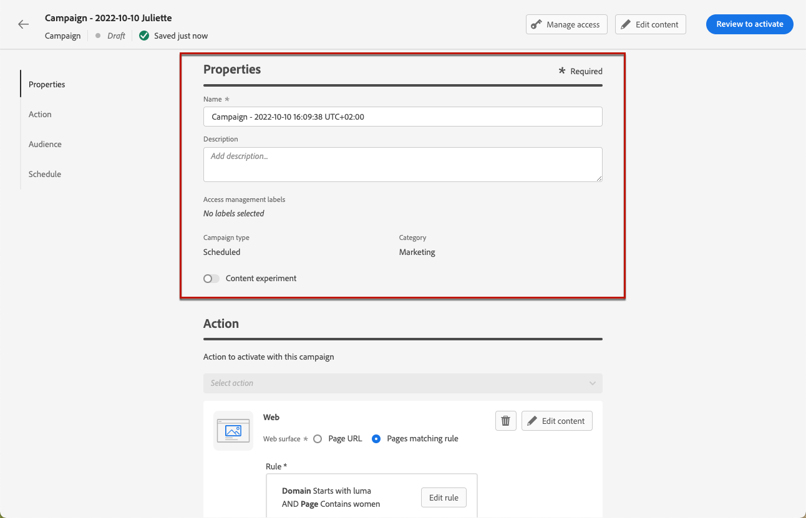

# Webervaringen maken {#create-web}

>[!AVAILABILITY]
>
>De functie Webkanaal is momenteel beschikbaar als bètaversie om alleen gebruikers te selecteren.

[!DNL Journey Optimizer] kunt u de webervaring aanpassen die u aan uw klanten via binnenkomende webcampagnes levert.

>[!CAUTION]
>
>Momenteel in [!DNL Journey Optimizer] u kunt alleen webervaringen maken met **campagnes**.

## Vereisten {#prerequesites}

Webpagina&#39;s openen en ontwerpen in het dialoogvenster [!DNL Journey Optimizer] voor de gebruikersinterface:

* Als u wijzigingen aan uw website wilt toevoegen, moet u het [Adobe Experience Platform Web SDK](https://experienceleague.adobe.com/docs/platform-learn/implement-web-sdk/overview.html){target=&quot;_blank&quot;} op uw website.

* Om toegang te krijgen tot [!DNL Journey Optimizer] webontwerper: u moet de [Helper voor Adobe Experience Cloud Visual Editing](https://chrome.google.com/webstore/detail/adobe-experience-cloud-vi/kgmjjkfjacffaebgpkpcllakjifppnca){target=&quot;_blank&quot;} browserextensie op Chrome. [Meer informatie](visual-editing-helper.md)

>[!CAUTION]
>
>Google Chrome is momenteel de enige browser die het ontwerpen van webpagina&#39;s ondersteunt in [!DNL Journey Optimizer].

De webervaring kan alleen correct worden geleverd als de volgende instellingen zijn gedefinieerd:

* In de [Adobe Experience Platform-gegevensverzameling](https://experienceleague.adobe.com/docs/experience-platform/edge/datastreams/overview.html){target=&quot;_blank&quot;}, controleert u of er een gegevensstroom is gedefinieerd, bijvoorbeeld onder de **[!UICONTROL Adobe Experience Platform]** de dienst u zowel heeft **[!UICONTROL Edge Segmentation]** en **[!UICONTROL Adobe Journey Optimizer]** opties ingeschakeld.

   Dit zorgt ervoor dat de inkomende Journey Optimizer-gebeurtenissen correct worden afgehandeld door de Adobe Experience Platform Edge. [Meer informatie](https://experienceleague.adobe.com/docs/experience-platform/edge/datastreams/configure.html){target=&quot;_blank&quot;}

   

   >[!NOTE]
   >
   >De **[!UICONTROL Adobe Journey Optimizer]** Deze optie kan alleen worden ingeschakeld wanneer de **[!UICONTROL Edge Segmentation]** is al ingeschakeld.

* In [Adobe Experience Platform](https://experienceleague.adobe.com/docs/experience-platform/profile/home.html?lang=nl){target=&quot;_blank&quot;}, zorg ervoor dat u één samenvoegbeleid hebt met de **[!UICONTROL Active-On-Edge Merge Policy]** optie ingeschakeld. Selecteer hiertoe een beleid in het dialoogvenster **[!UICONTROL Customer]** > **[!UICONTROL Profiles]** > **[!UICONTROL Merge Policies]** Menu Experience Platform. [Meer informatie](https://experienceleague.adobe.com/docs/experience-platform/profile/merge-policies/ui-guide.html#configure){target=&quot;_blank&quot;}

   Dit samenvoegbeleid wordt gebruikt door [!DNL Journey Optimizer] binnenkomende kanalen om binnenkomende campagnes op de rand correct te activeren en te publiceren. [Meer informatie](https://experienceleague.adobe.com/docs/experience-platform/profile/merge-policies/ui-guide.html){target=&quot;_blank&quot;}

   

## Een webcampagne maken {#create-web-campaign}

Volg onderstaande stappen om uw webervaring op te bouwen via een campagne.

1. Een campagne maken. [Meer informatie](../campaigns/create-campaign.md)

1. Selecteer **[!UICONTROL Web]** handeling.

   

1. Definieer een weboppervlak.

   >[!NOTE]
   >
   >Een weboppervlak is een webeigenschap die wordt geïdentificeerd door een URL waar de inhoud wordt geleverd. De URL kan overeenkomen met één pagina of meerdere pagina&#39;s, zodat u wijzigingen kunt doorvoeren op een of meerdere webpagina&#39;s.

   U kunt een van de **[!UICONTROL Page URL]** als u de wijzigingen alleen op één pagina wilt toepassen.

   

1. U kunt ook een **[!UICONTROL Pages matching rule]** om meerdere URL&#39;s met dezelfde regel als doel in te stellen, bijvoorbeeld als u de wijzigingen wilt toepassen op een hoofdbanner op een hele website of een bovenste afbeelding wilt toevoegen die op alle productpagina&#39;s van een website wordt weergegeven.

   Selecteer **[!UICONTROL Pages matching rule]** en klik op **[!UICONTROL Create rule]**.

   

1. Definieer uw criteria voor de **[!UICONTROL Domain]** en **[!UICONTROL Page]** velden.

   Als u bijvoorbeeld elementen wilt bewerken die op alle pagina&#39;s met vrouwenproducten van uw Luma-website worden weergegeven, selecteert u **[!UICONTROL Domain]** > **[!UICONTROL Starts with]** > `luma` en **[!UICONTROL Page]** > **[!UICONTROL Contains]** > `women`.

   

1. Sla uw wijzigingen op. De regel wordt weergegeven in het dialoogvenster **[!UICONTROL Create campaign]** scherm.

   

1. Nadat u het weboppervlak hebt gedefinieerd, selecteert u **[!UICONTROL Create]**. U kunt uw campagneeigenschappen en montages nu vormen.

## De webcampagne configureren {#configure-web-campaign}

1. In de **[!UICONTROL Properties]** kunt u de naam van de campagne bewerken en zo nodig een beschrijving toevoegen.

   

1. Als u aangepaste of basislabels voor gegevensgebruik wilt toewijzen aan de webcampagne, selecteert u de optie **[!UICONTROL Manage access]** boven op het scherm. [Leer meer op de Controle van de Toegang van het Niveau van Objecten (OLAC)](../administration/object-based-access.md)

1. U kunt **[!UICONTROL Content experiment]** de behandeling van de inhoud met delen van de doelgroep te testen, om te bepalen welke behandeling het best presteert ten opzichte van een specifieke meting. [Meer informatie](../campaigns/content-experiment.md)

   >[!AVAILABILITY]
   >
   >De **Inhoud experimenteren** Deze functie is momenteel alleen beschikbaar voor een aantal organisaties (Beperkte beschikbaarheid). Neem voor meer informatie contact op met uw Adobe-vertegenwoordiger.

1. Van de **[!UICONTROL Action]** tabblad van de campagne, selecteert u **[!UICONTROL Edit content]** om uw webcampagne te gaan ontwerpen. [Meer informatie](author-web.md)

   

1. Van de **[!UICONTROL Audience]** , definieert u wie uw webcampagne kan bekijken. Standaard is de webcampagne zichtbaar voor alle bezoekers.

   

   U kunt ook een specifiek publiek selecteren. Gebruik de **[!UICONTROL Select audience]** om de lijst met beschikbare Adobe Experience Platform-segmenten weer te geven. [Meer informatie over segmenten](../segment/about-segments.md)

   >[!NOTE]
   >
   >Voor API-getriggerde campagnes moet het publiek worden ingesteld via API-aanroep. [Meer informatie](../campaigns/api-triggered-campaigns.md)

   

1. In de **[!UICONTROL Identity namespace]** , kiest u de naamruimte die u wilt gebruiken om de personen van het geselecteerde segment te identificeren. [Meer informatie over naamruimten](../event/about-creating.md#select-the-namespace)

1. Een **[!UICONTROL Schedule]** voor uw webcampagne. [Meer informatie](../campaigns/create-campaign.md#schedule)

   

   Standaard wordt het programma gestart wanneer het handmatig wordt geactiveerd en eindigt het wanneer het handmatig wordt gestopt, maar u kunt ook specifieke datums en tijden definiëren waarop de wijzigingen zichtbaar moeten zijn.

   

## De webcampagne activeren {#activate-web-campaign}

Zodra u uw [webcampagneinstellingen](#configure-web-campaign) en u hebt de inhoud naar wens bewerkt met de [webontwerper](author-web.md), kunt u uw webcampagne controleren en activeren. Voer de onderstaande stappen uit.

>[!NOTE]
>
>U kunt ook een voorvertoning van de inhoud van uw webcampagne weergeven voordat u deze activeert. [Meer informatie](author-web.md#test-web-campaign)

1. Selecteer in uw webcampagne de optie **[!UICONTROL Review to activate]**.

   

1. Bekijk en bewerk indien nodig de inhoud, eigenschappen, oppervlak, publiek en planning.

1. Selecteer **[!UICONTROL Activate]**.

   

   >[!NOTE]
   >
   >Nadat u op **[!UICONTROL Activate]** Het kan tot 15 minuten duren voordat wijzigingen in webcampagnes live op uw website beschikbaar zijn.

Uw webcampagne neemt de **[!UICONTROL Live]** en is nu zichtbaar voor het geselecteerde publiek. Elke ontvanger van de campagne kan de wijzigingen zien die u aan uw website hebt toegevoegd met de opdracht [!DNL Journey Optimizer] webontwerper.

>[!NOTE]
>
>Als u een schema voor uw webcampagne hebt gedefinieerd, heeft deze de **[!UICONTROL Scheduled]** status tot de begindatum en -tijd zijn bereikt.
>
>Als u een webcampagne activeert die invloed heeft op dezelfde pagina&#39;s als een andere campagne die al actief is, worden alle wijzigingen toegepast op uw webpagina&#39;s.

Meer informatie over het activeren van campagnes in [deze sectie](../campaigns/review-activate-campaign.md).

## Een webcampagne stoppen {#stop-web-campaign}

Wanneer een webcampagne live is, kunt u deze stoppen om te voorkomen dat uw publiek uw wijzigingen ziet. Voer de onderstaande stappen uit.

1. Selecteer een live campagne in de lijst.

1. Selecteer in het bovenste menu de optie **[!UICONTROL Stop campaign]**.

   

1. De wijzigingen die u hebt toegevoegd, zijn niet meer zichtbaar voor het publiek dat u hebt gedefinieerd.

>[!NOTE]
>
>Nadat een webcampagne is gestopt, kunt u deze niet meer bewerken of activeren. U kunt de gedupliceerde campagne alleen dupliceren en activeren.