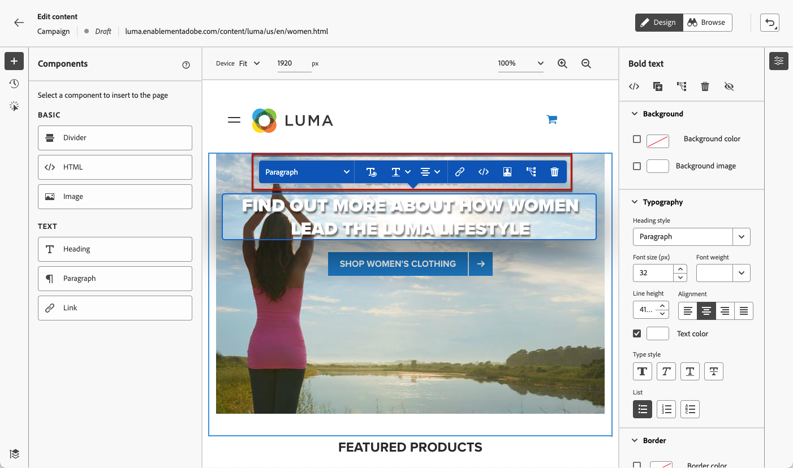

# Webinhoud bewerken {#edit-web-content}

Eenmaal [een webactie toevoegen](create-web.md#create-web-campaign) voor uw campagne kunt u de inhoud van uw site bewerken met de webontwerper.

[Leer hoe u een webcampagne maakt in deze video](#video)

In [!DNL Journey Optimizer], webauthoring wordt aangedreven door de **Adobe Experience Cloud Visual Helper** chrome browserextensie. [Meer informatie](web-prerequisites.md#visual-authoring-prerequisites)

>[!CAUTION]
>
>Webpagina&#39;s openen en ontwerpen in het dialoogvenster [!DNL Journey Optimizer] gebruikersinterface, zorg ervoor u de eerste vereisten volgt die in [deze sectie](web-prerequisites.md).

Heb toegang tot de volgende secties om meer over elk onderwerp te leren:

* [Wijzigingen beheren](manage-web-modifications.md)

* [Uw webcampagnes volgen](monitor-web-campaigns.md)

## Werken met de webontwerper {#work-with-web-designer}

>[!CONTEXTUALHELP]
>id="ajo_web_url_to_edit_surface"
>title="Bevestig de URL die u wilt bewerken"
>abstract="Bevestig de URL van de specifieke webpagina die u wilt gebruiken voor het bewerken van de inhoud die wordt toegepast op het hierboven gedefinieerde weboppervlak. De webpagina moet worden geïmplementeerd met de Adobe Experience Platform Web SDK."
>additional-url="https://experienceleague.adobe.com/docs/platform-learn/implement-web-sdk/overview.html" text="Meer informatie"

>[!CONTEXTUALHELP]
>id="ajo_web_url_to_edit_rule"
>title="Voer de te bewerken URL in"
>abstract="Voer de URL in van een specifieke webpagina die u wilt gebruiken voor het bewerken van de inhoud die wordt toegepast op alle pagina&#39;s die aan de regel voldoen. De webpagina moet worden geïmplementeerd met Adobe Experience Platform Web SDK."
>additional-url="https://experienceleague.adobe.com/docs/platform-learn/implement-web-sdk/overview.html" text="Meer informatie"

Volg onderstaande stappen om uw webcampagne te ontwerpen.

1. Van de **[!UICONTROL Action]** tabblad van het [campagne](create-web.md#create-web-campaign), selecteert u **[!UICONTROL Edit content]**.<!--change screen with rule-->

   

1. Als u een pagina&#39;s creeerde die regel aanpassen, moet u om het even welke URL ingaan die deze regel aanpast: de veranderingen zullen op alle pagina&#39;s worden toegepast die de regel aanpassen. De inhoud van de pagina wordt weergegeven.

   >[!NOTE]
   >
   >Als u één URL hebt ingevoerd als het weboppervlak, wordt de aan te passen URL al ingevuld.

   

   >[!CAUTION]
   >
   >De webpagina moet de [Adobe Experience Platform Web SDK](https://experienceleague.adobe.com/docs/platform-learn/implement-web-sdk/overview.html){target="_blank"}. [Meer informatie](web-prerequisites.md#implementation-prerequisites)

1. Klikken **[!UICONTROL Edit web page]** om te beginnen met ontwerpen. De webontwerper wordt weergegeven.

   

   >[!NOTE]
   >
   >Als u probeert een website te laden die niet kan worden geladen, wordt een bericht weergegeven waarin u wordt gesuggereerd dat u de [Visuele bewerkingshulpprogramma voor browsers](#install-visual-editing-helper). Zie enkele tips voor het oplossen van problemen in [deze sectie](web-prerequisites.md#troubleshooting).

1. Selecteer een element op het canvas, zoals een afbeelding, knop, alinea, tekst, container, kop, koppeling, enzovoort. [Meer informatie](#content-components)

1. Gebruik:

   * Het contextafhankelijke menu voor het bewerken van de inhoud, lay-out, het invoegen van koppelingen of personalisatie, enz.

     

   * De pictogrammen boven in het rechterdeelvenster om elk element te bewerken, te dupliceren, te verwijderen of te verbergen.

     

   * Het rechterdeelvenster dat dynamisch verandert volgens het geselecteerde element. U kunt bijvoorbeeld de achtergrond, typografie, rand, grootte, positie, tussenruimte, effecten of inline stijlen van een element bewerken.

     

>[!NOTE]
>
>De webinhoudontwerper is meestal vergelijkbaar met de e-mailontwerper. Meer informatie over [inhoud ontwerpen met [!DNL Journey Optimizer]](../email/get-started-email-design.md).

## Componenten gebruiken {#content-components}

>[!CONTEXTUALHELP]
>id="ajo_web_designer_components"
>title="Componenten aan uw webpagina toevoegen"
>abstract="U kunt een aantal componenten aan uw webpagina toevoegen en deze naar wens bewerken."

1. Van de **[!UICONTROL Components]** Selecteer een item aan de linkerkant. U kunt de volgende componenten aan uw webpagina toevoegen en deze naar wens bewerken:

   * [Scheidingslijn](../email/content-components.md#divider)
   * [HTML](../email/content-components.md#HTML)
   * [Afbeelding](../email/content-components.md#image)
   * Kop - Het gebruik van deze component lijkt op het gebruik van de **[!UICONTROL Text]** in de e-mailontwerper. [Meer informatie](../email/content-components.md#text)
   * Alinea - Het gebruik van deze component lijkt op het gebruik van de component **[!UICONTROL Text]** in de e-mailontwerper. [Meer informatie](../email/content-components.md#text)
   * Koppeling
   * [Offertebeslissing](../email/add-offers-email.md)

   

1. Houd de muisaanwijzer boven de pagina en klik op de knop **[!UICONTROL Insert before]** of **[!UICONTROL Insert after]** om de component toe te voegen aan een bestaand element op de pagina.

   

   >[!NOTE]
   >
   >Als u de selectie van een component wilt opheffen, klikt u op de knop **[!UICONTROL ESC]** in de contextafhankelijke blauwe banner die boven op het canvas wordt weergegeven.

1. Bewerk de component naar wens rechtstreeks in de inhoud van de pagina.

   

1. Pas de stijlen aan die vanuit het contextafhankelijke venster aan de rechterkant worden weergegeven, zoals achtergrond, tekstkleur, rand, grootte, positie, enz. - afhankelijk van de geselecteerde component.

   

## Voeg personalisatie en aanbiedingen toe

Als u verpersoonlijking wilt toevoegen, selecteert u een container en selecteert u het verpersoonlijkingspictogram in de contextafhankelijke menubalk die wordt weergegeven. Voeg uw veranderingen toe gebruikend de verpersoonlijkingsredacteur. [Meer informatie](../personalization/personalization-build-expressions.md)

Gebruik de **[!UICONTROL Offer decision]** in te voegen component [aanbiedingen](../offers/get-started/starting-offer-decisioning.md) in uw webpagina&#39;s. Het proces is hetzelfde als wanneer [een voorstel toevoegen aan een e-mailbericht](../email/add-offers-email.md). Het zal Beslissingsbeheer gebruiken om de beste aanbieding aan uw klanten te kiezen.

## Navigeren door de webontwerper {#navigate-web-designer}

In deze sectie worden de verschillende manieren beschreven waarop u door de webontwerper kunt navigeren. Als u de wijzigingen wilt weergeven en beheren die aan uw webervaring zijn toegevoegd, raadpleegt u [deze sectie](manage-web-modifications.md).

### Breedkruimels gebruiken {#breadcrumbs}

1. Selecteer een willekeurig element op het canvas.

1. Klik op de knop **[!UICONTROL Expand/Collapse Breadcrumbs]** aan de linkerbenedenzijde van het scherm om snel informatie over het geselecteerde element weer te geven.

   

1. Wanneer u de muisaanwijzer boven de broodkruimels houdt, wordt het bijbehorende element gemarkeerd in de editor.

1. Met deze editor kunt u eenvoudig naar elk bovenliggend, verwant of onderliggend element in de visuele editor navigeren.

### Wisselen naar modus Bladeren {#browse-mode}

>[!CONTEXTUALHELP]
>id="ajo_web_designer_browse"
>title="De modus Bladeren gebruiken"
>abstract="In deze modus kunt u naar de exacte pagina navigeren vanuit het geselecteerde oppervlak dat u wilt aanpassen."

U kunt de standaardinstelling wijzigen **[!UICONTROL Design]** aan de **[!UICONTROL Browse]** met de toegewezen knop.

Van de **[!UICONTROL Browse]** kunt u vanuit het geselecteerde oppervlak dat u wilt aanpassen naar de exacte pagina navigeren.

Dit is vooral handig wanneer u werkt met pagina&#39;s die zich achter verificatie bevinden of die niet vanaf het begin bij een bepaalde URL beschikbaar zijn. U kunt bijvoorbeeld verifiëren, naar uw accountpagina of naar uw winkelwagenpagina gaan en vervolgens teruggaan naar **[!UICONTROL Design]** om de wijzigingen op de gewenste pagina uit te voeren.

Gebruiken **[!UICONTROL Browse]** kunt u ook door alle weergaven van uw website navigeren wanneer u toepassingen van één pagina ontwerpt. [Meer informatie](web-spa.md)

### De apparaatgrootte wijzigen {#change-device-size}

U kunt de apparaatgrootte van de webontwerpweergave wijzigen in een vooraf gedefinieerde grootte, zoals **[!UICONTROL Tablet]** of **[!UICONTROL Mobile landscape]** of definieer een aangepaste grootte door het gewenste aantal pixels in te voeren.

U kunt de zoomfocus ook wijzigen van 25% in 400%.

De mogelijkheid om de apparaatgrootte te wijzigen is ontworpen voor responsieve sites die goed worden weergegeven op verschillende apparaten, vensters en schermgrootten. Responsieve sites worden automatisch aangepast en aangepast aan elke schermgrootte, zoals desktops, laptops, tablets of mobiele telefoons.

>[!CAUTION]
>
>U kunt een webervaring bewerken met een specifieke apparaatgrootte. Nochtans, zolang de selecteurs het zelfde zijn, zijn deze veranderingen op alle grootte en apparaten, niet alleen de apparatengrootte van toepassing dat u binnen werkt. Op dezelfde manier worden de wijzigingen toegepast op alle schermgrootten, en niet alleen op de desktopweergave wanneer u een ervaring bewerkt in de normale weergave.
>
>Momenteel [!DNL Journey Optimizer] ondersteunt geen paginawijzigingen die specifiek zijn voor het apparaatformaat. Dit betekent dat als u bijvoorbeeld een aparte mobiele website met een aparte sitestructuur hebt, u de wijzigingen specifiek voor uw mobiele site in een andere campagne moet doorvoeren.

## Hoe kan ik-video{#video}

In de onderstaande video ziet u hoe u een webervaring kunt ontwerpen met de webontwerper in [!DNL Journey Optimizer] campagnes.

>[!VIDEO](https://video.tv.adobe.com/v/3418803/?quality=12&learn=on)