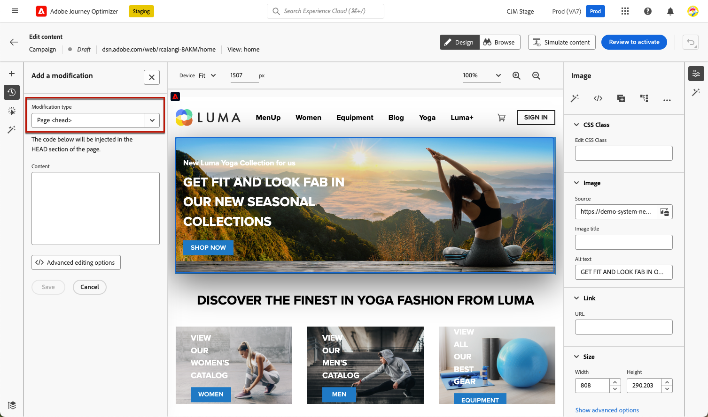

# Webwijzigingen beheren {#manage-web-modifications}

>[!CONTEXTUALHELP]
>id="ajo_web_designer_modifications"
>title="Eenvoudig al uw wijzigingen beheren"
>abstract="Met dit deelvenster kunt u door alle aanpassingen en stijlen navigeren die u aan uw webpagina hebt toegevoegd en deze beheren."

U kunt eenvoudig alle componenten, aanpassingen en stijlen beheren die u aan uw webpagina hebt toegevoegd. U kunt wijzigingen ook rechtstreeks vanuit het desbetreffende deelvenster toevoegen.

## Werken met het venster Wijzigingen {#use-modifications-pane}

1. Selecteer het pictogram **[!UICONTROL Modifications]** om het corresponderende venster links weer te geven.

   

1. U kunt alle wijzigingen bekijken die u op de pagina hebt aangebracht.

1. Selecteer een ongewenste wijziging en klik op de optie **[!UICONTROL Delete modification]** op de knop **[!UICONTROL More actions]** om deze te verwijderen.

   

   >[!CAUTION]
   >
   >Ga voorzichtig te werk wanneer u een actie verwijdert, aangezien dit van invloed kan zijn op volgende acties.

1. Als u a [&#x200B; enig-paginatoepassing &#x200B;](web-spa.md) creeert, kunt u om het even welke wijziging op andere meningen toepassen. [Meer informatie](web-spa.md#apply-modifications-views)

1. Als u meerdere wijzigingen tegelijk wilt verwijderen, klikt u op de knop **[!UICONTROL Select]** boven aan het deelvenster **[!UICONTROL Modifications]** , controleert u de gewenste wijzigingen en klikt u op het pictogram **[!UICONTROL Delete]** .

   

1. Gebruik de knop **[!UICONTROL More actions]** boven op het deelvenster **[!UICONTROL Modifications]** om alle wijzigingen tegelijk te verwijderen.

   

1. U kunt ook alleen de ongeldige wijzigingen verwijderen. Dit houdt in dat de wijzigingen worden overschreven door andere wijzigingen. Als u bijvoorbeeld de kleur van een tekst wijzigt en die tekst verwijdert, wordt de kleurwijziging ongeldig omdat de tekst niet meer bestaat.

1. U kunt acties annuleren en opnieuw uitvoeren met de knop **[!UICONTROL Undo/Redo]** rechtsboven in het scherm.

   

   Klik en houd de knop ingedrukt om te schakelen tussen de opties **[!UICONTROL Undo]** en **[!UICONTROL Redo]** . Klik vervolgens op de knop zelf om de gewenste actie toe te passen.

## Wijzigingen toevoegen vanuit het toegewezen venster {#add-modifications}

Wanneer u een pagina bewerkt met de webontwerper, kunt u nieuwe wijzigingen rechtstreeks vanuit het deelvenster **[!UICONTROL Modifications]** toevoegen, zonder dat u een component hoeft te selecteren en te bewerken in de interface van de webontwerper. Voer de onderstaande stappen uit.

1. Klik in het deelvenster **[!UICONTROL Modifications]** op de knop **[!UICONTROL More actions]** .

1. Selecteer **[!UICONTROL Add a modification]**.

   

1. Selecteer het wijzigingstype:

   * **[!UICONTROL CSS Selector]** - [&#x200B; Leer meer &#x200B;](#css-selector)
   * **[!UICONTROL Page `<Head>`]** - [&#x200B; Leer meer &#x200B;](#page-head)

1. Voer de inhoud in en **[!UICONTROL Save]** voer de wijzigingen in.

1. Klik op de knop **[!UICONTROL More actions]** naast de wijziging en selecteer **[!UICONTROL Info]** om de details weer te geven.

   

### CSS-kiezer {#css-selector}

Om het type van a **CSS selecteur** wijziging toe te voegen, volg hieronder de stappen.

1. Selecteer **[!UICONTROL CSS Selector]** als het wijzigingstype.

1. Met het veld **[!UICONTROL CSS Element Selector]** kunt u de HTML-elementen (of knooppunten in de DOM-structuur) zoeken en selecteren waarop u wijzigingen wilt toepassen. <!--specify the desired CSS element that you want to modify.-->

   

1. Selecteer een actietype (**[!UICONTROL Set Content]** of **[!UICONTROL Set Attribute]**) en vul de vereiste informatie/inhoud in.

   * **[!UICONTROL Set Content]** : geef de inhoud op die wordt opgenomen in het element dat wordt geïdentificeerd door het veld **[!UICONTROL CSS Element Selector]** .

   * **[!UICONTROL Set Attribute]**: geef een kenmerk op dat aan de huidige CSS-kiezer moet worden gekoppeld, zodat deze kiezer ook door dit kenmerk kan worden geïdentificeerd. Voer hiertoe een naam in het veld **[!UICONTROL Attribute name]** en een waarde in het veld **[!UICONTROL Content]** in. Als het kenmerk al bestaat, wordt de waarde bijgewerkt; anders wordt een nieuw kenmerk toegevoegd met de opgegeven naam en waarde.

     

### Pagina `<head>` {#page-head}

>[!CONTEXTUALHELP]
>id="ajo_web_designer_head"
>title="Aangepaste code toevoegen"
>abstract="Het HEAD-element is een container voor metagegevens en wordt tussen de HTML-tag en de BODY-tag geplaatst. Voeg alleen SCRIPT- en STIJLelementen toe. Als u DIV-tags en andere elementen toevoegt, komen de resterende HEAD-elementen mogelijk naar de BODY-sectie."

U kunt aangepaste code toevoegen met het wijzigingstype **[!UICONTROL Page `<head>`]** .

Het element `<head>` is een container voor metagegevens (gegevens over gegevens) en wordt tussen de tag `<html>` en de tag `<body>` geplaatst. In dit geval wacht de code niet op gebeurtenissen voor het laden van de hoofdtekst of de pagina. Deze wordt uitgevoerd aan het begin van het laden van de pagina.

Het element `<head>` wordt doorgaans gebruikt om JavaScript- of CSS-code boven aan de pagina toe te voegen. Kiezers voor volgende visuele handelingen zijn afhankelijk van de HTML-elementen die op dit tabblad zijn toegevoegd.

Voer de onderstaande stappen uit als u het type a **Pagina`<head>`** wilt wijzigen.

1. Selecteer **[!UICONTROL Page `<head>`]** als het wijzigingstype.

   

1. Voeg uw aangepaste code toe in het vak **[!UICONTROL Content]** .

   >[!CAUTION]
   >
   >U kunt alleen `<script>` - en `<style>` -elementen toevoegen aan de sectie `<head>` . Als u `<div>` -tags en andere elementen toevoegt, komen de resterende `<head>` -elementen mogelijk in de `<body>` -lus terecht.

1. Klik op de knop **[!UICONTROL Advanced editing options]**. De verpersoonlijkingsredacteur opent.

   

   U kunt de personalisatie-editor van [!DNL Journey Optimizer] gebruiken met al zijn personalisatie- en ontwerpmogelijkheden. [Meer informatie](../personalization/personalization-build-expressions.md)

#### Aangepaste codevoorbeelden {#custom-code-examples}

U kunt het wijzigingstype **[!UICONTROL Page `<head>`]** gebruiken op:

* JavaScript inline gebruiken of koppelen naar een extern JavaScript-bestand.

  Bijvoorbeeld om de kleur van een element te wijzigen:

  ```
  <script type="text/javascript">
  document.getElementById("element_id").style.color = "blue";
  </script>
  ```

* Configureer een stijl inline of koppel deze aan een externe stijlpagina.

  U kunt bijvoorbeeld een klasse definiëren voor een overlay-element:

  ```
  <style>
  .overlay
  { position: absolute; top:0; left: 0; right: 0; bottom: 0; background: red; }
  </style>
  ```

#### Aangepaste tips voor code {#custom-code-best-practices}

+++ **verpakt altijd de douanecode in één element.**

Bijvoorbeeld:

```
<script>
// Code goes here
</script>
```

Als er wijzigingen nodig zijn, brengt u wijzigingen aan in deze container.

Als u de aangepaste code niet meer nodig hebt, laat u deze container leeg, maar verwijdert u deze niet. Dit zorgt ervoor dat andere ervaringswijzigingen niet worden beïnvloed.

+++

+++ **voert document.write geen acties in de manuscripten van de douanecode uit.**

Scripts worden asynchroon uitgevoerd. Hierdoor worden documenten.write-handelingen vaak op de verkeerde plaats op de pagina weergegeven. Het gebruik van document.write in scripts die in aangepaste code zijn gemaakt, wordt afgeraden.

+++

+++ **als u een element creeert en het dan wijzigt, schrapt niet het originele element.**

Bij elke wijziging wordt een nieuw element gemaakt in het deelvenster **[!UICONTROL Modifications]** . Omdat de tweede actie Element 1 wijzigt, als u Element 1 schrapt, heeft die actie niet meer om het even wat te wijzigen, zodat werkt de verandering niet meer.

+++

+++ **ben voorzichtig wanneer het gebruiken van het &#x200B;** [!UICONTROL Page `<head>`]&#x200B;**aanpassingstype voor twee campagnes die zelfde URL beïnvloeden.**

Als u het wijzigingstype **[!UICONTROL Page `<head>`]** gebruikt voor twee campagnes die invloed hebben op dezelfde URL, wordt de JavaScript vanuit beide campagnes in de pagina geïnjecteerd. [!DNL Journey Optimizer] bepaalt automatisch de volgorde van de geleverde inhoud. Zorg ervoor dat de code niet afhankelijk is van plaatsing. Het is aan u om ervoor te zorgen dat er geen conflicten in de code zijn.

+++
