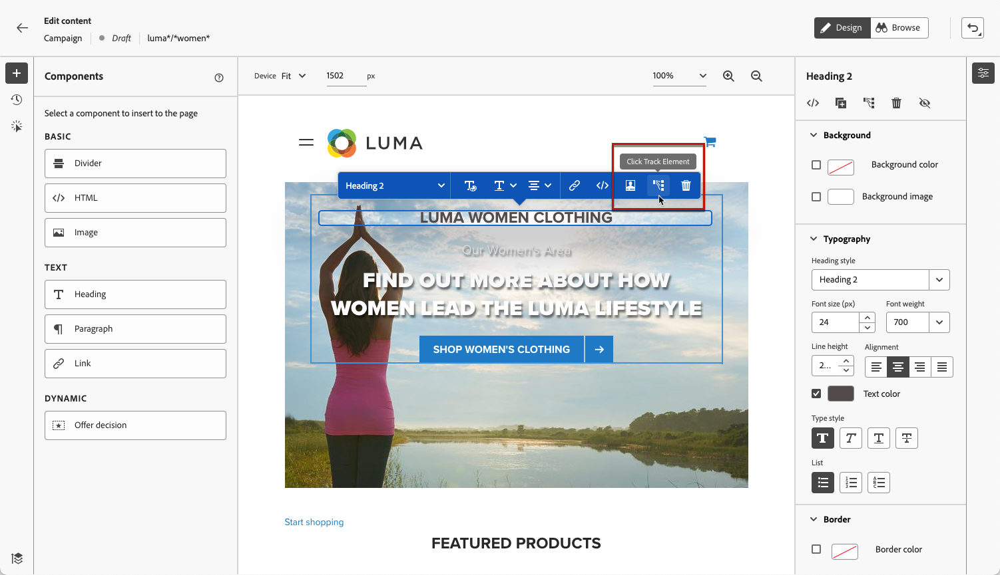

# Uw webervaringen bewaken {#monitor-web-experiences}

## Webrapporten controleren {#check-web-reports}

Zodra uw Webervaring levend is, kunt u het **[!UICONTROL Web]** lusje van het [&#x200B; rapport van de Reis &#x200B;](../reports/journey-global-report-cja-web.md) controleren en [&#x200B; rapport van de Campagne &#x200B;](../reports/campaign-global-report-cja-web.md) om elementen zoals het aantal indrukkingen te vergelijken, tarief en aantal overeenkomsten met uw Web-pagina te klikken.

<!--You can check the **[!UICONTROL Web]** tab of the campaign reports. Learn more about the campaign web [live report](../reports/campaign-live-report.md#web-tab) and [global report](../reports/campaign-global-report-cja.md#web).-->

Als u de webervaringscontrole verder wilt verbeteren, kunt u ook de klikken op een specifiek element van uw website bijhouden. Hierdoor kunt u het aantal klikken op dat element weergeven in de webrapporten. [&#x200B; leer hoe &#x200B;](#use-click-tracing)

## Klikspatiëring gebruiken {#use-click-tracking}

Met de webontwerper kunt u elk element van uw website selecteren en de muisklikken op dat element bijhouden.

Deze informatie kan nuttig zijn om de ervaring van gebruikers van uw website te verbeteren. Bijvoorbeeld, als het [&#x200B; Web meldt &#x200B;](../reports/campaign-global-report-cja-web.md) toont dat vele gebruikers een element klikken dat niet eigenlijk klikbaar is, kunt u een verbinding aan dat element willen toevoegen.

1. Selecteer een element op de pagina en kies **[!UICONTROL Click track element]** in het contextmenu.

   

   >[!NOTE]
   >
   >Alle items die u kunt klikken, kunnen worden geselecteerd.

1. De bijbehorende bijgehouden actie wordt automatisch weergegeven in het deelvenster **[!UICONTROL Click track]** aan de linkerkant.

   

1. Voeg een betekenisvol label toe om al uw bijgehouden elementen te beheren en deze gemakkelijk in de rapporten te vinden. In het veld **[!UICONTROL CSS selector]** wordt informatie weergegeven om het geselecteerde element te zoeken.

1. Herhaal bovenstaande stappen om zoveel andere elementen te selecteren als u nodig hebt voor het klikken op bijhouden. De bijbehorende acties worden allemaal weergegeven in het linkerdeelvenster.

   

1. Als u klikt op bijhouden op een element wilt verwijderen, selecteert u het bijbehorende verwijderingspictogram.

Zodra uw campagne levend is, kunt u het aantal klikken voor elk element in het van het campagneweb [&#x200B; levende rapport &#x200B;](../reports/campaign-live-report.md#web-tab) controleren en [&#x200B; Customer Journey Analytics rapport &#x200B;](../reports/campaign-global-report-cja-web.md).
