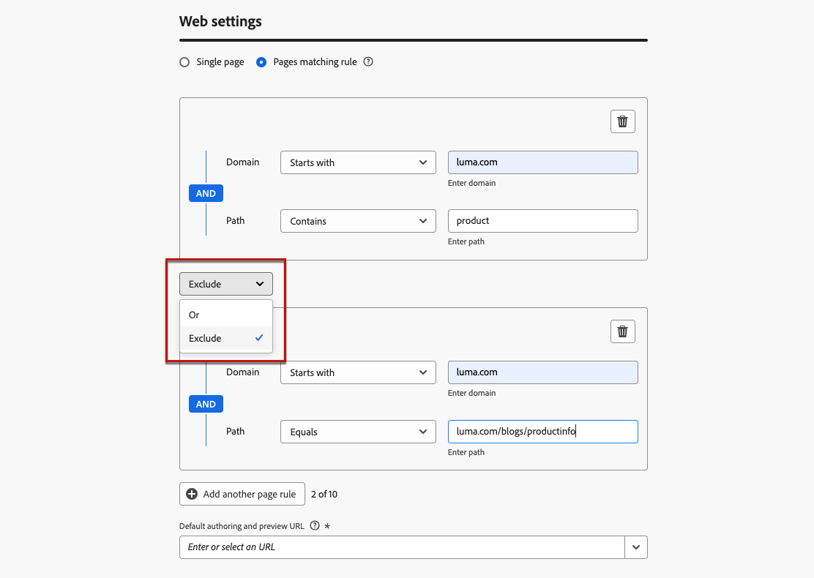

# Uw webervaringen configureren {#web-configuration}

## Webkanaalconfiguratie maken {#create-web-configuration}

Een webconfiguratie is een webeigenschap die wordt geïdentificeerd door een URL waar de inhoud wordt geleverd. De URL kan overeenkomen met één pagina of meerdere pagina&#39;s, zodat u wijzigingen kunt doorvoeren op een of meerdere webpagina&#39;s.

Volg onderstaande stappen om een webkanaalconfiguratie te maken.

1. Open het menu **[!UICONTROL Channels]** > **[!UICONTROL General settings]** > **[!UICONTROL Channel configurations]** en klik op **[!UICONTROL Create channel configuration]** .

   

1. Voer een naam en beschrijving (optioneel) voor de configuratie in.

   >[!NOTE]
   >
   > Namen moeten beginnen met een letter (A-Z). Het mag alleen alfanumerieke tekens bevatten. U kunt ook onderstrepingsteken `_` -, punt `.` - en afbreekstreepjes `-` gebruiken.

1. Als u aangepaste of basislabels voor gegevensgebruik aan de configuratie wilt toewijzen, kunt u **[!UICONTROL Manage access]** selecteren. [ leer meer over de Controle van de Toegang van het Niveau van Objecten (OLAC) ](../administration/object-based-access.md)

1. Selecteer het **kanaal 0} van het Web {.**

   

1. Selecteer **[!UICONTROL Marketing action]**(s) om het toestemmingsbeleid aan de berichten te associëren gebruikend deze configuratie. Alle toestemmingsbeleid verbonden aan de marketing actie wordt gebruikt om de voorkeur van uw klanten te respecteren. [Meer informatie](../action/consent.md#surface-marketing-actions)

1. Selecteer in de sectie **[!UICONTROL Web settings]** een van de volgende opties:

   * **[!UICONTROL Single page]** - Als u de wijzigingen alleen op één pagina wilt toepassen, voert u een **[!UICONTROL Page URL]** in.

   * **[!UICONTROL Pages matching rule]** - Als u meerdere URL&#39;s met dezelfde regel als doel wilt instellen, maakt u een overeenkomende regel voor pagina&#39;s en voert u een **[!UICONTROL Default authoring and preview URL]** in. [Meer informatie](#web-page-matching-rule)

1. Klik op **[!UICONTROL Submit]** om de wijzigingen op te slaan.

U kunt deze configuratie nu selecteren wanneer het gebruiken van het Kanaal van het Web in uw campagnes of reizen.

## Een overeenkomende regel voor pagina&#39;s maken {#web-page-matching-rule}

>[!CONTEXTUALHELP]
>id="ajo_admin_page_rule"
>title="Een overeenkomende regel voor pagina&#39;s maken"
>abstract="Als u een groep URL&#39;s met dezelfde criteria efficiënt wilt beheren en als doel wilt instellen, maakt u een overeenkomende regel Pagina&#39;s. Met deze regel kunt u meerdere URL&#39;s samenvoegen onder één regel, waardoor de toepassing van consistente instellingen en handelingen op deze pagina&#39;s eenvoudiger wordt."

>[!CONTEXTUALHELP]
>id="ajo_admin_default_url"
>title="Een URL definiëren voor het ontwerpen en voorvertonen van inhoud"
>abstract="Met dit veld zorgt u ervoor dat de pagina&#39;s die door de regel worden gegenereerd of waaraan de regel is gekoppeld, een opgegeven URL hebben die essentieel is voor een effectieve weergave van inhoud en voor een voorvertoning."

Wanneer het creëren van een Web of [ code-gebaseerde ervaring ](../code-based/get-started-code-based.md) configuratie, kunt u a **[!UICONTROL Pages matching rule]** bouwen om veelvoudige URLs te richten die de zelfde regel aanpassen. U kunt daarom dezelfde inhoudswijzigingen op meerdere pagina&#39;s tegelijk toepassen.

U kunt bijvoorbeeld de wijzigingen toepassen op een hoofdbanner op een hele website of een bovenste afbeelding toevoegen die op alle productpagina&#39;s van een website wordt weergegeven.

1. Wanneer het vormen van uw [ Web ](#web-configuration) of [ code-gebaseerde ervaring ](../code-based/code-based-configuration.md), selecteer **[!UICONTROL Pages matching rule]**.

1. Definieer de criteria voor de velden **[!UICONTROL Domain]** en **[!UICONTROL Page]** .

   >[!NOTE]
   >
   >Controleer de beschikbare exploitanten in [ deze sectie ](#available-operators).

   Als u bijvoorbeeld elementen wilt bewerken die op alle pagina&#39;s met vrouwenproducten van uw Luma-website worden weergegeven, selecteert u **[!UICONTROL Domain]** > **[!UICONTROL Starts with]** > `luma` en **[!UICONTROL Page]** > **[!UICONTROL Contains]** > `women` .

   

1. Als uw gebruiksgeval niet kan worden gemodelleerd gebruikend één regel, hebt u de optie om veelvoudige regels toe te voegen. Klik op **[!UICONTROL Add another page rule]** en herhaal de bovenstaande stap.

   >[!NOTE]
   >
   >U kunt maximaal 10 regels toevoegen.

1. U kunt de operatoren **[!UICONTROL Or]** of **[!UICONTROL Exclude]** tussen de verschillende regels gebruiken.

   **[!UICONTROL Exclude]** is nuttig wanneer een van de pagina&#39;s die aan de gedefinieerde regel voldoen, niet als doelpagina mag worden gebruikt. U kunt bijvoorbeeld alle `luma.com` pagina&#39;s aanwijzen die `product` bevatten, met uitzondering van de volgende pagina: `https://luma.com/blogs/productinfo` .

   

1. Voer de **[!UICONTROL Default authoring and preview URL]** in. Met deze stap zorgt u ervoor dat de pagina&#39;s die door de regel worden gegenereerd of waaraan de regel is gekoppeld, een aangewezen URL hebben voor zowel het maken van inhoud als het weergeven van voorvertoningen.

### Beschikbare operatoren voor het samenstellen van regels voor paginaovereenkomsten {#available-operators}

Wanneer het creëren van a [ regel die veelvoudige pagina&#39;s ](#web-page-matching-rule) aanpast, kunt u verschillende exploitanten op **[!UICONTROL Domain]** en op de **[!UICONTROL Path]** secties gebruiken om uw gewenste regel te bouwen. De beschikbare operatoren worden hieronder weergegeven.

* **Domein**

  | Operator  | Beschrijving  | Voorbeelden  |
  |---|---|---|
  | Gelijk  | Exacte overeenkomst van het domein.  | |
  | Begint met  | Komt overeen met alle domeinen (inclusief subdomeinen) die beginnen met de ingevoerde tekenreeks.  | Voorbeeld: &quot;Begint met: dev&quot; -> komt overeen met alle domeinen en subdomeinen die beginnen met &quot;dev&quot;, zoals: dev.example.com, dev.products.example.com, developer.example.com  |
  | Eindigt met  | Komt overeen met alle domeinen (inclusief subdomeinen) die eindigen met de ingevoerde tekenreeks.  | Voorbeeld: &quot;Eindigt met: example.com&quot; -> komt overeen met alle domeinen en subdomeinen die eindigen met &quot;example.com&quot;, zoals: stage.example.com, prod.example.com, myexample.com  |
  | Overeenkomende jokertekens  | Met de operator voor jokertekenovereenkomsten kan de gebruiker een jokertekenovereenkomst definiëren in het midden van de tekenreeks, zoals &quot;dev.*.example.com&quot;. De validatieregels bepalen dat de waarde één en slechts één jokerteken (sterretje) moet bevatten wanneer de operator &quot;jokertekenovereenkomst&quot; is.  | Voorbeeld: &quot;Jokertekentekoppeling: dev.*.example.com&quot; -> komt overeen met domeinen als: dev.products.example.com, dev.mytest.products.example.com, dev.blog.example.com  |
  | Alle  | Komt overeen met alle domeinen - nuttig bij het testen van een bepaald pad over domeinen  |  |

* **Weg**

<table>
    <thead>
    <tr>
        <th><strong>Operator</th>
        <th><strong>Beschrijving</th>
        <th><strong>Voorbeelden</th>
    </tr>
    </thead>
    <tbody>
    <tr>
        <td>Gelijk</td>
        <td>Exacte overeenkomst van het pad. </td>
        <td></td>
    </tr>
    <tr>
        <td>Begint met</td>
        <td>Komt overeen met alle paden (inclusief subpaden) die beginnen met de ingevoerde tekenreeks.</td>
        <td></td>
    </tr>
    <tr>
        <td>Eindigt met</td>
        <td>Komt overeen met alle paden (inclusief subpaden) die eindigen met de ingevoerde tekenreeks.</td>
        <td></td>
    </tr>
    <tr>
        <td>Alle</td>
        <td>Hiermee worden alle paden met elkaar vergeleken. Dit is handig wanneer u alle paden in een of meerdere domeinen aanwijst.</td>
        <td></td>
    </tr>
    <tr>
        <td>Overeenkomende jokertekens</td>
        <td>Met de operator voor jokertekens kan de gebruiker een interne jokerteken in het pad definiëren, zoals "/products/*/detail".  Het jokerteken * in de component Path ** komt overeen met een willekeurige reeks tekens totdat het eerste / teken wordt aangetroffen.  /*/ komt overeen met een willekeurige reeks tekens (inclusief subpaden)</td>
        <td>Voorbeeld: "Jokertekentekoppeling: /products/*/detail" komt overeen met alle paden zoals: <ul><li>example.com/products/yoga/detail</li><li>example.com/products/surf/detail</li><li>example.com/products/tennis/detail</li><li>example.com/products/yoga/pants/detail</li></ul>Voorbeeld: "Overeenkomsten: /prod*/detail, komt overeen met alle paden als: <ul><li>example.com/products/detail</li><li>example.com/production/detail</li></ul>komt niet overeen met paden als: <ul><li>example.com/products/yoga/detail</li></ul></td>
    </tr>
    <tr>
        <td>Bevat</td>
        <td>"contains" wordt omgezet in een jokerteken zoals "mystring" en komt overeen met alle paden die deze reeks tekens bevatten.</td>
        <td>Ex: "Bevat: product", komt overeen met alle paden die het tekenreeksproduct bevatten, zoals: <ul><li>example.com/products</li><li>example.com/yoga/perfproduct</li><li>example.com/surf/productdescription</li><li>example.com/home/product/page</li></ul></td>
    </tr>
    </tbody>
</table>
