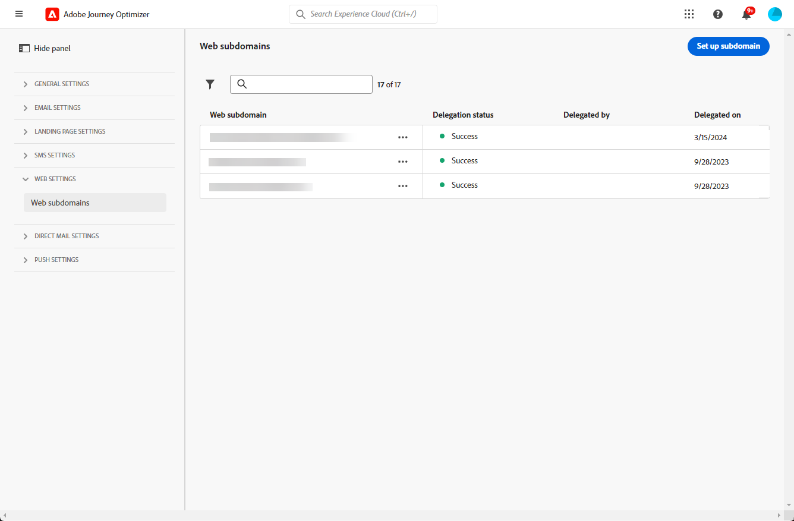

# Websubdomeinen configureren {#web-subdomains}

>[!CONTEXTUALHELP]
>id="ajo_admin_subdomain_web_header"
>title="Een websubdomein delegeren"
>abstract="U stelt het subdomein in voor gebruik met een webkanaal. Maak een keuze uit de subdomeinen die al zijn gedelegeerd aan Adobe."

>[!CONTEXTUALHELP]
>id="ajo_admin_subdomain_web"
>title="Een websubdomein delegeren"
>abstract="Als u inhoud van de Adobe Experience Manager Assets Essentials toevoegt aan uw webervaringen, moet u het subdomein instellen dat wordt gebruikt om deze inhoud te publiceren. Selecteer een van de subdomeinen die al zijn gedelegeerd aan Adobe."

>[!CONTEXTUALHELP]
>id="ajo_admin_subdomain_web_default"
>title="Een standaardsubdomein instellen"
>abstract="U kunt verschillende subdomeinen voor het web maken, maar alleen het standaardsubdomein wordt gebruikt. U kunt het standaardwebsubdomein wijzigen, maar u kunt slechts één subdomein tegelijk gebruiken."

Als u tijdens het ontwerpen van een webversie inhoud toevoegt die afkomstig is van de [Adobe Experience Manager Assets Essentials](../email/assets-essentials.md) moet u het subdomein instellen dat wordt gebruikt om deze inhoud te publiceren.

Hiervoor moet u kiezen uit de lijst met subdomeinen die al zijn gedelegeerd aan Adobe. Meer informatie over het delegeren van subdomeinen naar Adobe in [deze sectie](../configuration/delegate-subdomain.md).

>[!CAUTION]
>
>De subdomeinconfiguratie van het Web is gemeenschappelijk voor alle milieu&#39;s. Daarom geldt het volgende:
>
>* Als u websubdomeinen wilt openen en bewerken, moet u beschikken over **[!UICONTROL Manage Web Subdomains]** toestemming voor de productiesandbox.
>
> * Elke wijziging aan een websubdomein heeft ook invloed op de productiesandboxen.

U kunt meerdere subdomeinen voor het web maken, maar alleen de subdomeinen **default** subdomein wordt gebruikt. U kunt het standaardwebsubdomein wijzigen, maar u kunt slechts één subdomein tegelijk gebruiken.

1. Toegang krijgen tot **[!UICONTROL Administration]** > **[!UICONTROL Channels]** menu, selecteert u vervolgens **[!UICONTROL Web configuration]** > **[!UICONTROL Web subdomains]**.

   

1. Klik op **[!UICONTROL Set up subdomain]**.

1. Selecteer een gedelegeerd subdomein in de lijst.

   

   >[!NOTE]
   >
   >U kunt geen subdomein selecteren dat al als websubdomein wordt gebruikt.

1. Als u dit subdomein als standaard wilt instellen, selecteert u de bijbehorende optie.

   

   >[!NOTE]
   >
   >Alleen de **default** subdomein wordt gebruikt. U kunt het standaardwebsubdomein wijzigen, maar u kunt slechts één subdomein tegelijk gebruiken.

1. Klik op **[!UICONTROL Submit]**. Het subdomein krijgt de **[!UICONTROL Success]** status. Het is klaar om te worden gebruikt voor uw webervaringen.

1. De **[!UICONTROL Default]** badge wordt weergegeven naast het subdomein dat momenteel als standaard wordt gebruikt. Als u het standaardsubdomein wilt wijzigen, selecteert u **[!UICONTROL Set as default]** van de **[!UICONTROL More actions]** naast het gewenste subdomein.

   

   <!--Only a subdomain with the **[!UICONTROL Success]** status can be set as default.-->

1. U kunt alleen een **[!UICONTROL Failed]** subdomein om de lijst op te schonen. Selecteer **[!UICONTROL Delete]** van de **[!UICONTROL More actions]** naast het gewenste subdomein.

<!--You cannot delete a subdomain with the **[!UICONTROL Processing]** status.-->

