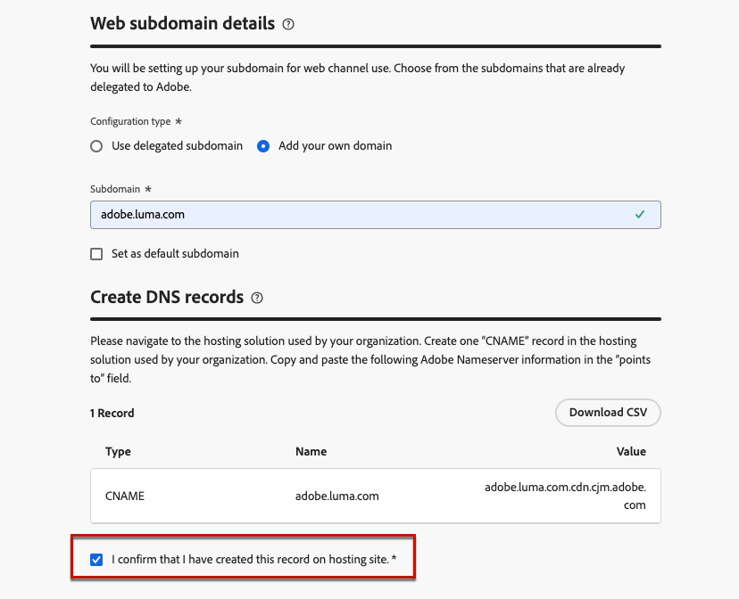

# Websubdomeinen configureren {#web-subdomains}

>[!CONTEXTUALHELP]
>id="ajo_admin_subdomain_web_header"
>title="Een websubdomein delegeren"
>abstract="U stelt het subdomein in voor gebruik met een webkanaal. U kunt een subdomein gebruiken dat al aan Adobe is gedelegeerd of een ander subdomein vormen."

>[!CONTEXTUALHELP]
>id="ajo_admin_subdomain_web"
>title="Een websubdomein delegeren"
>abstract="Als u inhoud van de Adobe Experience Manager Assets toevoegt aan uw webervaringen, moet u het subdomein instellen dat wordt gebruikt om deze inhoud te publiceren. Selecteer een subdomein dat al aan Adobe is gedelegeerd of configureer een nieuw subdomein."

>[!CONTEXTUALHELP]
>id="ajo_admin_subdomain_web_default"
>title="Een websubdomein instellen"
>abstract="Selecteer een subdomein in de lijst met subdomeinen die zijn gedelegeerd aan Adobe. U kunt dit websubdomein instellen als het standaardsubdomein, maar er kan slechts één standaardsubdomein tegelijk worden gebruikt."

## Aan de slag met websubdomeinen {#gs-web-subdomains}

Wanneer het ontwerpen van Webervaringen, als u inhoud toevoegt die uit de [ Adobe Experience Manager Assets ](../integrations/assets.md) bibliotheek komt, moet u opstelling subdomain die zal worden gebruikt om deze inhoud te publiceren.

U kunt een subdomein gebruiken dat al aan Adobe is gedelegeerd, of u kunt een ander subdomein vormen. Leer meer over het delegeren van subdomeinen aan Adobe in [ deze sectie ](../configuration/delegate-subdomain.md).

De subdomeinconfiguratie van het Web is **gemeenschappelijk aan alle milieu&#39;s**. Daarom geldt het volgende:

* Als u websubdomeinen wilt openen en bewerken, moet u beschikken over de machtiging **[!UICONTROL Manage Web Subdomains]** in de productiesandbox.

* Elke wijziging aan een websubdomein heeft ook invloed op de productiesandboxen.

U kunt verscheidene Websubdomeinen tot stand brengen, maar slechts zal het **gebrek** subdomain worden gebruikt. U kunt het standaardwebsubdomein wijzigen, maar u kunt slechts één subdomein tegelijk gebruiken.

## Websubdomeinen openen en beheren {#access-web-subdomains}

Voer de volgende stappen uit om subdomeinen te openen voor webervaringen:

1. Blader naar het menu **[!UICONTROL Administration]** > **[!UICONTROL Channels]** en selecteer vervolgens **[!UICONTROL Web settings]** > **[!UICONTROL Web subdomains]** . Alle subdomeinen die zijn ingesteld met de huidige sandbox worden weergegeven.

   

1. U kunt filteren op de gebruiker die elk subdomein of een van de delegatiestatus (**[!UICONTROL Draft]**, **[!UICONTROL Processing]**, **[!UICONTROL Success]** of **[!UICONTROL Failed]**) heeft gedelegeerd.

   

1. Het symbool **[!UICONTROL Default]** wordt weergegeven naast het subdomein dat momenteel als standaard wordt gebruikt. Als u het standaardsubdomein wilt wijzigen, selecteert u **[!UICONTROL Set as default]** in de knop **[!UICONTROL More actions]** naast het gewenste subdomein.

   

   U kunt het standaardwebsubdomein wijzigen, maar u kunt slechts één subdomein tegelijk gebruiken.

## Een bestaand subdomein gebruiken {#web-use-existing-subdomain}

Als u een subdomein wilt gebruiken dat al is gedelegeerd aan Adobe, voert u de volgende stappen uit:

1. Open het menu **[!UICONTROL Administration]** > **[!UICONTROL Channels]** en selecteer vervolgens **[!UICONTROL Web settings]** > **[!UICONTROL Web subdomains]** .

1. Klik op **[!UICONTROL Set up subdomain]**.

1. Selecteer de optie **[!UICONTROL Use delegated subdomain]** in de sectie **[!UICONTROL Configuration type]** en kies een gedelegeerd subdomein in de lijst.

   

   >[!NOTE]
   >
   >U kunt geen subdomein selecteren dat al als websubdomein wordt gebruikt.

1. Het voorvoegsel dat wordt weergegeven in de URL wordt automatisch toegevoegd. U kunt dit niet wijzigen.

1. Als u dit subdomein als standaard wilt instellen, selecteert u de bijbehorende optie.

   

   Slechts zal het **gebrek** subdomain worden gebruikt.

1. Klik op **[!UICONTROL Submit]**. Het subdomein krijgt de **[!UICONTROL Success]** status. Het is klaar om te worden gebruikt voor uw webervaringen.

   In zeer zeldzame gevallen, kon een subdomain opstelling ontbreken. In dit geval kunt u het subdomein **[!UICONTROL Failed]** verwijderen om de lijst op te schonen met de knop **[!UICONTROL Delete]** van het pictogram **[!UICONTROL More actions]** .

## Een nieuw subdomein configureren {#web-configure-new-subdomain}

>[!CONTEXTUALHELP]
>id="ajo_admin_web_subdomain_dns"
>title="De overeenkomende DNS-record genereren"
>abstract="Als u een nieuw websubdomein wilt configureren, moet u de Adobe-servergegevens kopiëren die in de Journey Optimizer-interface worden weergegeven en deze plakken in uw domeinhostingoplossing om het overeenkomende DNS-record te genereren. Als de controles zijn voltooid, kan het subdomein worden gebruikt om inhoud te publiceren die afkomstig is uit de Adobe Experience Manager Assets-bibliotheek."

Door gebrek, [!DNL Journey Optimizer] staat u toe om **tot 10 subdomeinen** in totaal (het behandelen van zowel e-mail als Webkanalen) af te vaardigen. Afhankelijk van uw licentiecontract kunt u echter maximaal 100 subdomeinen delegeren. Neem contact op met uw Adobe-contactpersoon voor meer informatie over het aantal subdomeinen waarop u recht hebt.

Volg onderstaande stappen om een nieuw subdomein te configureren:

1. Open het menu **[!UICONTROL Administration]** > **[!UICONTROL Channels]** en selecteer vervolgens **[!UICONTROL Web settings]** > **[!UICONTROL Web subdomains]** .

1. Klik op **[!UICONTROL Set up subdomain]**.

1. Selecteer **[!UICONTROL Add your own domain]** in de sectie **[!UICONTROL Configuration type]** .

1. Geef het subdomein op dat u wilt delegeren.

   >[!CAUTION]
   >
   >* U kunt geen bestaand websubdomein gebruiken.
   >
   >* Hoofdletters zijn niet toegestaan in subdomeinen.

   

   Het delegeren van een ongeldig subdomein naar Adobe is niet toegestaan. Zorg ervoor dat u een geldig subdomein invoert dat eigendom is van uw organisatie, zoals marketing.yourcompany.com.

   Subdomeinen op meerdere niveaus (van hetzelfde bovenliggende domein) worden ondersteund. U kunt bijvoorbeeld &#39;web.marketing.yourcompany.com&#39; gebruiken.

1. Als u dit subdomein als standaard wilt instellen, selecteert u de bijbehorende optie.

   >[!NOTE]
   >
   >Slechts zal het **gebrek** subdomain worden gebruikt.

1. Het verslag dat in uw DNS serververtoningen moet worden geplaatst. Kopieer deze record of download een CSV-bestand en navigeer vervolgens naar de oplossing voor domeinhosting om de overeenkomende DNS-record te genereren.

1. Zorg ervoor dat DNS het verslag in uw domein-ontvangende oplossing is geproduceerd. Als alles correct is geconfigureerd, schakelt u het selectievakje &quot;I confirm...&quot; in en klikt u op **[!UICONTROL Submit]** .

   

   Wanneer u een nieuw Web subdomain vormt, richt het altijd aan een verslag CNAME.

1. Nadat de subdomeindelegatie is verzonden, wordt het subdomein in de lijst weergegeven met de status **[!UICONTROL Processing]** . Voor meer op de statussen van subdomeinen, verwijs naar [ deze sectie ](../configuration/delegate-subdomain.md#access-delegated-subdomains).<!--Same statuses?-->

   Alvorens dat subdomain te kunnen gebruiken om Webberichten te verzenden, moet u wachten tot Adobe de vereiste controles uitvoert, die **tot 4 uren** kan nemen.

1. Zodra de controles succesvol zijn, krijgt subdomain de **[!UICONTROL Success]** status. U kunt deze functie gebruiken om webkanaalconfiguraties te maken.

   Het subdomein wordt gemarkeerd als **[!UICONTROL Failed]** als u geen validatierecord maakt voor de hostoplossing.

<!--
Only a subdomain with the **[!UICONTROL Success]** status can be set as default.
You cannot delete a subdomain with the **[!UICONTROL Processing]** status.
-->

## Een subdomein delegeren ongedaan maken {#undelegate-subdomain}

Als u een websubdomein wilt dedelegeren, neemt u contact op met uw Adobe-vertegenwoordiger met het subdomein dat u wilt dedelegeren.

<!--
1. Deactivate all the channel configurations associated with the subdomain. [Learn how](../configuration/channel-surfaces.md#deactivate-a-surface)

1. Stop the active campaigns associated with the subdomains. [Learn how](../campaigns/manage-campaigns.md#stop)

1. Stop the active journeys associated with the subdomains. [Learn how](../building-journeys/end-journey.md#stop-journey)-->

Als Websubdomain a [ nieuw gedelegeerd subdomain ](#web-configure-new-subdomain) was, kunt u het DNS CNAME- verslag schrappen dat u voor Websubdomain van uw het ontvangen oplossing creeerde (maar schrapt niet het originele e-mailsubdomain als om het even welk).

Nadat uw verzoek door Adobe wordt behandeld, wordt het niet-gedelegeerde domein niet meer getoond op de pagina van de subdomeininventaris.
