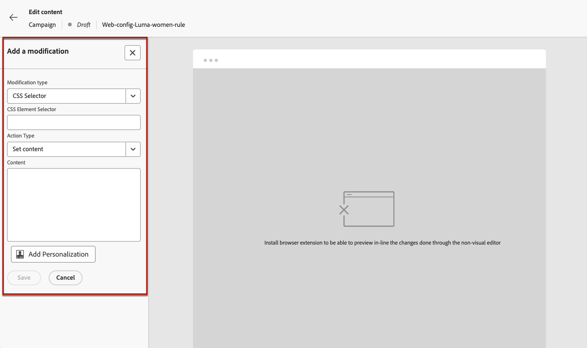
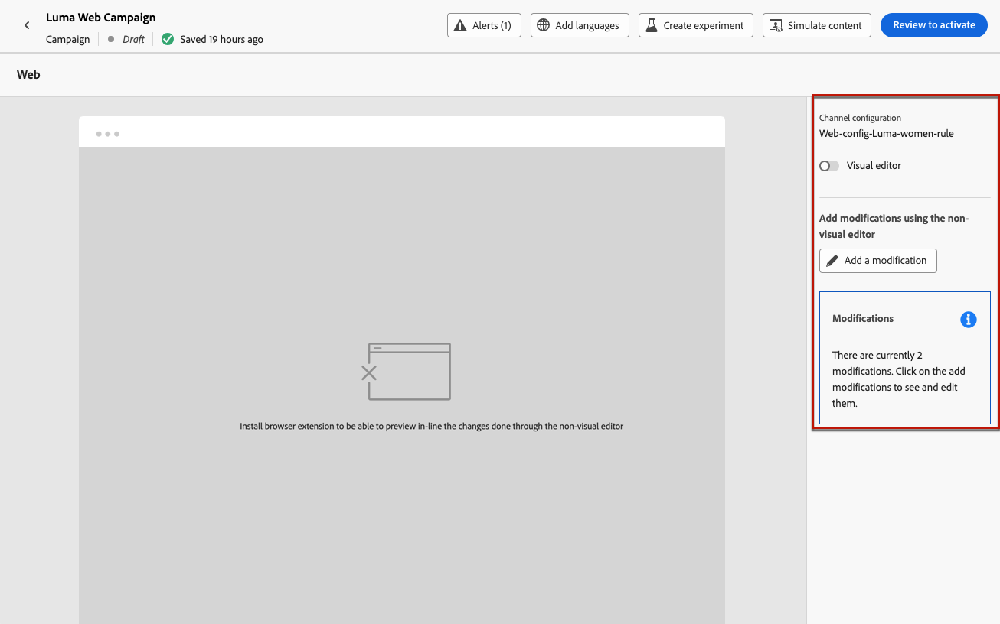

# De niet-visuele webeditor gebruiken {#web-non-visual-editor}

Naast [!DNL Journey Optimizer] visuele [ Webontwerper ](web-visual-editor.md), kunt u ook wijzigingen aan uw Web-pagina&#39;s toevoegen gebruikend a **niet-visuele redacteur**.

Dit kan nuttig zijn als u niet kunt, of niet wordt toegestaan om browser uitbreidingen zoals [ Adobe Experience Cloud Visual Helper ](web-prerequisites.md#visual-authoring-prerequisites) te installeren, die wordt vereist om uw pagina&#39;s in de Webontwerper te laden.

In bepaalde gevallen kunt u het ook gemakkelijker vinden om een niet-visuele editor te gebruiken om wijzigingen toe te passen op een bepaalde CSS-kiezer, zonder het risico dat u andere elementen op een webpagina wijzigt of de paginastructuur wijzigt.

Volg onderstaande stappen om uw webervaringen met de niet-visuele editor te maken.

1. Schakel de optie **[!UICONTROL Edit content]** uit in het **[!UICONTROL Visual editor]** -scherm tijdens de rit of campagne.

1. Klik op **[!UICONTROL Add a modification]** om uw webinhoud te bewerken.

   

1. De niet-visuele editorvertoningen. U kunt de eerste wijziging toevoegen met het linkerdeelvenster.

   

1. Selecteer het wijzigingstype in de vervolgkeuzelijst.

   Er zijn twee typen beschikbaar. Ze hebben verschillende opties. Zie de koppelingen hieronder voor meer informatie:

   * **[!UICONTROL CSS Selector]** - [ Leer meer ](manage-web-modifications.md#css-selector)
   * **[!UICONTROL Page `<head>`]** - [ Leer meer ](manage-web-modifications.md#page-head)

1. Klik op de knop **[!UICONTROL Add personalization]**. De verpersoonlijkingsredacteur opent.

   U kunt de personalisatie-editor van [!DNL Journey Optimizer] gebruiken met al zijn personalisatie- en ontwerpmogelijkheden. [Meer informatie](../personalization/personalization-build-expressions.md)

1. Voer de inhoud in en **[!UICONTROL Save]** voer de wijzigingen in.

   

1. De eerste wijziging wordt vóór het deelvenster **[!UICONTROL Modifications]** weergegeven.

   Klik op de knop **[!UICONTROL More actions]** naast de wijziging en selecteer **[!UICONTROL Info]** om de details weer te geven. U kunt desgewenst ook **[!UICONTROL Delete the modification]** gebruiken.

   {width="50%" align="left"}

   >[!NOTE]
   >
   >De **[!UICONTROL Modifications]** ruit is het zelfde als wanneer het gebruiken van de [ Webontwerper ](web-visual-editor.md). Alle acties u met het kunt uitvoeren zijn gedetailleerd in [ deze sectie ](manage-web-modifications.md#use-modifications-pane).

1. Klik op de knop **[!UICONTROL Add]** boven op het deelvenster **[!UICONTROL Modifications]** om nog een wijziging toe te voegen en herhaal de bovenstaande stappen.

1. Bovendien kunt u elk element van uw website selecteren en de klikken op dat element bijhouden. Als u het bijhouden van klikken wilt inschakelen en de handelingen wilt definiëren die moeten worden bijgehouden, klikt u op het tweede pictogram op de linkerspoorstaaf, zoals hieronder wordt weergegeven:

   {width="50%" align="left"}

   Gebruik **voeg Component** knoop toe om een nieuwe actie te selecteren om te volgen. Leer meer over klik het volgen gebruik in [ deze sectie ](monitor-web-experiences.md#use-click-tracking).

1. Klik op de pijl linksboven in het scherm om terug te bladeren naar het scherm van de reis- of campagneeditie. U kunt het huidige aantal wijzigingen zien en meer wijzigingen toevoegen.

   

   U kunt desgewenst ook naar de webontwerper schakelen. Alle wijzigingen blijven behouden.
