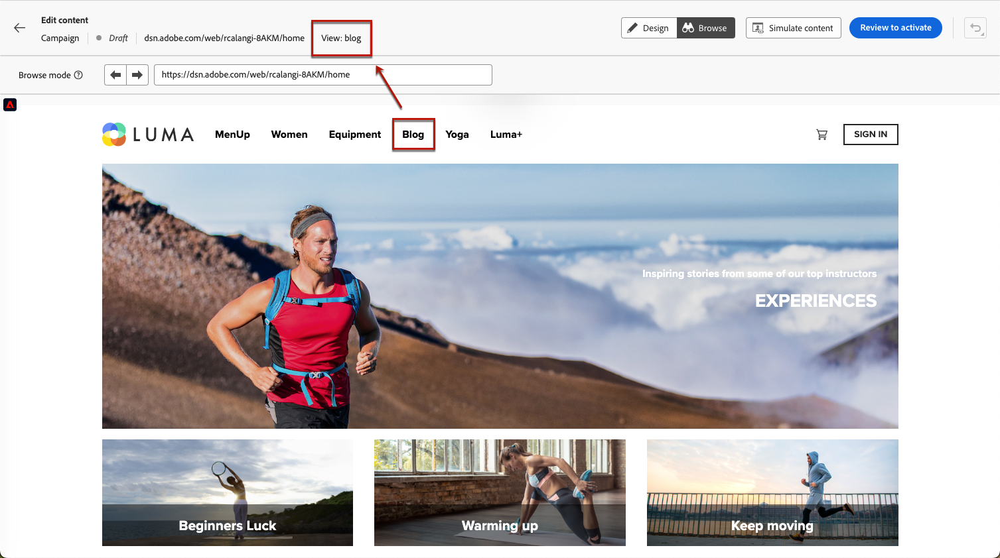

# Toepassingen van één pagina maken {#web-author-spas}

## Weergaven {#about-views}

>[!CONTEXTUALHELP]
>id="ajo_web_designer_modifications_views"
>title="Wijzigingen toepassen op geselecteerde weergaven"
>abstract="De wijzigingen worden alleen toegepast op geselecteerde weergaven. Weergaven kunnen worden gedetecteerd met de **Bladeren** en navigeer naar deze. Kan de weergave waarnaar u zoekt niet vinden?"
>additional-url="https://experienceleague.adobe.com/docs/platform-learn/implement-web-sdk/overview.html" text="Meer informatie"

**Toepassingen met één pagina** (SPA) kan nu worden gemaakt in de visuele editor van de webontwerper. Op deze manier kunt u selecteren welke specifieke **views** waarop u de wijzigingen van uw webpagina wilt toepassen.

[In deze video leert u hoe u toepassingen van één pagina ontwerpt](#video)

Een weergave kan worden gedefinieerd als een hele site of een groep visuele elementen op een site, zoals de startpagina, de hele productsite of het voorkeurenframe voor levering op alle afrekenpagina&#39;s.

Eenmalige ontwikkelaarsopstelling is nodig om de meningen in de implementatie van SDK van het Web van Adobe Experience Platform te bepalen. Op deze manier kunt u Adobe Journey Optimizer-webcampagnes maken en uitvoeren op SPA.

## Bepaal meningen in de implementatie van SDK van het Web {#define-views}

XDM-weergaven kunnen worden gebruikt in Adobe [!DNL Journey Optimizer] marktpartijen in staat stellen via de visuele editor webpersonalisatie- en experimentatiecampagnes op SPA uit te voeren. [Meer informatie](web-spa-implementation.md)

Weergaven openen en schrijven in het dialoogvenster [!DNL Journey Optimizer] gebruikersinterface, zorg ervoor u de stappen volgt die in [deze sectie](web-spa-implementation.md#implement-xdm-views).

## Weergaven detecteren in de webontwerper {#discover-views}

Zodra SPA opstelling in de implementatie van SDK van het Web van Adobe Experience Platform wordt gedaan, moet u door alle meningen van uw website navigeren die u wijzigingen op wilt toepassen. Voer de onderstaande stappen uit.

1. [Een webcampagne maken](create-web.md) en toegang tot de [webontwerper](edit-web-content.md).

   De weergave waarin u zich momenteel bevindt, wordt linksboven weergegeven.

   

1. Wisselen naar **[!UICONTROL Browse]** -modus. [Meer informatie](../web/edit-web-content.md#browse-mode)

   

1. Navigeer tussen de verschillende pagina&#39;s van de website om hen allen te ontdekken. De weergavenaam die bovenaan wordt weergegeven, verandert wanneer u door een andere pagina gaat.

   

## Wijzigingen toepassen op andere weergaven {#apply-modifications-views}

Nadat u een wijziging hebt toegevoegd terwijl u zich in een bepaalde weergave bevindt, kunt u deze toepassen op andere geselecteerde weergaven. Voer de onderstaande stappen uit.

>[!CAUTION]
>
>Als u geen weergaven hebt ontdekt met de **[!UICONTROL Browse]** kunt u deze niet selecteren voor het toepassen van uw wijzigingen. [Meer informatie](#discover-views)

1. Selecteer de **[!UICONTROL Modifications]** pictogram om het corresponderende venster links weer te geven.

   

1. Selecteer een wijziging en klik op de knop **[!UICONTROL More actions]** naast de knop. Selecteer **[!UICONTROL Apply to more views]**.

   

1. Selecteer de weergaven waarop u de wijzigingen wilt toepassen.

   

1. Klik op **[!UICONTROL Apply]**.

1. Wisselen naar **[!UICONTROL Browse]** om te controleren of de wijzigingen zijn toegepast op de gewenste pagina&#39;s.

   

## Hoe kan ik-video{#video}

In deze video wordt uitgelegd hoe u:

* SPA bekijken met **[!UICONTROL Browse]** mode
* Ontwerpbewerkingen uitvoeren op de huidige weergave
* websitewijzigingen toepassen op meerdere weergaven of op alle weergaven die zijn ontdekt
* Handelingen bulksgewijs uitvoeren op wijzigingen

>[!VIDEO](https://video.tv.adobe.com/v/3424536/?quality=12&learn=on)
