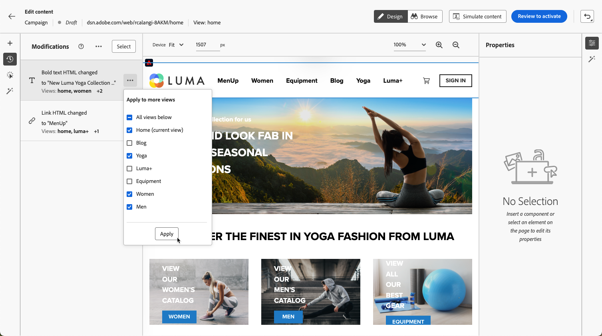

# Toepassingen van één pagina maken {#web-author-spas}

## Weergaven {#about-views}

>[!CONTEXTUALHELP]
>id="ajo_web_designer_modifications_views"
>title="Wijzigingen toepassen op geselecteerde weergaven"
>abstract="De wijzigingen worden alleen toegepast op geselecteerde weergaven. De meningen kunnen worden ontdekt gebruikend **doorbladeren** wijze en aan hen navigeren. Kan de weergave waarnaar u zoekt niet vinden?"
>additional-url="https://experienceleague.adobe.com/docs/platform-learn/implement-web-sdk/overview.html?lang=nl-NL" text="Meer informatie"

**Enige-pagina toepassingen** (SPAs) kan nu in de visuele redacteur van de Webontwerper worden ontworpen. Dit staat u toe om te selecteren welke specifieke **meningen** u uw Webpagina wijzigingen op wilt toepassen.

[In deze video leert u hoe u toepassingen van één pagina ontwerpt](#video)

Een weergave kan worden gedefinieerd als een hele site of een groep visuele elementen op een site, zoals de startpagina, de hele productsite of het voorkeurenframe voor levering op alle afrekenpagina&#39;s.

Eenmalige ontwikkelaarsopstelling is nodig om de meningen in de implementatie van Adobe Experience Platform Web SDK te bepalen. Dit laat u toe om het Webcampagnes van Adobe Journey Optimizer op SPAs tot stand te brengen en in werking te stellen.

## Weergaven definiëren in de Web SDK-implementatie {#define-views}

XDM-weergaven kunnen worden gebruikt in Adobe [!DNL Journey Optimizer] om marketers de mogelijkheid te bieden webpersonalisatie- en experimentatiecampagnes op SPA&#39;s uit te voeren via de visuele webeditor. [Meer informatie](https://experienceleague.adobe.com/docs/experience-platform/edge/personalization/ajo/web-spa-implementation.html?lang=nl-NL){target="_blank"}

Om tot meningen in het [!DNL Journey Optimizer] gebruikersinterface toegang te hebben en te schrijven, zorg ervoor u de stappen volgt die in [&#x200B; worden vermeld deze sectie &#x200B;](https://experienceleague.adobe.com/docs/experience-platform/edge/personalization/ajo/web-spa-implementation.html?lang=nl-NL#implement-xdm-views){target="_blank"}.

## Weergaven detecteren in de webontwerper {#discover-views}

Zodra de opstelling van SPAs in de implementatie van SDK van het Web van Adobe Experience Platform wordt gedaan, moet u door alle meningen van uw website navigeren die u wijzigingen wilt toepassen op. Voer de onderstaande stappen uit.

1. [&#x200B; creeer een Webreis of een campagne &#x200B;](create-web.md) en heb toegang tot [&#x200B; Webontwerper &#x200B;](web-visual-editor.md).

   De weergave waarin u zich momenteel bevindt, wordt linksboven weergegeven.

   

1. Wisselen naar modus **[!UICONTROL Browse]** . [Meer informatie](web-visual-editor.md#browse-mode)

   

1. Navigeer tussen de verschillende pagina&#39;s van de website om hen allen te ontdekken. De weergavenaam die bovenaan wordt weergegeven, verandert wanneer u door een andere pagina gaat.

   

## Wijzigingen toepassen op andere weergaven {#apply-modifications-views}

Nadat u een wijziging hebt toegevoegd terwijl u zich in een bepaalde weergave bevindt, kunt u deze toepassen op andere geselecteerde weergaven. Voer de onderstaande stappen uit.

>[!CAUTION]
>
>Als u geen weergaven hebt gevonden in de modus **[!UICONTROL Browse]** , kunt u deze niet selecteren voor het toepassen van uw wijzigingen. [Meer informatie](#discover-views)

1. Selecteer het pictogram **[!UICONTROL Modifications]** om het corresponderende venster links weer te geven.

   

1. Selecteer een wijziging en klik op de knop **[!UICONTROL More actions]** naast de wijziging. Selecteer **[!UICONTROL Apply to more views]**.

   

1. Selecteer de weergaven waarop u de wijzigingen wilt toepassen.

   

1. Klik op **[!UICONTROL Apply]**.

1. Wisselen naar de modus **[!UICONTROL Browse]** om te controleren of de wijzigingen zijn toegepast op de gewenste pagina&#39;s.

   

## Hoe kan ik-video{#video}

In deze video wordt uitgelegd hoe u:

* SPA-weergaven detecteren met de modus **[!UICONTROL Browse]**
* Ontwerpbewerkingen uitvoeren op de huidige weergave
* websitewijzigingen toepassen op meerdere weergaven of op alle weergaven die zijn ontdekt
* Handelingen bulksgewijs uitvoeren op wijzigingen

>[!VIDEO](https://video.tv.adobe.com/v/3446891/?captions=dut&quality=12&learn=on)
