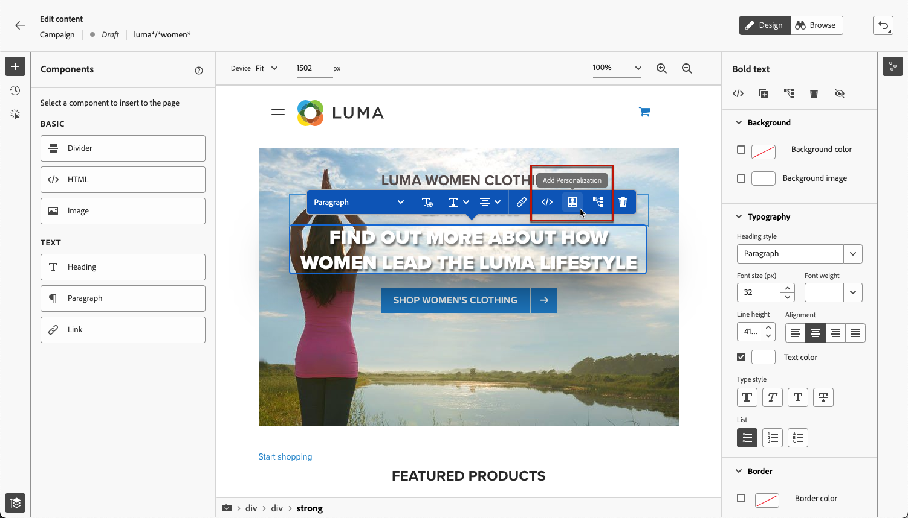
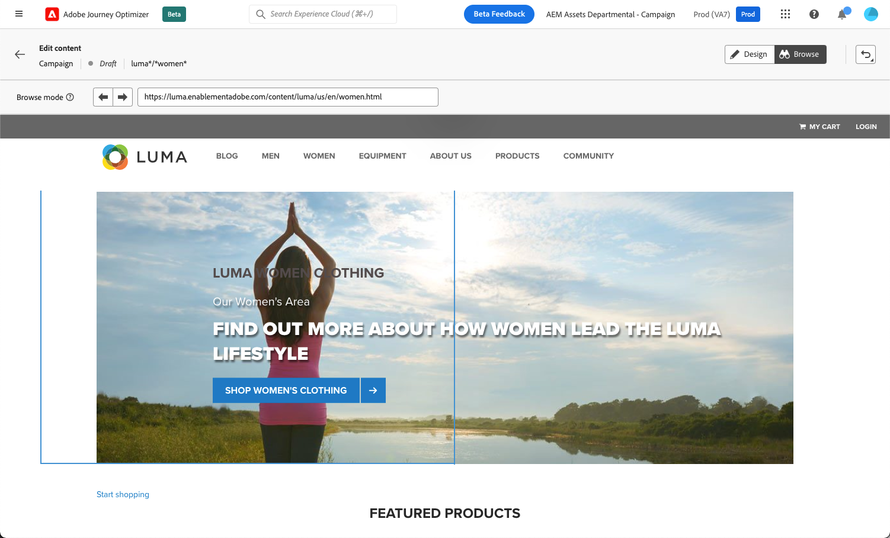

# Werken met de webontwerper {#work-with-web-designer}

<!--
>[!CONTEXTUALHELP]
>id="ajo_web_url_to_edit_surface"
>title="Confirm the URL to edit"
>abstract="Confirm the URL of the specific web page to use for editing the content that will be applied on the web configuration defined above. The web page must be implemented using the Adobe Experience Platform Web SDK."
>additional-url="https://experienceleague.adobe.com/docs/platform-learn/implement-web-sdk/overview.html" text="Learn more"

>[!CONTEXTUALHELP]
>id="ajo_web_url_to_edit_rule"
>title="Enter the URL to edit"
>abstract="Enter the URL of a specific web page to use for editing the content that will be applied to all pages matching the rule. The web page must be implemented using Adobe Experience Platform Web SDK."
>additional-url="https://experienceleague.adobe.com/docs/platform-learn/implement-web-sdk/overview.html" text="Learn more"
-->

In [!DNL Journey Optimizer], wordt het visuele Web authoring aangedreven door de **Adobe Experience Cloud Visual Helper** browser uitbreiding van Chrome. [Meer informatie](web-prerequisites.md#visual-authoring-prerequisites)

>[!CAUTION]
>
>Om tot Web-pagina&#39;s in het [!DNL Journey Optimizer] gebruikersinterface toegang te hebben en te schrijven, zorg ervoor u de eerste vereisten volgt die in [&#x200B; worden vermeld deze sectie &#x200B;](web-prerequisites.md).

## Creëer uw webervaring

Voer de onderstaande stappen uit om uw webervaring te gaan ontwerpen met de visuele webontwerper.

>[!CAUTION]
>
>[&#x200B; SDK van het Web van Adobe Experience Platform &#x200B;](https://experienceleague.adobe.com/docs/platform-learn/implement-web-sdk/overview.html){target="_blank"} moet in uw Web-pagina worden omvat. [Meer informatie](web-prerequisites.md#implementation-prerequisites)

1. Klik in het **[!UICONTROL Edit content]** -scherm op **[!UICONTROL Edit web page]** om de webontwerper te openen.

   

   <!---->

   >[!NOTE]
   >
   >Als u probeert om een website te laden die er niet in slaagt te laden, een berichtvertoningen die erop wijzen dat u de [&#x200B; Visuele het Uitgeven Browser van de Helper browser uitbreiding &#x200B;](#install-visual-editing-helper) installeert. Zie sommige uiteinden voor het oplossen van problemen in [&#x200B; deze sectie &#x200B;](web-prerequisites.md#troubleshooting).
   >
   >U kunt uw webinhoud ook bewerken zonder de visuele editor te laden. Als u dit wilt doen, schakelt u de optie **[!UICONTROL Visual editor]** uit om in plaats daarvan de modus Niet-visuele editie te gebruiken. [Meer informatie](web-non-visual-editor.md)

1. Selecteer eenmaal in de webontwerper een element op het canvas, zoals een afbeelding, knop, alinea, tekst, container, kop, koppeling, enzovoort. [Meer informatie](#content-components)

1. U kunt een element bewerken met:

   * Het contextafhankelijke menu voor het bewerken van de inhoud, lay-out, het invoegen van koppelingen of personalisatie, enz.

     

   * De pictogrammen boven in het rechterdeelvenster om elk element te bewerken, te dupliceren, te verwijderen of te verbergen.

     

   * Het rechterdeelvenster dat dynamisch verandert volgens het geselecteerde element. U kunt bijvoorbeeld de achtergrond, typografie, rand, grootte, positie, tussenruimte, effecten of inline stijlen van een element bewerken.

     

>[!NOTE]
>
>De ontwerper van webinhoud is meestal vergelijkbaar met de e-mail-Designer. Leer meer over [&#x200B; het ontwerpen van inhoud met  [!DNL Journey Optimizer]](../email/get-started-email-design.md).

Nadat u de webinhoud hebt bewerkt, kunt u uw wijzigingen beheren. [Meer informatie](manage-web-modifications.md)

## Componenten gebruiken {#content-components}

>[!CONTEXTUALHELP]
>id="ajo_web_designer_components"
>title="Componenten aan uw webpagina toevoegen"
>abstract="U kunt een aantal componenten aan uw webpagina toevoegen en deze naar wens bewerken."

1. Selecteer een item in het deelvenster **[!UICONTROL Components]** aan de linkerkant. U kunt de volgende componenten aan uw webpagina toevoegen en deze naar wens bewerken:

   * [Scheidingslijn](../email/content-components.md#divider)
   * [HTML](../email/content-components.md#HTML)
   * [Afbeelding](../email/content-components.md#image)
   * Kop - Het gebruik van deze component is vergelijkbaar met het gebruik van de component **[!UICONTROL Text]** in de Designer-e-mail. [Meer informatie](../email/content-components.md#text)
   * Alinea - Het gebruik van deze component is vergelijkbaar met het gebruik van de component **[!UICONTROL Text]** in de Designer-e-mail. [Meer informatie](../email/content-components.md#text)
   * Koppeling

   

1. Houd de muisaanwijzer boven de pagina en klik op de knop **[!UICONTROL Insert before]** of **[!UICONTROL Insert after]** om de component aan een bestaand element op de pagina toe te voegen.

   

   >[!NOTE]
   >
   >Als u de selectie van een component wilt opheffen, klikt u op de knop **[!UICONTROL ESC]** in de contextafhankelijke blauwe banner die boven op het canvas wordt weergegeven.

1. Bewerk de component naar wens rechtstreeks in de inhoud van de pagina.

   

1. Pas de stijlen aan die vanuit het contextafhankelijke venster aan de rechterkant worden weergegeven, zoals achtergrond, tekstkleur, rand, grootte, positie, enz. - afhankelijk van de geselecteerde component.

   

## Aanpassing toevoegen

Als u verpersoonlijking wilt toevoegen, selecteert u een container en selecteert u het verpersoonlijkingspictogram in de contextafhankelijke menubalk die wordt weergegeven. Voeg uw veranderingen toe gebruikend de verpersoonlijkingsredacteur. [Meer informatie](../personalization/personalization-build-expressions.md)

## Navigeren door de webontwerper {#navigate-web-designer}

In deze sectie worden de verschillende manieren beschreven waarop u door de webontwerper kunt navigeren. Om de wijzigingen te bekijken en te beheren die aan uw Webervaring worden toegevoegd, zie [&#x200B; deze sectie &#x200B;](manage-web-modifications.md).

### Breedkruimels gebruiken {#breadcrumbs}

1. Selecteer een willekeurig element op het canvas.

1. Klik op de knop **[!UICONTROL Expand/Collapse Breadcrumbs]** linksonder in het scherm om snel informatie over het geselecteerde element weer te geven.

   

1. Wanneer u de muisaanwijzer boven de broodkruimels houdt, wordt het bijbehorende element gemarkeerd in de editor.

1. Met deze editor kunt u eenvoudig naar elk bovenliggend, verwant of onderliggend element in de visuele editor navigeren.

### Wisselen naar modus Bladeren {#browse-mode}

>[!CONTEXTUALHELP]
>id="ajo_web_designer_browse"
>title="De modus Bladeren gebruiken"
>abstract="In deze modus kunt u naar de exacte pagina navigeren vanuit de geselecteerde configuratie die u wilt aanpassen."

U kunt de standaardmodus **[!UICONTROL Design]** omzetten in de **[!UICONTROL Browse]** -modus met behulp van de toegewezen knop.

In de modus **[!UICONTROL Browse]** kunt u naar de exacte pagina navigeren vanuit de geselecteerde configuratie die u wilt aanpassen.

Dit is vooral handig wanneer u werkt met pagina&#39;s die zich achter verificatie bevinden of die niet vanaf het begin bij een bepaalde URL beschikbaar zijn. U kunt bijvoorbeeld de verificatie uitvoeren, naar de accountpagina of naar de winkelpagina gaan en terugschakelen naar de modus **[!UICONTROL Design]** om de wijzigingen op de gewenste pagina uit te voeren.

Met de modus **[!UICONTROL Browse]** kunt u ook door alle weergaven van uw website navigeren wanneer u toepassingen van één pagina ontwerpt. [Meer informatie](web-spa.md)

### De apparaatgrootte wijzigen {#change-device-size}

U kunt de apparaatgrootte van de webontwerpweergave wijzigen in een vooraf gedefinieerde grootte, zoals **[!UICONTROL Tablet]** of **[!UICONTROL Mobile landscape]** , of een aangepaste grootte definiëren door het gewenste aantal pixels in te voeren.

U kunt de zoomfocus ook wijzigen van 25% in 400%.

De mogelijkheid om de apparaatgrootte te wijzigen is ontworpen voor responsieve sites die goed worden weergegeven op verschillende apparaten, vensters en schermgrootten. Responsieve sites worden automatisch aangepast en aangepast aan elke schermgrootte, zoals desktops, laptops, tablets of mobiele telefoons.

>[!CAUTION]
>
>U kunt een webervaring bewerken met een specifieke apparaatgrootte. Zolang de kiezers echter hetzelfde zijn, zijn deze wijzigingen van toepassing op alle formaten en apparaten en niet alleen op de apparaatgrootte waarin u werkt. Op dezelfde manier worden de wijzigingen toegepast op alle schermgrootten, en niet alleen op de desktopweergave wanneer u een ervaring bewerkt in de normale weergave.
>
>[!DNL Journey Optimizer] biedt momenteel geen ondersteuning voor paginawijzigingen die specifiek zijn voor de apparaatgrootte. Dit betekent dat als u bijvoorbeeld een aparte mobiele website met een aparte sitestructuur hebt, u de wijzigingen specifiek voor uw mobiele site in een andere campagne moet doorvoeren.

## Hoe kan ik-video{#video}

In de onderstaande video ziet u hoe u een webervaring kunt ontwerpen met de webontwerper in [!DNL Journey Optimizer] -campagnes.

>[!VIDEO](https://video.tv.adobe.com/v/3418803/?quality=12&learn=on)
