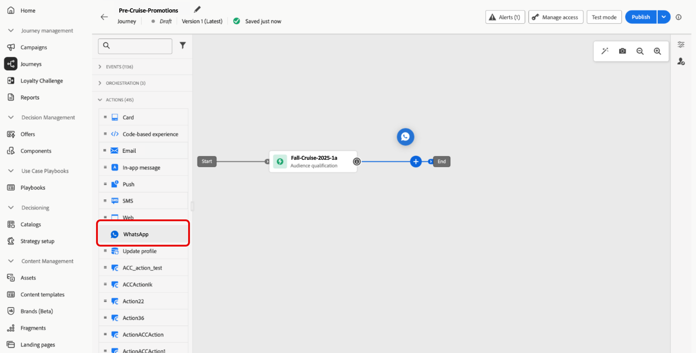

# Een whatsApp-bericht maken {#create-whatsapp}

>[!BEGINSHADEBOX]

**Lijst van inhoud**

* [Aan de slag met WhatsApp-berichten](get-started-whatsapp.md)
* [Aan de slag met WhatsApp-configuratie](whatsapp-configuration.md)
* **[creeer een bericht WhatsApp](create-whatsapp.md)**
* [Controleer en verzend uw WhatsApp-berichten](send-whatsapp.md)

>[!ENDSHADEBOX]

Met Adobe Journey Optimizer kunt u aansprekende berichten ontwerpen en verzenden op WhatsApp. Voeg eenvoudig een actie WhatsApp aan uw reis of campagne toe en maak uw berichtinhoud zoals hieronder gedetailleerd. Met Adobe Journey Optimizer kunt u ook uw WhatsApp-berichten testen voordat u ze verzendt. Zo kunt u de perfecte rendering, nauwkeurige personalisatie en een correcte configuratie van alle instellingen garanderen.

>[!VIDEO](https://video.tv.adobe.com/v/3451621?learn=on)

## Een WhatsApp-bericht toevoegen {#create-whatsapp-journey-campaign}

Blader hieronder naar de tabbladen om te leren hoe u een WhatsApp-bericht kunt toevoegen aan een campagne of een reis.

>[!BEGINTABS]

>[!TAB  voeg een bericht WhatsApp aan een Reis ] toe

1. Open uw reis dan belemmering en laat vallen a **WhatsApp activiteit** van de **sectie van Acties** van het palet.

   

1. Verstrek basisinformatie over uw bericht (etiket, beschrijving, categorie), dan kies de berichtconfiguratie aan gebruik.

   Voor meer informatie over hoe te om een reis te vormen, verwijs naar [ deze pagina ](../building-journeys/journey-gs.md)

   Het veld **[!UICONTROL configuration]** wordt standaard voorgevuld met de laatste configuratie die de gebruiker voor dat kanaal heeft gebruikt.

U kunt nu de inhoud van uw WhatsApp-bericht ontwerpen vanaf de knop **[!UICONTROL Edit content]** , zoals hieronder wordt beschreven.

>[!TAB  voeg een bericht WhatsApp aan een Campagne toe ]

1. Open het menu **[!UICONTROL Campaigns]** en klik op **[!UICONTROL Create campaign]** .

1. Selecteer het **Gepland - marketing** campagneretype.

1. Bewerk in de sectie **[!UICONTROL Properties]** de items **[!UICONTROL Title]** en **[!UICONTROL Description]** van uw campagne.

1. Klik op de knop **[!UICONTROL Select audience]** om het doelpubliek in de lijst met beschikbare Adobe Experience Platform-soorten publiek te definiëren. [Meer informatie](../audience/about-audiences.md).

1. Kies in het veld **[!UICONTROL Identity namespace]** de naamruimte die u wilt gebruiken om de personen van het geselecteerde publiek te identificeren. [Meer informatie](../event/about-creating.md#select-the-namespace).

1. Kies **[!UICONTROL WhatsApp]** in de sectie **[!UICONTROL Actions]** en selecteer of maak een nieuwe configuratie.

   Leer meer over configuratie WhatsApp in [ deze pagina ](whatsapp-configuration.md).

1. Klik op **[!UICONTROL Create experiment]** om uw inhoudexperiment te configureren en behandelingen te maken om de prestaties te meten en de beste optie voor uw doelgroep te identificeren. [Meer informatie](../content-management/content-experiment.md)

1. Geef in de sectie **[!UICONTROL Actions tracking]** op of u de klikken op koppelingen in uw WhatsApp-bericht wilt bijhouden.

1. Campagnes worden ontworpen om op een specifieke datum of op een terugkomende frequentie worden uitgevoerd. Leer hoe te om **[!UICONTROL Schedule]** van uw campagne in [ te vormen deze sectie ](../campaigns/create-campaign.md#schedule).

1. Kies in het menu **[!UICONTROL Action triggers]** de **[!UICONTROL Frequency]** van uw SMS-bericht:

   * Eenmaal
   * Dagelijks
   * Wekelijks
   * Maand

U kunt nu de inhoud van uw WhatsApp-bericht ontwerpen vanaf de knop **[!UICONTROL Edit content]** , zoals hieronder wordt beschreven.

>[!ENDTABS]

## De whatsApp-inhoud definiëren{#whatsapp-content}

>[!IMPORTANT]
>
>Voordat u uw WhatsApp-bericht in Journey Optimizer kunt ontwerpen, moet u eerst een sjabloon maken in Meta. [Meer informatie](https://www.facebook.com/business/help/2055875911147364?id=2129163877102343)

1. Van het reis of scherm van de campagneconfiguratie, klik de **[!UICONTROL Edit content]** knoop om de whatsApp berichtinhoud te vormen.

<!--
1. Select **[!UICONTROL Template message]**.
-->

1. Kies uw **categorie van het Malplaatje**:

   * Marketing
   * Hulpprogramma
   * Verificatie

   [ Leer meer op de categorieën van het Malplaatje ](https://developers.facebook.com/docs/whatsapp/updates-to-pricing/new-template-guidelines/#template-category-guidelines)

1. Van het **WhatsApp malplaatje** drop-down, selecteer uw eerder gecreeerd malplaatje dat in Meta wordt ontworpen.

   [ Leer meer op hoe te om uw Whatsapp malplaatjes ](https://www.facebook.com/business/help/2055875911147364?id=2129163877102343) te creëren

1. Gebruik de verpersoonlijkingsredacteur om verpersoonlijking aan uw malplaatje toe te voegen. U kunt elk kenmerk gebruiken, bijvoorbeeld de profielnaam of plaats.

   Blader door de volgende pagina om meer over [ verpersoonlijking ](../personalization/personalize.md) te leren.

1. Gebruik de knop **[!UICONTROL Simulate content]** om een voorvertoning weer te geven van uw WhatsApp-berichtinhoud, verkorte URL&#39;s en gepersonaliseerde inhoud. [Meer informatie](send-whatsapp.md)

Nadat u de tests hebt uitgevoerd en de inhoud hebt gevalideerd, kunt u uw WhatsApp-bericht naar uw publiek sturen. Deze stappen zijn gedetailleerd in [ deze pagina ](send-whatsapp.md)

<!--
* **[!UICONTROL Template message]**: Predefined message imported from Meta into Journey Optimizer. These are intended for sending notifications, alerts, or updates to your customers.

* **[!UICONTROL Response message]**: Message created in Journey Optimizer and sent in reply to customer queries or interactions.

>[!BEGINTABS]

>[!TAB Template message]

1. From the journey or campaign configuration screen, click the **[!UICONTROL Edit content]** button to configure the WhatsApp message content.

1. Select **[!UICONTROL Template message]**.

1. Choose your Template category. [Learn more](https://developers.facebook.com/docs/WhatsApp/updates-to-pricing/new-template-guidelines/)

1. From the **WhatsApp template** drop-down, select your previously created template designed in Meta.

1. Use the personalization editor to define content, add personalization and dynamic content. You can use any attribute, such as the profile name or city for example. You can also define conditional rules. Browse to the following pages to learn more about [personalization](../personalization/personalize.md) and [dynamic content](../personalization/get-started-dynamic-content.md) in the personalization editor.

1. Use the **[!UICONTROL Simulate content]** button to preview your WhatsApp message content, shortened URLs, and personalized content. [Learn more](send-whatsapp.md)

Once you have performed your tests and validated the content, you can send your WhatsApp message to your audience. These steps are detailed in [this page](send-whatsapp.md)

>[!TAB Response message]

1. From the journey or campaign configuration screen, click the **[!UICONTROL Edit content]** button to configure the WhatsApp message content.

1. Select **[!UICONTROL Response message]**.

1. Enter your text in the **[!UICONTROL Body]** field.

1. Use the personalization editor to define content, add personalization and dynamic content. You can use any attribute, such as the profile name or city for example. You can also define conditional rules. Browse to the following pages to learn more about [personalization](../personalization/personalize.md) and [dynamic content](../personalization/get-started-dynamic-content.md) in the personalization editor.

1. Use the **[!UICONTROL Simulate content]** button to preview your WhatsApp message content, shortened URLs, and personalized content. [Learn more](send-whatsapp.md)

Once you have performed your tests and validated the content, you can send your WhatsApp message to your audience. These steps are detailed in [this page](send-whatsapp.md)

>[!ENDTABS]
-->
