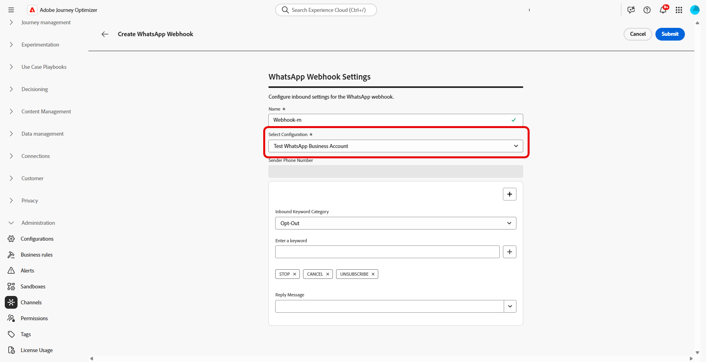
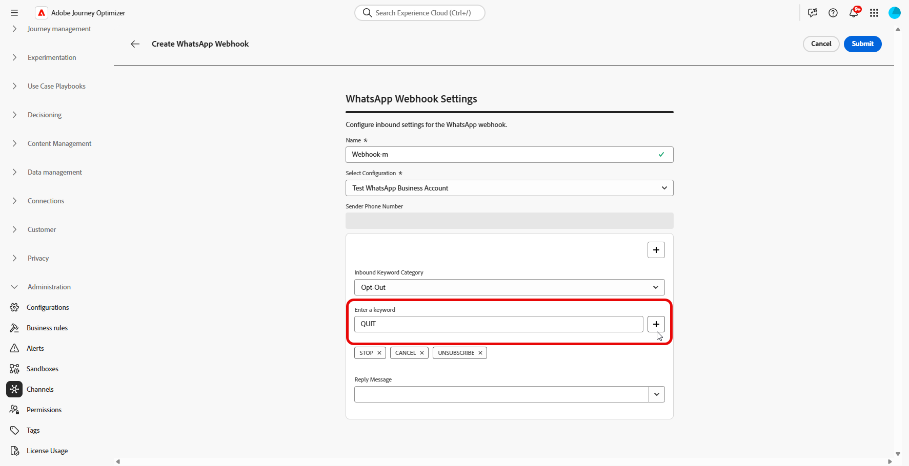
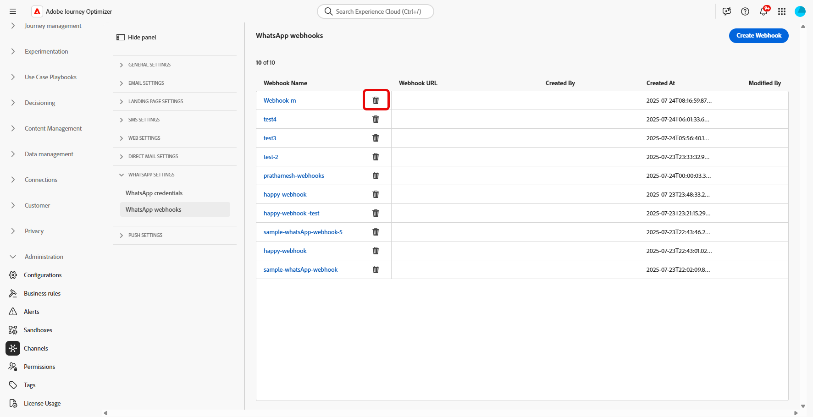

# Aan de slag met WhatsApp-configuratie {#whatsapp-config}

Voordat u het WhatsApp-bericht verzendt, moet u uw Adobe Journey Optimizer-omgeving configureren en koppelen aan uw WhatsApp-account. Dit doet u als volgt:

1. [Uw WhatsApp API-referenties maken](#WhatsApp-credentials)
1. [Maak uw whatsApp-webhooks](#WhatsApp-webhook)
1. [De whatsApp-configuratie maken](#WhatsApp-configuration)

Deze stappen moeten door een Beheerder van het Systeem van Adobe Journey Optimizer [ worden uitgevoerd ](../start/path/administrator.md).

## WhatsApp API-referenties maken {#whatsapp-credentials}

1. Blader in de linkertrack naar **[!UICONTROL Administration]** `>` **[!UICONTROL Channels]** en selecteer het menu **[!UICONTROL API Credentials]** . Klik op de knop **[!UICONTROL Create new API credentials]**.

1. Configureer uw API-referenties, zoals hieronder wordt beschreven:

   * **API Token**: Ga uw API teken in. Leer meer in [ Documentatie van Meta ](https://developers.facebook.com/blog/post/2022/12/05/auth-tokens/)
   * **identiteitskaart Bedrijfs van de Rekening**: Ga het unieke aantal met betrekking tot uw bedrijfsportefeuille in. Leer meer in [ Documentatie van Meta ](https://www.facebook.com/business/help/1181250022022158?id=180505742745347).

   

1. Klik op **[!UICONTROL Continue]**.

1. Kies de **WhatsApp BedrijfsRekening** u met uw whatsApp API geloofsbrieven wilt verbinden.

   

1. Selecteer de **naam van de Afzender** wordt gebruikt om uw WhatsApp- berichten te verzenden die.

1. De instellingen voor het telefoonnummer worden automatisch ingevuld:

   * **Classificatie van de Kwaliteit**: wijst op klant terugkoppelt op berichten die in de afgelopen 24 uren worden verzonden.
      * Groen: Hoge kwaliteit
      * Geel: Medium-kwaliteit
      * Rood: lage kwaliteit

     Leer meer over [ de classificatie van de Kwaliteit ](https://www.facebook.com/business/help/766346674749731#)

   * **Output**: wijst op het tarief waaraan uw telefoonaantal berichten kan verzenden.

1. Klik op **[!UICONTROL Submit]** wanneer u de configuratie van uw API-referenties hebt voltooid.

Nadat u de API-referentie hebt gemaakt en geconfigureerd, moet u nu uw Webhaak voor WhatsApp-berichten maken. [Meer informatie](#whatsapp-webhook)

## Webhaak maken {#WhatsApp-webhook}

>[!CONTEXTUALHELP]
>id="ajo_admin_whatsapp_webhook_inbound_keyword_category"
>title="Binnenkomende trefwoordcategorie"
>abstract="<b> Opt-binnen </b>: verzendt uw bepaalde auto-reactie wanneer een gebruiker intekent.  <b> Opt-uit </b>: verzendt uw bepaalde auto-reactie wanneer een gebruiker afmeldt.  <b> Hulp </b>: verzendt uw bepaalde auto-reactie wanneer een gebruiker om hulp of steun verzoekt.  <b> Gebrek </b>: verzendt uw fallback auto-reactie wanneer geen sleutelwoorden aanpassen."

>[!CONTEXTUALHELP]
>id="ajo_admin_whatsapp_webhook_inbound_keyword"
>title="Trefwoorden invoeren"
>abstract="U kunt trefwoorden definiëren om specifieke automatische reacties te activeren op basis van de gebruikerstekst. Trefwoorden zijn niet hoofdlettergevoelig, dus stop en STOP worden bijvoorbeeld op dezelfde manier behandeld."

>[!CONTEXTUALHELP]
>id="ajo_admin_whatsapp_webhook_webhook_url"
>title="URL voor terugbellen"
>abstract="De validatieaanvraag en webhaakmeldingen voor dit object worden naar de opgegeven URL verzonden."

>[!CONTEXTUALHELP]
>id="ajo_admin_whatsapp_webhook_verify_token"
>title="Token verifiëren"
>abstract="Het token dat Meta terugweergeeft om de callback-URL tijdens het verificatieproces te bevestigen en te verifiëren."

>[!NOTE]
>
>Zonder opgegeven opt-in- of opt-out-trefwoorden zijn standaardtoestemmingsberichten niet ingeschakeld.

Nadat de whatsApp API-referenties zijn gemaakt, kunt u nu Webhooks configureren naar:

* **Vang binnenkomende reacties** voor het beheren van opt-in en opt-out toestemming
* **ontvang leveringsrapporten** zoals gelezen ontvangstbewijzen (waar beschikbaar) en de status van de berichtlevering
* **laat het volgen gebeurtenissen** voor analyses en het melden in de datasets van Adobe Experience Platform toe

Webhooks fungeren als de communicatiekanaal tussen Meta WhatsApp Business Platform en Adobe Journey Optimizer, zodat u realtime meldingen kunt ontvangen over berichtgebeurtenissen en gebruikersinteracties.

1. Navigeer in de linkertrack naar **[!UICONTROL Administration]** `>` **[!UICONTROL Channels]** , selecteer het menu **[!UICONTROL WhatsApp Webhooks]** onder **[!UICONTROL WhatsApp settings]** en klik op de knop **[!UICONTROL Create Webhook]** .

   

1. Voer een **[!UICONTROL Name]** in voor uw webhaak.

1. Van **[!UICONTROL Select configuration]** drop-down, selecteer [ API Geloofsbrieven ](#whatsapp-credentials) u eerder creeerde.

   

1. Kies uw **[!UICONTROL Inbound keyword category]** , zoals:

   * **[!UICONTROL Opt-in Keywords]**
   * **[!UICONTROL Opt-out Keywords]**
   * **[!UICONTROL Help Keywords]**
   * **[!UICONTROL Default]** - Fallback-categorie voor alle binnenkomende berichten die niet overeenkomen met andere trefwoorden. Gebruik deze categorie om het volgen gebeurtenissen (opent, leveringsrapporten) in de datasets van Adobe Experience Platform toe te laten.

1. Ga uw **[!UICONTROL Keywords]** in en klik .

   

1. Voer in het veld **[!UICONTROL Reply Message]** het bericht in dat wordt verzonden wanneer een geconfigureerd trefwoord wordt ontvangen of selecteer een vooraf gedefinieerde optie in het vervolgkeuzemenu.

   

<!--
1. Click **[!UICONTROL View payload editor]** to validate and customize your request payloads. 
    
    You can dynamically personalize your payload using profile attributes, and ensure accurate data is sent for processing and response generation with the help of built-in helper functions.
-->
1. Klik  om extra **[!UICONTROL Inbound keyword]** toe te voegen.

1. Klik **[!UICONTROL Submit]** wanneer u de configuratie van uw WhatsApp Webhaak beëindigde.

1. In het **[!UICONTROL Webhooks]** menu, klik het  om uw WebHaak te schrappen WhatsApp.

   

1. Als u de bestaande configuratie wilt wijzigen en toegang wilt krijgen tot uw **[!UICONTROL Webhook URL]** of **[!UICONTROL Webhook Verify toker]** , zoekt u de gewenste Webhaak en klikt u op de optie **[!UICONTROL Edit]** om de gewenste wijzigingen aan te brengen.

1. Kopieer de **[!UICONTROL Webhook Verify toker]** die u hier hebt gegenereerd en plak deze in de Meta-interface als onderdeel van uw WebHaak-instelling.

   Voor gedetailleerde instructies op hoe en waar om dit verificatietoken toe te voegen, verwijs naar [ documentatie van Meta ](https://developers.facebook.com/docs/graph-api/webhooks/getting-started#configure-webhooks-product).

1. Open en kopieer uw nieuwe **[!UICONTROL Webhook URL]** vanuit uw eerder verzonden **[!UICONTROL WhatsApp Webhook]** .

   

Nu uw Webhaak wordt gevormd, kunt u uw configuratie tot stand brengen WhatsApp.

## WhatsApp-configuratie maken {#whatsapp-configuration}

1. Blader in de linkertrack naar **[!UICONTROL Administration]** > **[!UICONTROL Channels]** en selecteer **[!UICONTROL General settings]** > **[!UICONTROL Channel configurations]** . Klik op de knop **[!UICONTROL Create channel configuration]**.

   

1. Voer een naam en beschrijving (optioneel) voor de configuratie in en selecteer vervolgens het WhatsApp-kanaal.

   >[!NOTE]
   >
   > Namen moeten beginnen met een letter (A-Z). Het mag alleen alfanumerieke tekens bevatten. U kunt ook onderstrepingsteken `_` -, punt `.` - en afbreekstreepjes `-` gebruiken.

1. Selecteer **[!DNL WhatsApp]** als kanaal.

   {width=80%}

1. Selecteer **[!UICONTROL Marketing action(s)]** om toestemmingsbeleid aan de berichten te associëren gebruikend deze configuratie. Alle toestemmingsbeleid verbonden aan de marketing actie wordt gebruikt om de voorkeur van uw klanten te respecteren. [Meer informatie](../action/consent.md#surface-marketing-actions)

1. Selecteer in de sectie **[!UICONTROL WhatsApp Settings]** de eerder gemaakte **[!UICONTROL WhatsApp configuration]** .

   {width=80%}

1. Ga **[!UICONTROL Sender Phone Number]** in &#x200B; u voor uw mededelingen wilt gebruiken.

1. Gebruik **[!UICONTROL WhatsApp Execution Field]** om onder de profielattributen het telefoonaantal te selecteren dat u in prioriteit wilt gebruiken als verscheidene aantallen in het gegevensbestand beschikbaar zijn. [Meer informatie](../configuration/primary-email-addresses.md#override-execution-address-channel-config)

   >[!NOTE]
   >
   >Door gebrek, [!DNL Journey Optimizer] gebruikt het telefoonaantal dat in de [ wordt gespecificeerd algemene montages ](../configuration/primary-email-addresses.md) op het zandbakniveau. Wanneer u dit veld bijwerkt, wordt de standaardwaarde voor de ritten en campagnes met deze configuratie genegeerd.

1. Nadat alle parameters zijn geconfigureerd, klikt u op **[!UICONTROL Submit]** om te bevestigen. U kunt de kanaalconfiguratie als ontwerp ook bewaren en zijn configuratie later hervatten.

1. Nadat de kanaalconfiguratie is gemaakt, wordt deze in de lijst weergegeven met de status **[!UICONTROL Processing]** .

   >[!NOTE]
   >
   >Als de controles niet succesvol zijn, leer meer over de mogelijke mislukkingsredenen in [ deze sectie ](../configuration/channel-surfaces.md).

1. Wanneer de controles succesvol zijn, krijgt de kanaalconfiguratie de **[!UICONTROL Active]** status. Het is klaar om te worden gebruikt om berichten te leveren.

Zodra gevormd, kunt u hefboomwerking alle uit-van-de-doos kanaalmogelijkheden zoals bericht creatie, verpersoonlijking, verbinding het volgen, en rapportering.

U kunt nu WhatsApp-berichten verzenden met Journey Optimizer.

## Problemen met whatsApp-kanaalinstelling oplossen {#troubleshooting}

### HTTP 500-fouten tijdens instellen van API-referentie

Als er een HTTP 500-fout optreedt bij het configureren van WhatsApp API-referenties, voert u de volgende stappen voor het oplossen van problemen uit:

1. **verifieer toestemmingen**: Bevestig dat uw organisatie de `cjm_whatsapp` provisioned bevoegdheid heeft. Zonder deze machtiging kan het WhatsApp-kanaal niet worden geconfigureerd.

1. **bevestigt de gebieden van de bedrijfsrekening**: Zorg ervoor alle verplichte gebieden correct worden gevuld:
   * **API Token**: Moet een geldig toegangstoken van Meta met aangewezen toestemmingen zijn. [Meer informatie](https://developers.facebook.com/blog/post/2022/12/05/auth-tokens/)
   * **identiteitskaart van de BedrijfsRekening**: Moet uw identiteitskaart van de BedrijfsRekening van Meta precies aanpassen. [Meer informatie](https://www.facebook.com/business/help/1181250022022158?id=180505742745347)

1. **de geloofsbrieven van de Test extern**: Verifieer direct uw geloofsbrieven met Meta API om te bevestigen of de kwestie met de geloofsbrieven of met de credentiebehandeling van Journey Optimizer is.

1. **laat geavanceerd registreren** toe: Om interne server of authentificatiewanconfiguraties te identificeren, laat geavanceerde logboeken in uw milieu van Journey Optimizer toe om gedetailleerde informatie over de API vraagmislukkingen te verstrekken.

1. **de steun van het Contact**: Als het milieu en de aanspraken geldig maar de fout van HTTP 500 blijft bestaan, contacteer uw vertegenwoordiger van Adobe.

## Hoe kan ik-video {#video}

In de onderstaande video ziet u hoe u het WhatsApp-kanaal instelt in Adobe Journey Optimizer.

+++ Zie video

>[!VIDEO](https://video.tv.adobe.com/v/3470268/?learn=on)

+++
