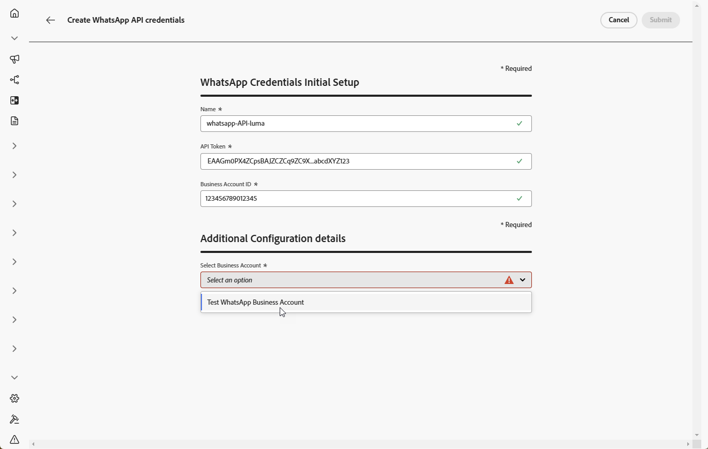

# Aan de slag met WhatsApp-configuratie {#whatsapp-config}

>[!BEGINSHADEBOX]

**Lijst van inhoud**

* [Aan de slag met WhatsApp-berichten](get-started-whatsapp.md)
* **[krijgen begonnen met configuratie WhatsApp](whatsapp-configuration.md)**
* [Een whatsApp-bericht maken](create-whatsapp.md)
* [Controleer en verzend uw WhatsApp-berichten](send-whatsapp.md)

>[!ENDSHADEBOX]

Voordat u het WhatsApp-bericht verzendt, moet u uw Adobe Journey Optimizer-omgeving configureren en koppelen aan uw WhatsApp-account. Dit doet u als volgt:

1. [Uw WhatsApp API-referenties maken](#WhatsApp-credentials)
1. [De whatsApp-configuratie maken](#WhatsApp-configuration)

Deze stappen moeten door een Beheerder van het Systeem van Adobe Journey Optimizer [ worden uitgevoerd ](../start/path/administrator.md).

## WhatsApp API-referenties maken {#whatsapp-credentials}

1. Blader in de linkertrack naar **[!UICONTROL Administration]** `>` **[!UICONTROL Channels]** en selecteer het menu **[!UICONTROL API Credentials]** . Klik op de knop **[!UICONTROL Create new API credentials]**.

1. Configureer uw API-referenties, zoals hieronder wordt beschreven:

   * **API Token**: Ga uw API teken in. Leer meer in [ Documentatie van Meta ](https://developers.facebook.com/docs/facebook-login/guides/access-tokens/)
   * **identiteitskaart Bedrijfs van de Rekening**: Ga het unieke aantal met betrekking tot uw bedrijfsportefeuille in. Leer meer in [ Documentatie van Meta ](https://www.facebook.com/business/help/1181250022022158?id=180505742745347).

   

1. Klik op **[!UICONTROL Continue]**.

1. Kies de **BedrijfsRekening** u met uw whatsApp API geloofsbrieven wilt verbinden.

   

1. Selecteer het **aantal van de Telefoon** wordt gebruikt om uw Whatsapp berichten te verzenden die.

1. De instellingen voor het telefoonnummer worden automatisch ingevuld:

   * **Classificatie van de Kwaliteit**: wijst op klant terugkoppelt op berichten die in de afgelopen 24 uren worden verzonden.
      * Groen: Hoge kwaliteit
      * Geel: Medium-kwaliteit
      * Rood: lage kwaliteit

     Leer meer op [ Kwaliteit rating ](https://www.facebook.com/business/help/766346674749731#)

   * **Output**: wijst op het tarief waaraan uw telefoonaantal berichten kan verzenden.

1. Klik op **[!UICONTROL Submit]** wanneer u de configuratie van uw API-referenties hebt voltooid.

Nadat u de API-referentie hebt gemaakt en geconfigureerd, moet u nu een kanaalconfiguratie voor WhatsApp-berichten maken. [Meer informatie](#whatsapp-configuration)

## WhatsApp-configuratie maken {#whatsapp-configuration}

1. Blader in de linkertrack naar **[!UICONTROL Administration]** > **[!UICONTROL Channels]** en selecteer **[!UICONTROL General settings]** > **[!UICONTROL Channel configurations]** . Klik op de knop **[!UICONTROL Create channel configuration]**.

   

1. Voer een naam en beschrijving (optioneel) voor de configuratie in en selecteer vervolgens het WhatsApp-kanaal.

   >[!NOTE]
   >
   > Namen moeten beginnen met een letter (A-Z). Het mag alleen alfanumerieke tekens bevatten. U kunt ook onderstrepingsteken `_` -, punt `.` - en afbreekstreepjes `-` gebruiken.

1. Selecteer **[!DNL WhatsApp]** als kanaal.

   

1. Selecteer **[!UICONTROL Marketing action(s)]** om toestemmingsbeleid aan de berichten te associëren gebruikend deze configuratie. Alle toestemmingsbeleid verbonden aan de marketing actie wordt gebruikt om de voorkeur van uw klanten te respecteren. Meer informatie

1. Selecteer het eerder gemaakte bestand **[!UICONTROL WhatsApp API configuration]** .

   

1. Ga **[!UICONTROL Sender number]** in &#x200B; u voor uw mededelingen wilt gebruiken.

1. Nadat alle parameters zijn geconfigureerd, klikt u op **[!UICONTROL Submit]** om te bevestigen. U kunt de kanaalconfiguratie als ontwerp ook bewaren en zijn configuratie later hervatten.

1. Nadat de kanaalconfiguratie is gemaakt, wordt deze in de lijst weergegeven met de status **[!UICONTROL Processing]** .

   >[!NOTE]
   >
   >Als de controles niet succesvol zijn, leer meer over de mogelijke mislukkingsredenen in [ deze sectie ](../configuration/channel-surfaces.md).

1. Wanneer de controles succesvol zijn, krijgt de kanaalconfiguratie de **[!UICONTROL Active]** status. Het is klaar om te worden gebruikt om berichten te leveren.

U kunt nu WhatsApp-berichten verzenden met Journey Optimizer.
