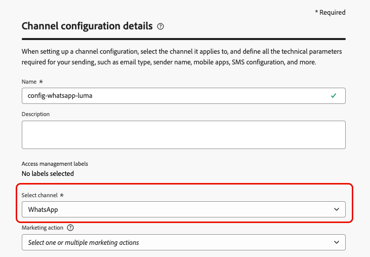

# Aan de slag met WhatsApp-configuratie {#whatsapp-config}

>[!BEGINSHADEBOX]

**Lijst van inhoud**

* [Aan de slag met WhatsApp-berichten](get-started-whatsapp.md)
* **[krijgen begonnen met configuratie WhatsApp](whatsapp-configuration.md)**
* [Een whatsApp-bericht maken](create-whatsapp.md)
* [Controleer en verzend uw WhatsApp-berichten](send-whatsapp.md)

>[!ENDSHADEBOX]

Voordat u het WhatsApp-bericht verzendt, moet u uw Adobe Journey Optimizer-omgeving configureren en koppelen aan uw WhatsApp-account. Dit doet u als volgt:

1. [Uw WhatsApp API-referenties maken](#WhatsApp-credentials)
1. [Maak uw whatsApp-webhooks](#WhatsApp-webhook)
1. [De whatsApp-configuratie maken](#WhatsApp-configuration)

Deze stappen moeten door een Beheerder van het Systeem van Adobe Journey Optimizer [ worden uitgevoerd ](../start/path/administrator.md).

## WhatsApp API-referenties maken {#whatsapp-credentials}

1. Blader in de linkertrack naar **[!UICONTROL Administration]** `>` **[!UICONTROL Channels]** en selecteer het menu **[!UICONTROL API Credentials]** . Klik op de knop **[!UICONTROL Create new API credentials]**.

1. Configureer uw API-referenties, zoals hieronder wordt beschreven:

   * **API Token**: Ga uw API teken in. Leer meer in [ Documentatie van Meta ](https://developers.facebook.com/docs/facebook-login/guides/access-tokens/)
   * **identiteitskaart Bedrijfs van de Rekening**: Ga het unieke aantal met betrekking tot uw bedrijfsportefeuille in. Leer meer in [ Documentatie van Meta ](https://www.facebook.com/business/help/1181250022022158?id=180505742745347).

   

1. Klik op **[!UICONTROL Continue]**.

1. Kies de **BedrijfsRekening** u met uw whatsApp API geloofsbrieven wilt verbinden.

   

1. Selecteer de **naam van de Afzender** wordt gebruikt om uw Whatsapp berichten te verzenden die.

1. De instellingen voor het telefoonnummer worden automatisch ingevuld:

   * **Classificatie van de Kwaliteit**: wijst op klant terugkoppelt op berichten die in de afgelopen 24 uren worden verzonden.
      * Groen: Hoge kwaliteit
      * Geel: Medium-kwaliteit
      * Rood: lage kwaliteit

     Leer meer over [ de classificatie van de Kwaliteit ](https://www.facebook.com/business/help/766346674749731#)

   * **Output**: wijst op het tarief waaraan uw telefoonaantal berichten kan verzenden.

1. Klik op **[!UICONTROL Submit]** wanneer u de configuratie van uw API-referenties hebt voltooid.

Nadat u de API-referentie hebt gemaakt en geconfigureerd, moet u nu een kanaalconfiguratie voor WhatsApp-berichten maken. [Meer informatie](#whatsapp-configuration)

## Webhaak maken {#WhatsApp-webhook}

>[!CONTEXTUALHELP]
>id="ajo_admin_whatsapp_webhook_inbound_keyword_category"
>title="Binnenkomende trefwoordcategorie"
>abstract="<b> Opt-binnen </b>: verzendt uw bepaalde auto-reactie wanneer een gebruiker intekent.  <b> Opt-uit </b>: verzendt uw bepaalde auto-reactie wanneer een gebruiker afmeldt.  <b> Hulp </b>: verzendt uw bepaalde auto-reactie wanneer een gebruiker om hulp of steun verzoekt.  <b> Gebrek </b>: verzendt uw fallback auto-reactie wanneer geen sleutelwoorden aanpassen."

>[!CONTEXTUALHELP]
>id="ajo_admin_whatsapp_webhook_inbound_keyword"
>title="Trefwoorden invoeren"
>abstract= "You can define keywords to trigger specific auto-responses, such as for Opt-In, Opt-Out, Help, or Default, based on what users text. Keywords are not case-sensitive, e.g., stop and STOP are treated the same."

>[!CONTEXTUALHELP]
>id="ajo_admin_whatsapp_webhook_webhook_url"
>title=" URL voor terugbellen"
>abstract="De validatieaanvraag en webhaakmeldingen voor dit object worden naar de opgegeven URL verzonden."

>[!CONTEXTUALHELP]
>id="ajo_admin_whatsapp_webhook_verify_token"
>title="Token verifiëren"
>abstract="Het token dat Meta terugweergeeft om de callback-URL tijdens het verificatieproces te bevestigen en te verifiëren."

>[!NOTE]
>
>Zonder opgegeven opt-in- of opt-out-trefwoorden zijn standaardtoestemmingsberichten niet ingeschakeld.

Zodra uw whatsApp API geloofsbrieven en uw [ Meta Webhooks ](https://developers.facebook.com/docs/whatsapp/webhooks/) met succes zijn gecreeerd, moet de volgende stap een webhaak tot stand brengen en uw binnenkomende montages vormen.

1. Navigeer in de linkertrack naar **[!UICONTROL Administration]** `>` **[!UICONTROL Channels]** , selecteer het menu **[!UICONTROL WhatsApp Webhooks]** onder **[!UICONTROL WhatsApp settings]** en klik op de knop **[!UICONTROL Create Webhook]** .

1. Voer een [!UICONTROL Name] in voor uw webhaak.

1. Van drop-down, selecteer [ API Geloofsbrieven ](#whatsapp-credentials) u eerder creeerde.

1. Klik  beginnen vormend **[!UICONTROL Inbound keyword category]** zoals:

   * **[!UICONTROL Opt-in Keywords]**
   * **[!UICONTROL Opt-out Keywords]**
   * **[!UICONTROL Help Keywords]**

1. Voer uw **[!UICONTROL Keyword]** in.

   Om veelvoudige sleutelwoorden toe te voegen, voegt de klik  toe.

1. Geef op welke **[!UICONTROL Reply Message]** moet worden verzonden wanneer een geconfigureerd trefwoord wordt ontvangen.

<!--
1. Click **[!UICONTROL View payload editor]** to validate and customize your request payloads. 
    
    You can dynamically personalize your payload using profile attributes, and ensure accurate data is sent for processing and response generation with the help of built-in helper functions.
-->

1. Klik **[!UICONTROL Submit]** wanneer u de configuratie van uw WhatsApp Webhaak beëindigde.

1. In het **[!UICONTROL Webhooks]** menu, klik het  om uw WebHaak te schrappen WhatsApp.

1. Als u de bestaande configuratie wilt wijzigen, zoekt u de gewenste Webhaak en klikt u op de optie **[!UICONTROL Edit]** om de gewenste wijzigingen aan te brengen.

1. Open en kopieer uw nieuwe **[!UICONTROL Webhook URL]** vanuit uw eerder verzonden **[!UICONTROL WhatsApp Webhook]** .

Nu uw Webhaak wordt gevormd, kunt u uw configuratie tot stand brengen WhatsApp.

## WhatsApp-configuratie maken {#whatsapp-configuration}

1. Blader in de linkertrack naar **[!UICONTROL Administration]** > **[!UICONTROL Channels]** en selecteer **[!UICONTROL General settings]** > **[!UICONTROL Channel configurations]** . Klik op de knop **[!UICONTROL Create channel configuration]**.

   

1. Voer een naam en beschrijving (optioneel) voor de configuratie in en selecteer vervolgens het WhatsApp-kanaal.

   >[!NOTE]
   >
   > Namen moeten beginnen met een letter (A-Z). Het mag alleen alfanumerieke tekens bevatten. U kunt ook onderstrepingsteken `_` -, punt `.` - en afbreekstreepjes `-` gebruiken.

1. Selecteer **[!DNL WhatsApp]** als kanaal.

   

1. Selecteer **[!UICONTROL Marketing action(s)]** om toestemmingsbeleid aan de berichten te associëren gebruikend deze configuratie. Alle toestemmingsbeleid verbonden aan de marketing actie wordt gebruikt om de voorkeur van uw klanten te respecteren. Meer informatie

1. Selecteer het eerder gemaakte bestand **[!UICONTROL WhatsApp API configuration]** .

   

1. Ga **[!UICONTROL Sender number]** in &#x200B; u voor uw mededelingen wilt gebruiken.

1. Nadat alle parameters zijn geconfigureerd, klikt u op **[!UICONTROL Submit]** om te bevestigen. U kunt de kanaalconfiguratie als ontwerp ook bewaren en zijn configuratie later hervatten.

1. Nadat de kanaalconfiguratie is gemaakt, wordt deze in de lijst weergegeven met de status **[!UICONTROL Processing]** .

   >[!NOTE]
   >
   >Als de controles niet succesvol zijn, leer meer over de mogelijke mislukkingsredenen in [ deze sectie ](../configuration/channel-surfaces.md).

1. Wanneer de controles succesvol zijn, krijgt de kanaalconfiguratie de **[!UICONTROL Active]** status. Het is klaar om te worden gebruikt om berichten te leveren.

Zodra gevormd, kunt u hefboomwerking alle uit-van-de-doos kanaalmogelijkheden zoals bericht creatie, verpersoonlijking, verbinding het volgen, en rapportering.

U kunt nu WhatsApp-berichten verzenden met Journey Optimizer.